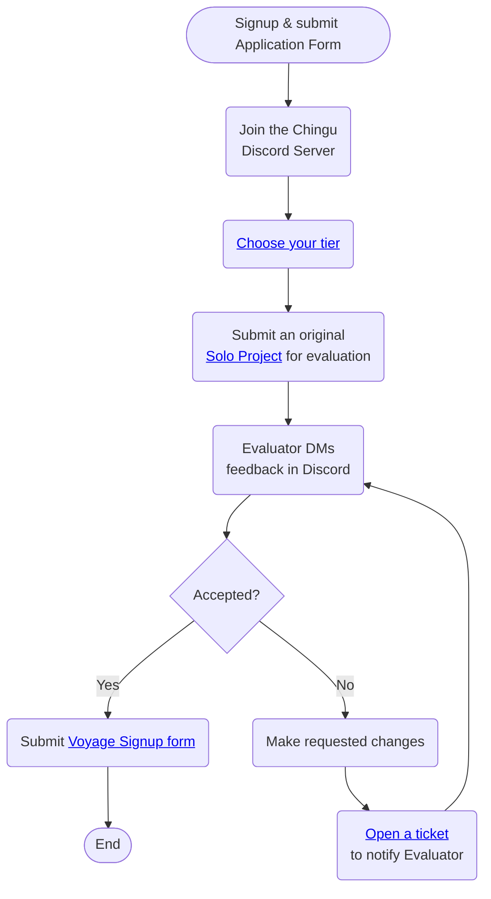
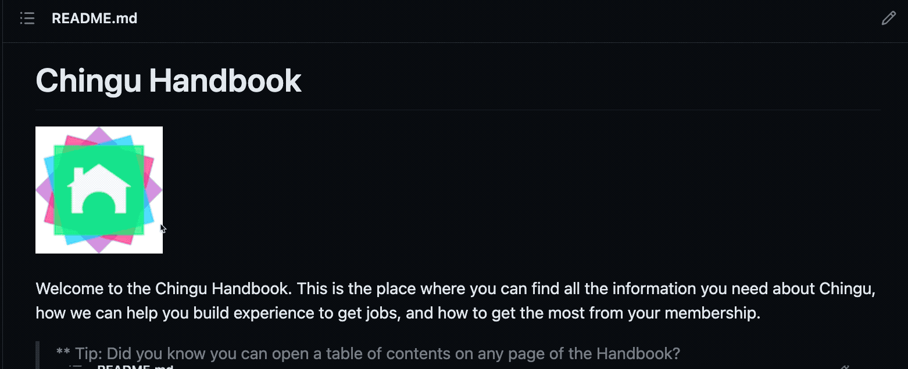

<!-- markdownlint-disable MD033 -->

# Chingu Handbook

  

Welcome to the Chingu Handbook. This is the place where you can find all the
information you need about Chingu, how we can help you build experience to get
jobs, and how to get the most from your membership.

## How to get started 📒

---

```mermaid
flowchart TB
   A(["Signup & submit Application Form"]) --> B(Join the Chingu</br>Discord Server);
   B --> C(<a href='https://github.com/chingu-voyages/Handbook/blob/main/docs/guides/soloproject/soloproject.md#1-choose-your-tier-1%EF%B8%8F%E2%83%A3-2%EF%B8%8F%E2%83%A3-3%EF%B8%8F%E2%83%A3' target='_blank'>Choose your tier</a>);
   C --> D(Submit an original</br><a href='https://github.com/chingu-voyages/Handbook/blob/main/docs/guides/soloproject/soloproject.md' target='_blank'>Solo Project</a> for evaluation);
   D --> E(Evaluator DMs</br>feedback in Discord);
   E --> F{Accepted?};
   F -- Yes --> G(Submit <a href='https://forms.gle/dFaNuYWAjARd99qo8' target='_blank'>Voyage Signup form</a>);
   F -- No --> H(Make requested changes);
   H --> I(<a href='https://discord.com/channels/330284646283608064/1193342042080817323' target='_blank'>Open a ticket</a></br>to notify Evaluator);
   I --> E;
   G --> Z([End]);
```

---

## What is Chingu❓

Chingu is an organization whose mission is to help Web Development professionals 
transform what they’ve learned in university studies, private courses, videos, and 
individual studies into the experience needed to get jobs. 🎬

## How did Chingu get started?

The idea for Chingu came from one of our original co-founders who had spent 
thousands on a top-flight bootcamp and excelled in the program of study. 

But, upon completing the course of study he found he knew the technology parts of 
Web Development, but didn’t have the skills expected from a Junior Developer 
including how to design applications, work in a team, use distributed tools like 
git & GitHub in a team, and use Agile frameworks like Scrum.

Despite having done well at this bootcamp and having invested considerable time and 
money into it his employment prospects were dim. This raised the question that 
started Chingu - “How can I gain the experience to become employable?”. As a result of this Chingu was started in 2016.

## Who is Chingu for? 🤔

Chingu helps you get a job by giving you real experience. You will join a team,
build a project, and add it to your portfolio. The kind of experience to help you
stand above other job applicants to get noticed.

Our programs and services are geared to help Web Developers, UI/UX Designers, and
Agile Product Owners & Scrum Masters.

## What are our core principles?

Given our mission, what are some of the high-level principles that govern what we 
do and how we do it? Click [here](./docs/manifesto.md) to read more about what is important to us in
the governance of Chingu.

## Directory of Information ℹ️

### Getting Started 🏎️

- [Community Standards](./docs/gettingstarted/communitystds.md)
- [Programs & Services](./docs/gettingstarted/programs.md)
- [Getting Help](./docs/gettingstarted/gettinghelp.md)
- [What to Do First](./docs/gettingstarted/whattodofirst.md)
- [Our Partners](./docs/gettingstarted/partners.md)

### Onboarding 📒

---

```mermaid
flowchart TB
   A(Have you completed a Voyage?) -- No --> B(<a href='https://github.com/chingu-voyages/Handbook/blob/main/docs/guides/soloproject/soloproject.md#1-choose-your-tier-1%EF%B8%8F%E2%83%A3-2%EF%B8%8F%E2%83%A3-3%EF%B8%8F%E2%83%A3' target='_blank'>Choose your tier</a>);
   A -- Yes --> C(Learn more about <a href='https://github.com/chingu-voyages/Handbook/blob/feature/add-voyagexp/docs/guides/voyagexp/voyagexp.md' target='_blank'>VoyageXP</a>);
   C --> Z([End]);
   B --> D(Submit an original</br><a href='https://github.com/chingu-voyages/Handbook/blob/main/docs/guides/soloproject/soloproject.md' target='_blank'>Solo Project</a> for evaluation);
   D --> E(Evaluator DMs</br>feedback in Discord);
   E --> F{Accepted?};
   F -- Yes --> G(Learn more about <a href='https://github.com/chingu-voyages/Handbook/blob/main/docs/guides/voyage/voyage.md' target='_blank'>Voyages</a>);
   G --> Z([End]);
   F -- No --> H(Make requested changes);
   H --> I(<a href='https://discord.com/channels/330284646283608064/1193342042080817323' target='_blank'>Open a ticket</a></br>to notify Evaluator);
   I --> E;
```

### Program Guides

- [Solo Project](./docs/guides/soloproject/soloproject.md)
- [Voyage](./docs/guides/voyage/voyage.md)
- [VoyageXP](./docs/guides/voyagexp/voyagexp.md)
- [Pair Challenge Guide](./docs/guides/pairprog/pairprog.md)
- [Handbook Contributors Guide](./docs/guides/contributors/contributors.md)

### Helpful Information 📒

---

| Teamwork Resources | Project Resources | Technical Resources |
| ------------------ | ----------------- | ------------------- |
| [Soft Skills 101](./docs/resources/projresources/softskills101.md) | [Agile Methodology 101](./docs/resources/projresources/agile101.md) | [Git & GitHub](./docs/resources/techresources/gitgithub.md)  |
| [How to be a Great Teammate](./docs/resources/projresources/greatteammate.md) | [Agile Tools](./docs/resources/projresources/agiletools.md) | [Choosing your Techstack](./docs/resources/techresources/techstack.md)  |
| [Traits of Highly Effective Teams](./docs/resources/projresources/effectiveteams.md) | | [Deploying your App](./docs/resources/techresources/appdeployment.md) |
| [How to Handle Team Conflict](./docs/resources/projresources/teamconflict.md) | | [Software Licenses](./docs/resources/techresources/softwarelicenses.md) |
| | | [UI/UX Workflow](./docs/resources/techresources/uiux.md) |
| | | [Glossary](./docs/resources/glossary/glossary.md) |

## Tips 💁🏽

1. You can open a table of contents on any page of the Handbook.
   

2. Are you more comfortable using a language other than English? Use the
   free Google Translate extension in Chrome-based browsers. You can learn more
   in the
   [Chrome Web Store](https://chrome.google.com/webstore/detail/google-translate/aapbdbdomjkkjkaonfhkkikfgjllcleb).
