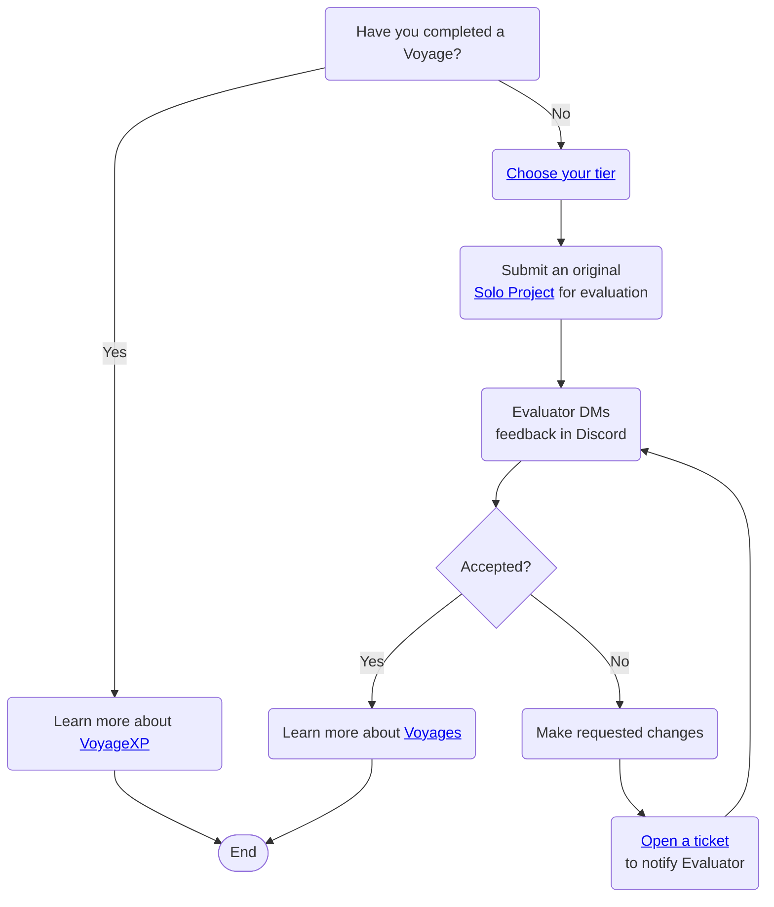

<!-- markdownlint-disable MD033 -->

# Chingu Handbook

  

Welcome to the Chingu Handbook. This is your guide to everything Chingu — what it is, how it works, and how to get the most from your membership.

## What is Chingu?

Chingu helps Web Developers, UI/UX Designers (people who design how apps look and feel), and Scrum Practitioners (people who manage the process of building software) turn what they've learned into real work experience.

Many people finish courses, bootcamps, or self-study programs knowing the material — but without the hands-on experience employers expect. Chingu fills that gap.

## How did Chingu get started?

One of our co-founders spent a lot of money on a top coding bootcamp and did well. But after finishing, he realized something important: he understood the technology, but didn't have the skills a Junior Developer actually needs — things like working on a team, designing apps, using tools like Git and GitHub with others, and following a structured workflow called Agile/Scrum.

Despite all the time and money he invested, getting hired was still hard. That question — *"How can I gain the experience to become employable?"* — led to the creation of Chingu in 2016.

## Who is Chingu for?

Chingu is for anyone who wants a job in tech but needs real-world experience to get there.

You'll join a team, build a project together, and add it to your portfolio. That kind of experience helps you stand out from other job applicants and get noticed by employers.

Chingu serves:

- Web Developers
- UI/UX Designers
- Agile Product Owners and Scrum Masters

## What do we believe in?

Our mission shapes everything we do. Read our [Manifesto](./docs/manifesto.md) to learn about the values and principles that guide Chingu.

## Getting Around the Handbook

### Getting Started

- [Community Standards](./docs/gettingstarted/communitystds.md)
- [Programs & Services](./docs/gettingstarted/programs.md)
- [Getting Help](./docs/gettingstarted/gettinghelp.md)
- [What to Do First](./docs/gettingstarted/whattodofirst.md)
- [Our Partners](./docs/gettingstarted/partners.md)

### How to Onboard

New to Chingu? Use this chart to find your next step. Follow the arrows from the top to see what applies to you.

---

```mermaid
flowchart TB
   A(Have you completed a Voyage?) -- No --> B(<a href='https://github.com/chingu-voyages/Handbook/blob/main/docs/guides/soloproject/soloproject.md#1-choose-your-tier-1%EF%B8%8F%E2%83%A3-2%EF%B8%8F%E2%83%A3-3%EF%B8%8F%E2%83%A3' target='_blank'>Choose your tier</a>);
   A -- Yes --> C(Learn more about <a href='https://github.com/chingu-voyages/Handbook/blob/feature/add-voyagexp/docs/guides/voyagexp/voyagexp.md' target='_blank'>VoyageXP</a>);
   C --> Z([End]);
   B --> D(Submit an original</br><a href='https://github.com/chingu-voyages/Handbook/blob/main/docs/guides/soloproject/soloproject.md' target='_blank'>Solo Project</a> for evaluation);
   D --> E(Evaluator DMs</br>feedback in Discord);
   E --> F{Accepted?};
   F -- Yes --> G(Learn more about <a href='https://github.com/chingu-voyages/Handbook/blob/main/docs/guides/voyage/voyage.md' target='_blank'>Voyages</a>);
   G --> Z([End]);
   F -- No --> H(Make requested changes);
   H --> I(<a href='https://discord.com/channels/330284646283608064/1193342042080817323' target='_blank'>Open a ticket</a></br>to notify Evaluator);
   I --> E;
```

---

### Program Guides

- [Solo Project](./docs/guides/soloproject/soloproject.md)
- [Voyage](./docs/guides/voyage/voyage.md)
- [VoyageXP](./docs/guides/voyagexp/voyagexp.md)
- [Pair Challenge Guide](./docs/guides/pairprog/pairprog.md)
- [Handbook Contributors Guide](./docs/guides/contributors/contributors.md)

### Helpful Resources

| Teamwork | Projects | Technology |
| -------- | -------- | ---------- |
| [Soft Skills 101](./docs/resources/projresources/softskills101.md) | [Agile Methodology 101](./docs/resources/projresources/agile101.md) | [Git & GitHub](./docs/resources/techresources/gitgithub.md) |
| [How to be a Great Teammate](./docs/resources/projresources/greatteammate.md) | [Agile Tools](./docs/resources/projresources/agiletools.md) | [Choosing your Tech Stack](./docs/resources/techresources/techstack.md) |
| [Traits of Highly Effective Teams](./docs/resources/projresources/effectiveteams.md) | | [Deploying your App](./docs/resources/techresources/appdeployment.md) |
| [How to Handle Team Conflict](./docs/resources/projresources/teamconflict.md) | | [Software Licenses](./docs/resources/techresources/softwarelicenses.md) |
| | | [UI/UX Workflow](./docs/resources/techresources/uiux.md) |
| | | [Glossary](./docs/resources/glossary/glossary.md) |

## Tips

**View the table of contents:** Every page in the Handbook has a built-in table of contents. Here's how to open it:

**Read in your language:** If English is not your first language, use the free Google Translate extension for Chrome-based browsers to read the Handbook in your own language. [Get it from the Chrome Web Store](https://chrome.google.com/webstore/detail/google-translate/aapbdbdomjkkjkaonfhkkikfgjllcleb).
