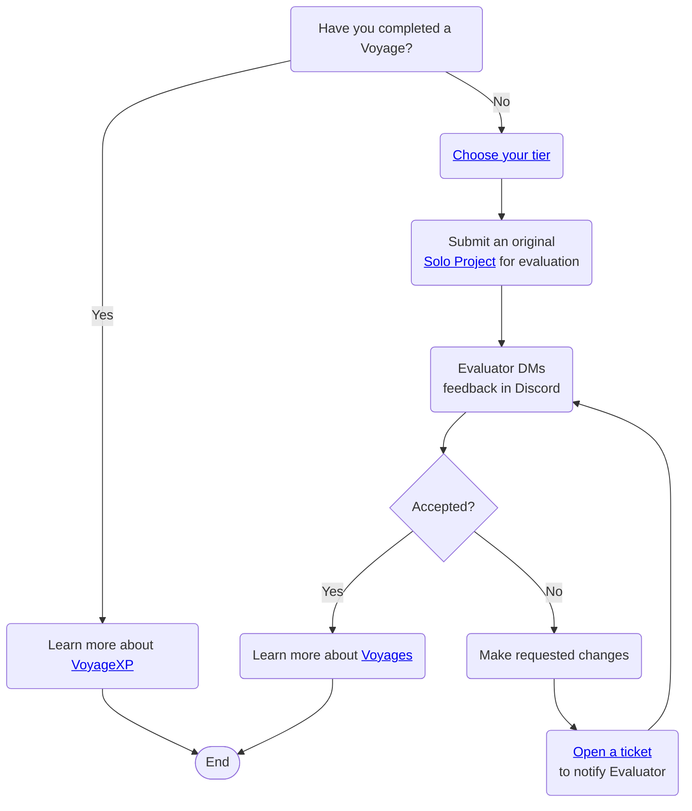

  

# Chingu Handbook

Welcome to the Chingu Handbook. This is the place where you can find all the
information you need about Chingu, how we can help you build experience to get
jobs, and how to get the most from your membership.

## What is Chingu❓

We're excited that you've chosen to join us and we know you have lots of
questions. So let's get started! 🎬

### Chingu Means Friend 🫱🏻‍🫲🏼

It's important to know that "Chingu" means "friend" in Korean. This isn't just a
catchy name; it perfectly describes what we want this organization to be for our
members.

We want to be that friend that supports your goal to advance in your Web
Development career. But, we also want every Chingu here to be just as
supportive.

### Who is Chingu for? 🤔

Chingu is intended to help a variety of different Web Development professionals
further their careers by building near real-world experience. The kind of
experience to help you stand above other job applicants to get noticed.

Our programs and services are geared to help Web Developers, UI/UX Designers, and Agile Product Owners & Scrum Masters.

## Directory of Information ℹ️

### Getting Started 🏎️

---

- [Community Standards](./docs/gettingstarted/communitystds.md)
- [Programs & Services](./docs/gettingstarted/programs.md)
- [Getting Help](./docs/gettingstarted/gettinghelp.md)
- [What to Do First](./docs/gettingstarted/whattodofirst.md)
- [Our Partners](./docs/gettingstarted/partners.md)

### Onboarding 📒

---

### Program Guides

- [Solo Project](./docs/guides/soloproject/soloproject.md)
- [Voyage](./docs/guides/voyage/voyage.md)
- [VoyageXP](./docs/guides/voyagexp/voyagexp.md)
- [Pair Challenge Guide](./docs/guides/pairprog/pairprog.md)
- [Handbook Contributors Guide](./docs/guides/contributors/contributors.md)
- [Content Creators Guide](./docs/guides/contentcreator/contentcreator.md)

### Helpful Information 📒

---

| Teamwork Resources | Project Resources | Technical Resources |
| ------------------ | ----------------- | ------------------- |
| [Soft Skills 101](./docs/resources/projresources/softskills101.md) | [Agile Methodology 101](./docs/resources/projresources/agile101.md) | [Git & GitHub](./docs/resources/techresources/gitgithub.md)  |
| [How to be a Great Teammate](./docs/resources/projresources/greatteammate.md) | [Agile Tools](./docs/resources/projresources/agiletools.md) | [Choosing your Techstack](./docs/resources/techresources/techstack.md)  |
| [Traits of Highly Effective Teams](./docs/resources/projresources/effectiveteams.md) | | [Deploying your App](./docs/resources/techresources/appdeployment.md) |
| [How to Handle Team Conflict](./docs/resources/projresources/teamconflict.md) | | [Software Licenses](./docs/resources/techresources/softwarelicenses.md) |
| | | [UI/UX Workflow](./docs/resources/techresources/uiux.md) |
| | | [Glossary](./docs/resources/glossary/glossary.md) |

## Tips 💁🏽

1. Did you know you can open a table of contents on any page of the Handbook?
   

2. Are you more comfortable using a language other than English? You can use the
   free Google Translate extension in Chrome-based browsers. You can learn more
   in the
   [Chrome Web Store](https://chrome.google.com/webstore/detail/google-translate/aapbdbdomjkkjkaonfhkkikfgjllcleb).
