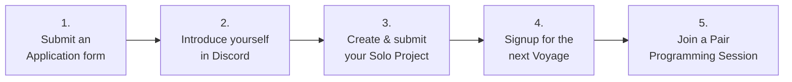
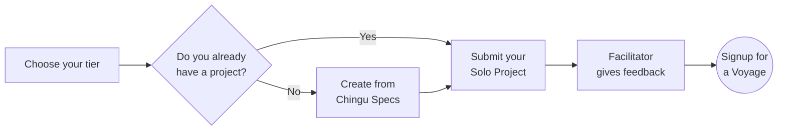

# What to do First?


You've joined Chingu and have access to Discord. So what's should you do next?



## Submit an Application form

If you are reading this you've probably already done this. But, if you haven't
signed up yet, please go to [chingu.io](https://chingu.io) and click the `Apply for free` button.
    
We use the information you provide to help us make your Chingu experience worthwhile, and we **NEVER** share your email address or other personal information.  

> **TIP** Make sure `@chingu.io` is whitelisted in your email system so you won't miss notifications we send out. We promise not to flood your inbox.

    
## Introduce Yourself in Discord

Introduce yourself in the [introduce-yourself](https://discord.com/channels/330284646283608064/553103063649353738) channel. Using this Markdown template so other Chingu's 
can get to know you.
    
```
**Background** 
Introduce yourself to your fellow Chingus. What country 
do you live in? Are you in school, are you working, what are your 
hobbies?

**Coding History** 
When did you start programming and in what language?
What motivated you to become a developer? What technical environment
are you most productive in?

**Coding Goals** 
What skills and knowledge do you want to gain in the next six months,
the next year, and why?

**Chingu History** 
Is this your first Voyage? If you are already a 
Chingu what have you learned so far? What do you want to achieve in 
this Voyage?

**Strengths** 
What are the hard and soft skills you are the best at 
and are the most proud of? What strength will you bring to your 
Village and Voyage team and what help do you need from your peers?

**Projects** 
What projects have you worked on in the past? Which one are you most 
proud of and which one would you like to do over again. Why?
```

## Create and submit your Solo Project

The [Solo Project](../guides/soloproject/soloproject.md) helps you validate that you have 
the necessary technical skills to be successful in a Voyage. It's also another 
way to build an app for your portfolio.

    
You'll first need to choose the [tier](https://github.com/chingu-voyages/Handbook/blob/main/docs/guides/soloproject/soloproject.md#1-choose-your-tier-1%EF%B8%8F%E2%83%A3-2%EF%B8%8F%E2%83%A3-3%EF%B8%8F%E2%83%A3) that matches your 
current skill level. There are three tiers and ou should select the one that 
best matches your curren skill level - beginner (Tier 1), 
intermediate (Tier 2), or experienced (Tier 3). 
    
If you already have a project that matches your tier 
go ahead and submit it for evaluation. Your project can be one you've completed 
on your own or as a part of a team. It should meet these criteria:
    
- It must coorespond to the requirements of the tier you've selected
- It should be original work (not copied from someone else, including a tutorial)
- If created as part of a team you should be a major contributor to the project

When you are done, submit a [Solo Project Completion form](https://docs.google.com/forms/d/e/1FAIpQLSdN3dN7OjzppDCBNIsIf-bOJC_XAlQ9eiPcYQx_m6DfhaiRmA/viewform) so we can evaluate your project. 
(Note: please use the same email as your application form)
    
One of our Facilitators will evaluate your Solo Project and will DM you in 
Discord with feedback you can use! They will look at both your code as well 
as the running app so you'll get 360-degree feedback. 

Please check your `Message Requests` or spam folder on discord. If you have not received a DM in 5 days after submission, feel free to open a ticket to check the status.

Once you've passed the Solo Project, you will receive a link to sign up for the next voyage, and a commitment form closer to the start date, you'll be ready to participate in a Voyage!
    

## Sign up to Participate in a Voyage!

Voyages are 6-week long remote team projects where you'll build a web app
while refining your technical skills and adding new "soft" skills, like Agile.

You can find the schedule of upcoming Voyages in the 
[#voyage-schedule](https://discord.com/channels/330284646283608064/913775964138393611) 
channel in Discord. 
    
To signup simply complete and submit a [Voyage Signup](https://forms.gle/QGLbjKubYVfmSLMJ7) form. We’ll email an acknowledgement with information to help you get ready.
    

## Join a Pair Programming session

While you are waiting for your Voyage to start you might wish to join in one of
our weekly Pair Programming sessions. Pair Programming with another Chingu will
help you learn with a like-minded professional and expand your network.

You can learn more about what Pair Programming is and how to get started
[here](../guides/pairprog.md).
