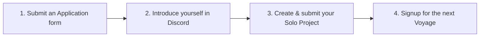

# What to do First?

You've joined Chingu and have access to Discord. So what's should you do next?



# 1. Complete an Application form

- Make sure `@chingu.io` is whitelisted in your email system.
    
We will send you emails from time-to-time so it's important that they reach 
your inbox instead of your junk or spam email folder.
    
- Introduce yourself in the [introduce-yourself](https://discord.com/channels/330284646283608064/553103063649353738) channel. Using this Markdown template 
so other Chingu's can get to know you.
    
```
**Background** 
Introduce yourself to your fellow Chingus. What country 
do you live in? Are you in school, are you working, what are your 
hobbies?

**Coding History** 
When did you start programming and in what language?
What motivated you to become a developer? What technical environment
are you most productive in?

**Coding Goals** 
What skills and knowledge do you want to gain in the next six months,
the next year, and why?

**Chingu History** 
Is this your first Voyage? If you are already a 
Chingu what have you learned so far? What do you want to achieve in 
this Voyage?

**Strengths** 
What are the hard and soft skills you are the best at 
and are the most proud of? What strength will you bring to your 
Village and Voyage team and what help do you need from your peers?

**Projects** 
What projects have you worked on in the past? Which one are you most 
proud of and which one would you like to do over again. Why?
```
    
- Submit a [Chingu Application form](https://forms.gle/irXhGqgqrRx94mrA9)
    
We use the information you provide to help us make your Chingu experience worthwhile, and we **NEVER** share your email address or other personal information.

Once you've submitted your Application you'll see that more Discord channels have become available to you. 
    

# 2. Create and submit your Solo Project

- [Choose the tier](https://www.notion.so/Solo-Projects-2a41ff900cc24a72a919f0eb5e79c42b?pvs=21) that matches your current skill level.
    
We have three tiers cooresponding to three levels of expertise - beginner (Tier 1), intermediate (Tier 2), & Experienced (Tier 3).
    
- [If you already have a project](https://www.notion.so/Solo-Projects-2a41ff900cc24a72a919f0eb5e79c42b?pvs=21) that matches your tier 
go ahead and submit it for evaluation. Your project can be one you've completed 
on your own or as a part of a team. It should meet this criteria:
    
- Coorespond to one of our three tiers
- It should be original work (not copied from someone else, including a tutorial)
- If created as part of a team you should be a major contributor to the project

If you don't have a project that matches your tier create one following the 
specifications we provide.
    
- If you applied as a Developer, UI/UX designer, or Data Scientist you can find 
ideas for Solo Projects to create —> [here](https://www.notion.so/4efdd43df321489d9bf4e73cbc4e66cb?pvs=21)

- If you applied as a Product Owner you can find ideas for Solo Projects to create —> [here](https://www.notion.so/45b5f1e7967f4919aea77a7c09fa5172?pvs=21)
    
Submit a [Solo Project Completion form](https://docs.chingu.io/voyage/soloproj/submit) so we can evaluate your project.
    
One of our Facilitators will evaluate your Solo Project and will DM you in 
Discord with feedback you can use! They will look at both your code as well 
as the running app.

Once you've passed the Solo Project you'll be ready to participate in a Voyage!
    

# 3. Sign up to Participate in a Voyage!

- Find upcoming Voyages
    
Check out the [#voyage-schedule](https://discord.com/channels/330284646283608064/913775964138393611) channel in Discord to find a Voyage that best fits your 
schedule. 
    
- Signup for a Voyage
    
Complete and submit a [Voyage Signup](https://forms.gle/QGLbjKubYVfmSLMJ7) form. 
We’ll email an acknowledgement containing information to help you get ready.
    

- Signup for a Pair Programming session

All Chingus are welcome to participate in our weekly 
[Pair Programming](https://www.notion.so/Pair-Programming-9c82e465b4a74f7ea298eead84f55c89?pvs=21) sessions.