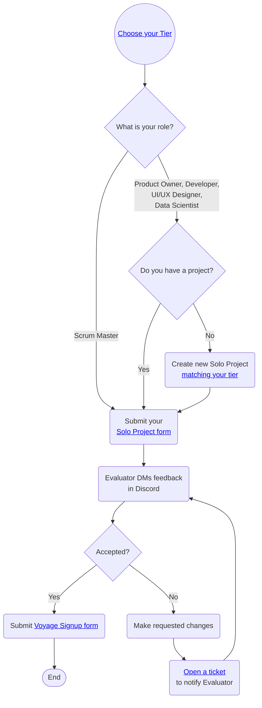

# Solo Project

## Overview

The goal of the Solo Project is to help you and the Chingu team verify that
you've chosen a Tier that gives you the best chance of success in a Voyage. It
also gives you another app you can add to your portfolio.

When you are done and have submitted your Solo Project our team will
evaluate your project and provide feedback you can use on both functionality
as well as your UI/UX.

## Steps to Follow

### 1. Choose your Tier 1️⃣-2️⃣-3️⃣

You'll first need to choose a **tier** that matches your
current skill level. There are three tiers and you should select the one that
best matches your current skill level - beginner (Tier 1),
intermediate (Tier 2), or experienced (Tier 3).

[Click here for Developer tiers](./topics/tier_developer.md) 
[Click here for UI/UX Designer tiers](./topics/tier_uiuxdesigner.md) 
[Click here for Product Owner tiers](./topics/tier_productowner.md) 
[Click here for Scrum Master tiers](./topics/tier_scrummaster.md) 
[Click here for Data Scientist tiers](./topics/tier_datascientist.md) 

### 2. Submit a project that matches your tier 👍

You will need to submit a project that matches the requirements of the tier you've
chosen then go ahead and submit it for evaluation. Your project can be one
you've completed on your own or as a part of a team.

It **must** meet these criteria:

- Your project should match the requirements of the
[tier you have chosen](#1-choose-your-tier-1%EF%B8%8F⃣-2%EF%B8%8F⃣-3%EF%B8%8F⃣)
- It should be original work (not copied from someone else, including tutorials
or AI-generated code)
- If created as part of a team you should be a major contributor to the project
- It has been developed within the last 12 months, or has a significant number
of commits made by you within the last year.

Remember that you are required to produce original work! You should not copy and submit a solo project you did not personally author. For more information refer to our [Community Standards](../../gettingstarted/communitystds.md).

#### If you are a Developer or Data Scientist

You'll be asked to provide the URLs for both your GitHub repo and the [deployed application](../../resources/techresources/techstack.md#deployment-options) when you submit the [Solo Project Completion Form](https://forms.gle/VCpN1K6j341Vz1dq6) for your project.

Your project source code **must be hosted on GitHub** and your completed project must be deployed on the Internet.

#### If you are a Product Owner

If you are in the Product Owner role your Solo Project submission form includes a short quiz to help both you and Chingu assess your level of PO skill. You can find the quiz in the [Solo Project Completion Form](https://forms.gle/VCpN1K6j341Vz1dq6). The minimum passing score for the quiz is 80%. But, if you score below that we'll let you update your answers for the questions you missed.

You will also be asked to provide the URL of a public website containing a sample product backlog you have created. This backlog can be in the service of your choice including GitHub Projects, Trello, Miro, ClickUp, Jira, or any similar tool.

Your sample product backlog doesn't need to be complicated, but it should demonstrate that you understand how to organize the project visually using a combination of Epics, User Stories, and Tasks. Including dependencies between these product backlog items as well as acceptance criteria, edge cases, and test criteria is a definite plus.

If you don't have a project you can create a backlog from [this project specification](https://github.com/chingu-voyages/soloproject-tier3-chingu-trivia-po).

#### If you are a Scrum Master

If you are in the Scrum Master role your Solo Project submission form includes a short quiz to help both you and Chingu assess your level of PO skill. These include a combination of multiple choice and a few long form questions. You can find the quiz in the [Solo Project Completion Form](https://forms.gle/VCpN1K6j341Vz1dq6).

The minimum passing score for the quiz is 80%. But, if you score below that we'll let you update your answers for the questions you missed.

#### If you are a UI/UX Designer

You will also be asked to provide the URL of a public website containing a website design you have created. This could be a design hosted on Figma, AdobeXD, or in any other prototyping tool. It might also be a more formal study including things like the definition of personas and stakeholder goals as well as basic screen layout and navigation.

### 3. Submit a Solo Project Completion Form ✅

When you've completed your Solo Project you will need to submit the **[Solo Project Completion Form](https://forms.gle/bwPYEaco5a3KhMqU6)** before you can move on to the Voyage Project.

> You are encouraged to submit this form as soon as your Solo Project is done. There is no need to wait until the submission deadline if you finish earlier.
>

Once you submit the Solo Project Completion Form our goal is to evaluate your
project and provide feedback in a Discord direct message (DM) within
***2 business*** days. However, this may take longer based on the number of
Chingus submitting projects in the same timeframe.

There is no need to resubmit the completion form once you've received
feedback. If any rework is requested you can open a support ticket
[here](https://discord.com/channels/330284646283608064/1105911757177888908)
when you are ready for your project to be retested.

## Solo Project Tips ✏️

1. It is more important to complete the project than it is to add features since completion is required before you can advance to the Voyage Project.
2. Concentrate on completing the required tasks for your tier and then work on bonus tasks only if time permits. Keep in mind that advancing to the Voyage phase of the Cohort depends on the completion of the required tasks listed in the project repo we've provided.
3. Choose tools you are comfortable and productive with. In the limited time available to complete the Solo Project it's not a good idea to try to use something you don't already know.
4. Unless otherwise noted in the required tasks for your tiers Solo Project the languages, tools, libraries, and frameworks you use are up to you. For example, all of the following approaches are acceptable paths to a successful project:
    - Using any language for web development, not just Javascript
    - Using Vanilla JS instead of a library or framework
    - Using a framework of your choice like React or Vue
    - Using a boilerplate or generator like Create React App (CRA)
    - Using a CSS library or creating your own CSS
5. Your repo should contain a well written [readme](https://medium.com/chingu/keys-to-a-well-written-readme-55c53d34fe6d).
6. Remember that your app should run error-free. There should be no errors in the browser or server console logs.
7. When you submit your project ***you must provide URL's for***:
    - the publicly accessible repository containing your project (eg. Github).
    - the running version of your project where you have deployed it on an
    Internet accessible host (eg. Github Pages, Netlify, etc.) so we can evaluate not
    just your code, but also your UI/UX.
8. You may **NOT** use a source code generator (like GitHub Co-Pilot) to
create any part of your Solo Project.
9. Chingu is all about collaborative learning and supporting each other as
    we level up! Use our Discord channels to get help and advice.
