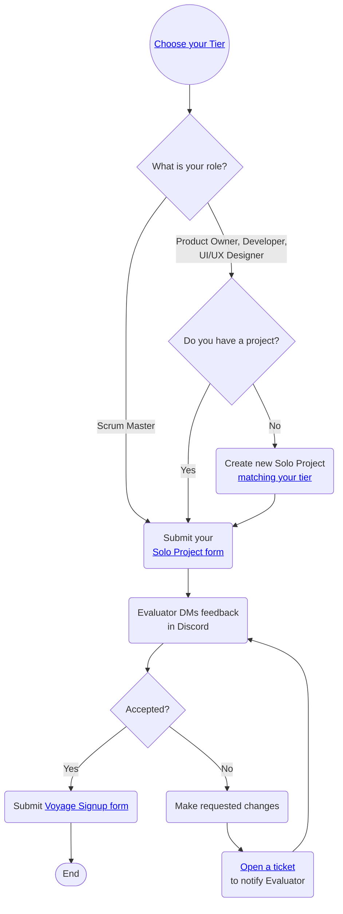
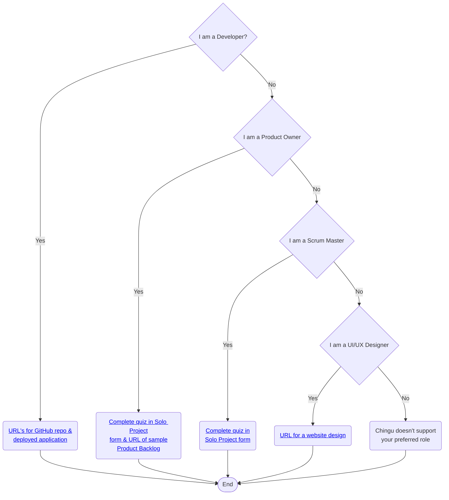
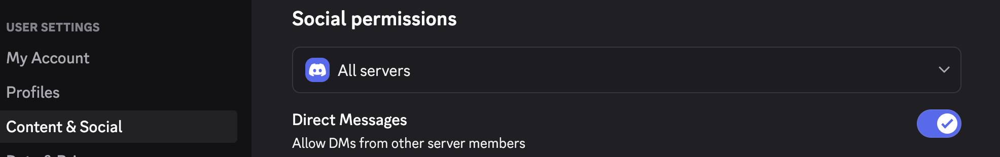

# Solo Project

## Overview

The Solo Project helps you and the Chingu team verify that the Tier you have
chosen matches your current skill level, so you will be ready for your first
Voyage.

Once you have submitted your Solo Project, our team will evaluate it and provide
helpful feedback, highlighting what you did well and areas for improvement.

## Steps to Follow

### 1. Choose your Tier 1️⃣-2️⃣-3️⃣

You'll first need to choose a **tier** that matches your current skill level
for your preferred role. There are three tiers - beginner (Tier 1),
intermediate (Tier 2), or experienced (Tier 3).

[Developer (Web) tiers](./topics/tier_developer.md) 
[Developer (Python) tiers](./topics/tier_developer_python.md) 
[UI/UX Designer tiers](./topics/tier_uiuxdesigner.md) 
[Product Owner tiers](./topics/tier_productowner.md) 
[Scrum Master tiers](./topics/tier_scrummaster.md) 

### 2. Submit a project 👍

Next, submit a project that matches the requirements of your role and tier.

It **must** meet these criteria:

🟢 It must match the requirements of the
[tier you have chosen](#1-choose-your-tier-1%EF%B8%8F⃣-2%EF%B8%8F⃣-3%EF%B8%8F⃣) 
🟢 It should be original work  
🟢 It must be one created in the past year or be one you've
significantly enhanced within the past year. 
🔴 Don't copy from someone else, including tutorials 
🔴 Don't use AI-generated code 
🔴 Don't use team projects unless you are a major contributor

Remember it must be your original work! You should not copy and submit a
project you did not personally author. For more information refer to our
[Community Standards](../../gettingstarted/communitystds.md).

#### What you will need to submit

### If you are a Developer

You will need to provide the URLs for:

1. a **public GitHub repo** containing the source code.
2. the [deployed application](../../resources/techresources/techstack.md#deployment-options)
accessible through the Internet. Please include a test account and password if
a signin is required.

You can use the [Solo Project Completion Form](https://forms.gle/VCpN1K6j341Vz1dq6)
to submit your project.

### If you are a Product Owner

Product Owner projects include:

1. a short quiz in the submission form. The minimum passing score for the quiz
is 80%. If you don't pass you will be able to update your answers
for the questions you missed.
2. the URL of a **public website** containing a sample product backlog you have
created. This may be in the service of your choice. For example, GitHub
Projects, Trello, Miro, ClickUp, Jira, or any similar tool.

You can find the quiz in the [Solo Project Completion Form](https://forms.gle/VCpN1K6j341Vz1dq6).

Your sample product backlog doesn't need to be complicated, but it should
demonstrate that you understand how to visually organize the project using
Epics, User Stories, and Tasks. It is a plus if you include dependencies between
product backlog items, acceptance criteria, edge cases, and test criteria.

If you don't already have a project you can create a backlog using
[this project specification](https://github.com/chingu-voyages/soloproject-tier3-chingu-trivia-po).

### If you are a Scrum Master

If you are a Scrum Master the Solo Project submission form includes
a short quiz. This is a combination of multiple-choice and long-form
questions.

The minimum passing score for the quiz is 80%. If you don't pass you will be
able to update your answers for the questions you missed.

You can find the quiz in the [Solo Project Completion Form](https://forms.gle/VCpN1K6j341Vz1dq6).

### If you are a UI/UX Designer

UI/UX Designers must submit a case study matching the requirements of their chosen tier. This 
should be a URL to a publicly available website or design document detailing the research, 
problems encountered, and solutions for your Solo Project.

This should be a link to the Figma or equivalent file showing:
* Wireframe for each screen
* Documentation of the user flow from screen to screen
* It may include a more formal study including things like personas and stakeholder goals
* Any notes you think members of a development team would find helpful during implementation

You should also keep in mind the importance of 
[CRAP design fundamentals](https://attentioninsight.com/crap-design-principles/) - Contrast, Repetition, Alignment, and Proximity.

You can use the [Solo Project Completion Form](https://forms.gle/VCpN1K6j341Vz1dq6)
to submit your project.

### 3. Submit a Solo Project Completion Form ✅

You will need to submit your project using the
**[Solo Project Completion Form](https://forms.gle/bwPYEaco5a3KhMqU6)**. This
must be completed before your first Voyage.

> You are encouraged to submit this form as soon as your Solo Project is done.
There is no need to wait until the submission deadline if you finish earlier.
>

After submitting the Solo Project Completion Form we will evaluate it and
provide feedback in a Discord direct message (DM) within
***4 business*** days. This could take longer based on the number of
Chingus submitting projects at the same time.

Since we DM feedback to you in Discord it's important that you enable DM's so
you will be able to see it. Make sure that in your Discord `Settings -> Content &
Social -> Social Permissions` you've enabled DM's from other server members.

There is no need to resubmit the completion form once you've received
feedback. The feedback we DM to you will contain information on what to do next.

## Solo Project Tips ✏️

🟢 Completing a project that meets the requirements of your tier and role is
more important than submitting a complex project. 
🟢 The languages, tools, libraries, and frameworks you use are up to you. 
    - Using any language for web development, not just Javascript 
    - Using a framework of your choice like React or Vue 
    - Using a boilerplate or generator like Vite 
    - Using a CSS library or creating your own CSS 
🟢 Your repo should contain a well-written [readme](https://medium.com/chingu/keys-to-a-well-written-readme-55c53d34fe6d). 
🟢 When you submit your project **you must provide URL's as defined above** 
🟢  Chingu is all about collaborative learning and supporting each other as
we level up! Use our Discord channels to get help and advice from other Chingu's. 
🔴 Don't use tools and libraries you aren't already familiar with. 
🔴 Your app shouldn't have errors in the browser or server console logs. 
🔴 **DO NOT** use a source code generator or AI tool (like GitHub Co-Pilot)
for any part of your Solo Project.
