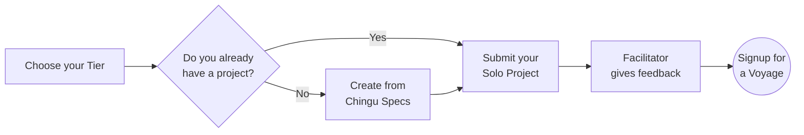

# Solo Project Guide

## Overview

The goal of the Solo Project is to help you and the Chingu team verify that
you've chosen a Tier that gives you the best chance of success in a Voyage. It
also gives you another app you can add to your portfolio.

When you are done and have submitted your Solo Project our team will 
evaluate your project and provide feedback you can use on both functionality 
as well as your UI/UX.

## Steps to Follow

### 1. Choose your Tier 1️⃣-2️⃣-3️⃣

You'll first need to choose a *_tier_* that matches your 
current skill level. There are three tiers and you should select the one that 
best matches your current skill level - beginner (Tier 1), 
intermediate (Tier 2), or experienced (Tier 3). 

For Developers

<table>
<tr>
<td><strong>Tier</strong></td>
<td><strong>Requirements</strong></td>
</tr>
<tr>
<td>Tier&nbsp;1</td>
<td>

This tier is for developers who are just starting out in web development.

<strong>Skills:</strong>
<ul>
    <li>Basic understanding of HTML and CSS.</li>
    <li>Familiarity with at least one programming language (Python, Javascript, PHP, Ruby, etc.)</li>
</ul>
<strong>Tools</strong>
<ul>
    <li>Code Editor: Familiarity with a code editor such as Visual Studio Code, Vim, Sublime Text, etc.</li>
    <li>Git/GitHub: Basic understanding of how to use Git/GitHub. Familiarity with cloning repositories, committing changes, and pushing code.</li>
    <li>Web Development Tools: Basic use of browser developer tools for debugging HTML and CSS.</li>
    <li>Simple Deployment Tools: Familiarity with FTP clients or basic hosting services to deploy static web pages.</li>
</ul>

Your Solo Project <strong><em>must implement</em></strong> a front-end web page using vanilla HTML, CSS, and a scripting language like Javascript or Python.

</td>
</tr>
<tr>
<td>Tier&nbsp;2</td>
<td>

This tier is for developers who have a solid foundation in web development.

<strong>Skills:</strong>
<ul>
    <li>Intermediate HTML and CSS.</li>
    <li>Intermediate or advanced programming experience with JavaScript/PHP/Python/Ruby/etc.</li>
    <li>Understanding of CSS preprocessors like SASS, LESS, Stylus, or TailwindCSS.</li>
    <li>Understanding of Responsive Web Design basics.</li>
    <li>Understanding of how to use an API to retrieve data from a backend system.</li>
    <li>Experience with a front-end framework such as React, Vue, Angular, etc.</li>
</ul>

<strong>Tools</strong>
<ul>
    <li>Advanced Code Editor Usage: Proficient use of code editors with advanced features such as integrated terminals, version control systems, and debugging tools.</li>
    <li>Git/GitHub: Familiarity with Git/GitHub concepts such as branching, merging, pull requests, and resolving conflicts.</li>
    <li>Web Development Tools: Intermediate use of browser developer tools for debugging HTML, CSS, and Javascript.</li>
    <li>Deployment Tools: Familiarity with deployment tools such as Netlify, Heroku, or similar services.</li>
</ul>

Your Solo Project <strong><em>must implement</em></strong> a front-end written using a framework such as React, Svelte, VueJS, Django, Laravel, etc.

</td>
</tr>

<tr>
<td>Tier&nbsp;3</td>
<td>

This tier is for developers with intermediate or advanced competency in web development technologies.

<strong>Skills:</strong>
<ul>
    <li>Intermediate or Advanced HTML and CSS</li>
    <li>Intermediate or advanced programming experience with JavaScript/PHP/Python/Ruby/etc.</li>
    <li>Experience in a framework/library like React, Vue, Angular, etc.</li>
    <li>Understanding of how to create and use APIs with REST or GraphQL API.</li>
    <li>Ability to create a backend server which implements an API of your own design using packages such as Express.</li>
</ul>

<strong>Tools:</strong>

<ul>
<li>Integrated Development Environment (IDE): Mastery of a full-fledged IDE like WebStorm or advanced usage of Visual Studio Code for full-stack development.</li>
<li>API Development Tools: Advanced use of REST or GraphQL API tools, including API design and documentation tools like Swagger or Apollo.</li>
<li>Database Management Tools: Familiarity with database tools and ORMs for interacting with SQL (like PostgreSQL, MySQL) or NoSQL databases (like MongoDB).</li>

</ul>

Your Solo Project <strong><em>must implement</em></strong> a front-end application that accesses a back-end server that implements an API of your own design, optionally using a database such as a NoSQL DBMS like MongoDB or a SQL DBMS like PostgreSQL.

Your backend must include CRUD (if using a database) or POST/READ/UPDATE/DELETE (for APIs).

</tr>
</table>

For UI/UX Designers

<table>

<tr>
<td><strong>Tier</strong></td>
<td><strong>Requirements</strong></td>
</tr>

<tr>
<td>Tier&nbsp;1</td>

<td>
<strong>Skills:</strong>
<ul>
    <li>Basic Design Principles: Understanding of basic design concepts like color theory, typography, layout, and composition.</li>
    <li>User Research: Basic knowledge of conducting user research, creating user personas, and understanding user needs.</li>
    <li>Wireframing and Prototyping: Familiarity with tools to create simple wireframes and prototypes.</li>
    <li>UI/UX Fundamentals: Entry-level understanding of user interface and user experience principles.</li>
    <li>Basic Accessibility Principles: Awareness of challenges faced by those with vision, hearing, motor, cognitive, etc. differences.</li>
</ul>

<strong>Tools:</strong>

<ul>
    <li>Design Software: Entry-level proficiency with user interface design tools like Figma or Sketch. Skills include using frames, groups, shapes, text entry, and font, color, size, and effect configuration.</li>
    <li>Prototyping Tools: Basic usage of tools like InVision, Marvel, or Figma to create simple prototypes.</li>
    <li>User Research Tools: Basic understanding of tools such as Google Forms or Typeform which may be used for conducting surveys or user interviews.</li>
</ul>
</td>
</tr>

<tr>
<td>Tier&nbsp;2</td>

<td>
<strong>Skills:</strong>
<ul>
    <li>Design Principles: Strong grasp of design principles, ability to create visually appealing and functional designs.</li>
    <li>User-Centered Design: Familiarity with user personas, conducting in-depth user research, and applying insights to design decisions.</li>
    <li>Information Architecture: Ability to structure information effectively for better user experiences.</li>
    <li>Usability Testing: Understanding and conducting usability testing to gather feedback and iterate designs.</li>
</ul>
<strong>Tools:</strong>

<ul>
    <li>Design Software: Familiarity using tools like Figma, Sketch, or similar tools for design tasks.</li>
    <li>Prototyping and Animation Tools: Ability to create interactive prototypes using advanced features in tools like Figma, Principle, or Adobe After Effects.</li>
</ul>
</td>
</tr>

<tr>
<td>Tier&nbsp;3</td>

<td>
<strong>Skills:</strong>
<ul>
    <li>Design Skills: Understanding of design principles, visual aesthetics, and creativity in problem-solving.</li>
    <li>User Research: Ability to conduct comprehensive user research, analyze data, and derive actionable insights.</li>
    <li>Design System Creation: Familiarity in developing and maintaining design systems for consistency and scalability.</li>
    <li>Leadership and Collaboration: Ability to lead design projects, collaborate with cross-functional teams, and communicate design rationale effectively.</li>
</ul>

<strong>Tools:</strong>

<ul>
    <li>User Testing Tools: Familiarity with tools like UserTesting.com, Maze, or Lookback for conducting user testing and gathering insights.</li>
    <li>Design Software: Mastery of tools like Figma, Sketch, or other industry-standard software.</li>
    <li>Prototyping and Animation Tools: Use of prototyping tools like Framer, Principle, or advanced animation features in design software.</li>
    <li>Collaboration Tools: Familiarity with team collaboration tools like Miro, Notion, or Trello for team coordination and project management.</li>
</ul>
</td>
</tr>
</table>

For Product Owners

<table>
<tr>
<td><strong>Tier</strong></td>
<td><strong>Requirements</strong></td>
</tr>

<tr>
<td>Tier&nbsp;1</td>

<td>
<strong>Skills:</strong>
<ul>
    <li>Understanding Agile Principles: Grasp the basics of the Agile Methodology and Scrum.</li>
    <li>Communication: Ability to articulate ideas clearly and effectively.</li>
    <li>User Story Writing: Crafting user stories that are simple, clear, and understandable.</li>
    <li>Basic Product Management: Entry-level understanding of product development cycles.</li>
</ul>

<strong>Tools:</strong>
<ul>
    <li>Project Management Tools: Familiarity with tools like Trello, Asana, or Jira for basic task tracking.</li>
    <li>Communication Tools: Proficiency in Slack, Discord, or similar platforms for team communication.</li>
</ul>
</td>
</tr>

<tr>
<td>Tier&nbsp;2</td>

<td>
<strong>Skills:</strong>
<ul>
    <li>Refinement of Agile Principles: Deeper understanding and practical application of Agile methodologies.</li>
    <li>Stakeholder Management: Ability to engage with stakeholders effectively.</li>
    <li>Prioritization Techniques: Understanding various prioritization frameworks (MoSCoW, Value vs. Effort, etc.).</li>
    <li>Analytics and Metrics: Basic understanding of key product metrics and how to measure them.</li>
</ul>

<strong>Tools:</strong>
<ul>
    <li>Project Management Tools: Further proficiency in tools like Jira, Miro, ClickUp, etc..</li>
    <li>Prototyping Tools: Familiarity with tools like Figma, Sketch, etc. for basic prototyping.</li>
</ul>
</td>
</tr>

<tr>
<td>Tier&nbsp;3</td>

<td>
<strong>Skills:</strong>
<ul>
    <li>Agile Expertise: Experience in implementing and adapting Agile methodologies.</li>
    <li>Strategic Thinking: Ability to align the product roadmap with the company's overall strategy. This includes crafting product vision & goals, plus sprint goals.</li>
    <li>Data-Driven Decision Making: Strong analytical skills to derive insights from data.</li>
    <li>Leadership and Mentorship: Guiding and mentoring junior team members.</li>
</ul>

<strong>Tools:</strong>
<ul>
    <li>Analytics Tools: Familiarity with tools like Google Analytics, Mixpanel, Amplitude, etc. for in-depth data analysis.</li>
    <li>Prototyping and Design Tools: Experience using tools like Figma, Sketch, etc. for detailed prototyping and design.</li>
</ul>
</td>
</tr>
</table>

For Data Scientists

<table>
<tr>
<td><strong>Tier</strong></td>
<td><strong>Requirements</strong></td>
</tr>

<tr>
<td>Tier&nbsp;1</td>

<td>
<strong>Skills:</strong>
<ul>
    <li>Basic understanding of programming (Python, Javascript, etc.)</li>
    <li>Fundamental knowledge of statistics and mathematics</li>
    <li>Ability to clean and preprocess data</li>
    <li>Basic knowledge of data visualization</li>
    <li>Familiarity with basic machine learning concepts</li>
    <li>Understand basic Web Development processes such as git/GitHub, Agile project management, etc.</li>
</ul>

<strong>Tools:</strong>
<ul>
    <li>Programming Languages: Python or Javascrip</li>
    <li>Data Manipulation: Pandas (Python), Pandas.js or Data-Forge (Javascript)</li>
    <li>Data Visualization: Matplotlib, Seaborn (Python), D3 (Javascript)</li>
    <li>IDEs: Jupyter Notebook</li>
</ul>
</td>

</tr>
<tr>
<td>Tier&nbsp;2</td>
<td>
<strong>Skills:</strong>
<ul>
    <li>Programming for data analysis and manipulation</li>
    <li>Understanding of statistical analysis and hypothesis testing</li>
    <li>Knowledge of data engineering principles</li>
    <li>Understanding of big data technologies and frameworks</li>
</ul>

<strong>Tools:</strong>
<ul>
    <li>Statistical Analysis: NumPy, SciPy (Python), Math.js, NumJS (Javascript)</li>
    <li>Database Query Languages: SQL</li>
    <li>Advanced Visualization: Plotly, Tableau, D3, etc.</li>
    <li>Cloud Platforms: AWS, Azure, Google Cloud Platform, etc.</li>
</ul>
</td>
</tr>

<tr>
<td>Tier&nbsp;3</td>
<td>
<strong>Skills:</strong>
<ul>
    <li>Understanding of advanced machine learning algorithms and their implementation</li>
    <li>Ability to build and deploy complex models</li>
    <li>Expertise in data engineering and architecture</li>
    <li>Strong problem-solving and analytical skills</li>
    <li>Experience with machine learning algorithms and model evaluation</li>   
</ul>

<strong>Tools:</strong>
<ul>
    <li>Machine Learning Libraries: Scikit-learn (Python), TensorFlow.js (Javascript)</li>
    <li>Deep Learning Frameworks: TensorFlow, PyTorch, etc.</li>
    <li>Model Deployment: Flask, Docker, Kubernetes</li>
</ul>
</td>
</tr>
</table>

### 2. If you already have a project that matches your tier 👍

If you already have a project that matches the requirements of the tier you've
chosen then go ahead and submit it for evaluation. Your project can be one 
you've completed on your own or as a part of a team. It should meet these 
criteria:
    
- It must correspond to the requirements of the tier you've selected
- It should be original work (not copied from someone else, including a tutorial)
- If created as part of a team you should be a major contributor to the project
- It has been developed within the last 12 months, or has a significant number 
of commits made by you within the last year.

### 3. If you don't have a project ready

If you don't have a project you can create one from the 30+ projects we've
provided specifications for.

For Product Owners

| Project Name | Tier 1 | Tier 2 | Tier 3 |
| :--- | :--- | :--- | :--- | 
| Chingu Trivia | [Click here](https://github.com/chingu-voyages/soloproject-tier1-chingu-trivia-po) | [Click here](https://github.com/chingu-voyages/soloproject-tier2-chingu-trivia-po) | [Click here](https://github.com/chingu-voyages/soloproject-tier3-chingu-trivia-po) |

 

For Web Developers, UI/UX Designers, & Data Scientists

 
<b>Note: Some project requirements are outdated, we are in the process of updating them. You are still welcome to use the project ideas but the project will need to meet requirements listed above.</b>

| Project Name | Tier 1 | Tier 2 | Tier 3 |
| :--- | :--- | :--- | :--- | 
| 100DaysofCSS Clone | [Click here](https://github.com/chingu-voyages/soloproject-tier1-100dayscss) | - | - |
| Initab Clone | [Click here](https://github.com/chingu-voyages/soloproject-tier1-initab-clone) | - | - |
| Tickybot Clone | [Click here](https://github.com/chingu-voyages/soloproject-tier1-tickybot-clone) | - | - |
| Website Template | [Click here](https://github.com/chingu-voyages/soloproject-tier1-website-template) | - | - |
| Connect 4 | - | [Click here](https://github.com/chingu-voyages/soloproject-tier2-connect4-game) | - |
| MapBox API | - | [Click here](https://github.com/chingu-voyages/soloproject-tier2-mapbox-api) | - |
| Matching Game | - | [Click here](https://github.com/chingu-voyages/soloproject-tier2-matching-game) | - |
| Bookfinder | - | [Click here](https://github.com/chingu-voyages/soloproject-tier2-bookfinder) | - |
| Bookfinder (React Native) | - | [Click here](https://github.com/chingu-voyages/soloproject-tier2-bookfinder-rn) | - |
| Journal App | - | - | [Click here](https://github.com/chingu-voyages/soloproject-tier3-journal-app) |
| Mars Photos | - | - | [Click here](https://github.com/chingu-voyages/soloproject-tier3-mars-photos) |
| Meteorite Explorer | - | - | [Click here](https://github.com/chingu-voyages/soloproject-tier3-meteorite-explorer) |
| Chingu Trivia | [Click here](https://github.com/chingu-voyages/soloproject-tier1-chingu-trivia) | [Click here](https://github.com/chingu-voyages/soloproject-tier2-chingu-trivia) | [Click here](https://github.com/chingu-voyages/soloproject-tier3-chingu-trivia) |
| Critical Space Strike | [Click here](https://github.com/chingu-voyages/soloproject-tier1-criticalspacestrike) | [Click here](https://github.com/chingu-voyages/soloproject-tier2-criticalspacestrike) | [Click here](https://github.com/chingu-voyages/soloproject-tier3-criticalspacestrike) | 
| eCalendar | [Click here](https://github.com/chingu-voyages/soloproject-tier1-ecalendar) | [Click here](https://github.com/chingu-voyages/soloproject-tier2-ecalendar) | [Click here](https://github.com/chingu-voyages/soloproject-tier3-ecalendar) |
| Favorite Fonts | [Click here](https://github.com/chingu-voyages/soloproject-tier1-favfonts) | [Click here](https://github.com/chingu-voyages/soloproject-tier2-favfonts) | [Click here](https://github.com/chingu-voyages/soloproject-tier3-favfonts) |
| Flutter Blog | [Click here](https://github.com/chingu-voyages/soloproject-tier1-flutter-blogui) | [Click here](https://github.com/chingu-voyages/soloproject-tier2-flutter-blogui) | [Click here](https://github.com/chingu-voyages/soloproject-tier3-flutter-blogui) |
| Game Night | [Click here](https://github.com/chingu-voyages/soloproject-tier1-gamenight) | [Click here](https://github.com/chingu-voyages/soloproject-tier2-gamenight) | [Click here](https://github.com/chingu-voyages/soloproject-tier3-gamenight) |
| Virtual Pet | [Click here](https://github.com/chingu-voyages/soloproject-tier1-virtualpet) | [Click here](https://github.com/chingu-voyages/soloproject-tier2-virtualpet) | [Click here](https://github.com/chingu-voyages/soloproject-tier3-virtualpet) |

 

One of our Facilitators will evaluate your Solo Project and will DM you in 
Discord with feedback you can use! They will look at both your code as well 
as the running app so you'll get 360-degree feedback.

### 4. Submit a Solo Project Completion Form ✅
    
When you've completed your Solo Project you will need to submit the **[Solo Project Completion Form](https://forms.gle/4qiLptoNdfkfaDVv9)** before you can move on to the Voyage Project.

> You are encouraged to submit this form as soon as your Solo Project is done. There is no need to wait until the submission deadline if you finish earlier.
> 

Once you submit the Solo Project Completion Form your project will be 
evaluated and a member of the Facilitation Team will provide you with 
status in a Discord direct message (DM).

There is no need to resubmit the completion form once you've received 
feedback. If any rework is requested you can open a support ticket 
[here](https://discord.com/channels/330284646283608064/1105911757177888908)
when you are ready for your project to be retested.
    
## Solo Project Requirements & Specifications 🧬
    
If you don't already have a project to submit you can create one from the following list. Simply pick a Solo Project that matches the tier you've chosen and click on the 'X' to see a detailed description, and what is required to complete it.
    
## Solo Project Prerequisites ✍️
    
- Your project should match the requirements of the 
[tier you have chosen](#1-choose-your-tier)
- Project source code must be hosted on GitHub
- Completed project must be deployed on the Internet.
- You'll be asked to provide the URLs for both your GitHub repo and the [deployed application](../../resources/techresources/techstack.md#deployment-options) when you submit the [Solo Project Completion Form](https://forms.gle/4qiLptoNdfkfaDVv9) for your project.

Remember that you are required to produce original work! You should not copy and submit a solo project you did not personally author. For more information refer to our [Community Standards](../../gettingstarted/communitystds.md).
    
## Solo Project Tips ✏️
    
1. It is more important to complete the project than it is to add features since completion is required before you can advance to the Voyage Project.
2. Concentrate on completing the required tasks for your tier and then work on bonus tasks only if time permits. Keep in mind that advancing to the Voyage phase of the Cohort depends on the completion of the required tasks listed in the project repo we've provided.
3. Choose tools you are comfortable and productive with. In the limited time available to complete the Solo Project it's not a good idea to try to use something you don't already know.
4. Unless otherwise noted in the required tasks for your tiers Solo Project the languages, tools, libraries, and frameworks you use are up to you. For example, all of the following approaches are acceptable paths to a successful project:
    - Using any language for web development, not just Javascript
    - Using Vanilla JS instead of a library or framework
    - Using a framework of your choice like React or Vue
    - Using a boilerplate or generator like Create React App (CRA)
    - Using a CSS library or creating your own CSS
5. Your repo should contain a well written [readme](https://medium.com/chingu/keys-to-a-well-written-readme-55c53d34fe6d).
6. Remember that your app should run error-free. There should be no errors in the browser or server console logs.
7. When you submit your project ***you must provide URL's for***: 
    - the publicly accessible repository containing your project (eg. Github).
    - the running version of your project where you have deployed it on an 
    Internet accessible host (eg. Github Pages, Netlify, etc.) so we can evaluate not
    just your code, but also your UI/UX.
8. You may **NOT** use a source code generator (like GitHub Co-Pilot) to 
create any part of your Solo Project.
9. Chingu is all about collaborative learning and supporting each other as
    we level up! Use our Discord channels to get help and advice.
