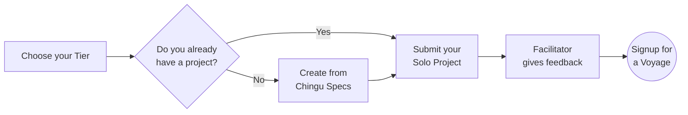

# Solo Project Guide

## Overview

The goal of the Solo Project is to help you and the Chingu team verify that
you've chosen a Tier that gives you the best chance of success in a Voyage. It
also gives you another app you can add to your portfolio.

When you are done and have submitted your Solo Project our team will 
evaluate your project and provide feedback you can use on both functionality 
as well as your UI/UX.

## Steps to Follow

### 1. Choose your Tier

You'll first need to choose a *_tier_* that matches your 
current skill level. There are three tiers and ou should select the one that 
best matches your curren skill level - beginner (Tier 1), 
intermediate (Tier 2), or experienced (Tier 3). 

For Developers

| Tier | Requirements |
| :--- | :--- |
| Tier 1 - Frontend | Developers are just starting out in Web Development and have a basic understanding of:    - CSS   - HTML   - Any web development language like Javascript, PHP, Python, Ruby, etc.    No frameworks or backend application servers are used in Tier 1 projects |
| Tier 2 - Frontend | Developers should have the following skills & expertise:    - Have a solid foundation using intermediate HTML, CSS, & Any web development language like Javascript, PHP, Python, Ruby, etc.  - Have started learning CSS preprocessors like SASS, LESS, Stylus, or TailwindCSS  - Understand the importance and practice of Responsive Web Design Basics  - Understand the fundamentals of how to use an API to retrieve data from a backend system  - Uses a FE framework like React, Vue, Angular, etc. |
| Tier 3 - Full Stack | Developers should have the following skills & expertise:   - Intermediate or Advanced HTML/CSS/JavaScript/PHP/Python/Ruby/etc. and experience in a framework/library like React, Vue, Angular, etc.  - Understand API's and interest in creating a REST or GraphQL API  - Optionally uses a database such as a NoSQL DBMS like MongoDB or a SQL DBMS like PostgreSQL  - Interest in or experience creating backend servers using packages such as Express |

For UI/UX Designers

| Tier   | Requirements |
| :--- | :--- |
| Tier 1 | Designers who are just starting out should understand the following:    - Fundamentals of layout  - Fundamentals of color theory  - Principles of User Interface design  - Limited experience using design tools such as Figma, Adobe XD, etc. to create app wireframes |
| Tier 2 | Designers should have the following skills & expertise:   -  Fundamentals of creating a style guide   -  Principles of responsive applications  -  Some experience using design tools such as Figma, Adobe XD, etc. to create app wireframes  -  Capabilities & limitations of browsers  -  Capabilities & limitations of CSS & HTML (coding experience not required) |
| Tier 3 | Designers should have the following skills & expertise:   - Fundamentals of User Experience design  - Experience creating a style guide   - Principles of accessible design  - Experience using design tools such as Figma, Adobe XD, etc. to create app wireframes |

For Product Owners

| Tier   | Requirements |
| :--- | :--- |
| Tier 1 | PO's who have studied Agile and Scrum, but who haven't yet had the opportunity to put what they've learned into practice in a team. |
| Tier 2 | PO's who have taken either Product Owner or Scrum Master training and who have applied what they've learned in a team. |
| Tier 3 | PO's who have successfully been certified as either a Product Owner or a Scrum Master from any certification authority. |

### 2. If you already have a project that matches your tier 

If you already have a project that matches the requirements of the tier you've
chosen then go ahead and submit it for evaluation. Your project can be one 
you've completed on your own or as a part of a team. It should meet these 
criteria:
    
- It must coorespond to the requirements of the tier you've selected
- It should be original work (not copied from someone else, including a tutorial)
- If created as part of a team you should be a major contributor to the project
- It have been developed within the last 12 months, or have a significant number 
of commits made by you within the last year.

### 3. If you don't have a project ready

If you don't have a project you can create one from the 30+ projects we've
provided specifications for.

For Product Owners

| Project Name | Tier 1 | Tier 2 | Tier 3 |
| :--- | :--- | :--- | :--- | 
| Chingu Trivia | [Click here](https://github.com/chingu-voyages/soloproject-tier1-chingu-trivia-po) | [Click here](https://github.com/chingu-voyages/soloproject-tier2-chingu-trivia-po) | [Click here](https://github.com/chingu-voyages/soloproject-tier3-chingu-trivia-po) |

 

For Web Developers, UI/UX Designers, & Data Scientists

| Project Name | Tier 1 | Tier 2 | Tier 3 |
| :--- | :--- | :--- | :--- | 
| 100DaysofCSS Clone | [Click here](https://github.com/chingu-voyages/soloproject-tier1-100dayscss) | - | - |
| Initab Clone | [Click here](https://github.com/chingu-voyages/soloproject-tier1-initab-clone) | - | - |
| Tickybot Clone | [Click here](https://github.com/chingu-voyages/soloproject-tier1-tickybot-clone) | - | - |
| Website Template | [Click here](https://github.com/chingu-voyages/soloproject-tier1-website-template) | - | - |
| Connect 4 | - | [Click here](https://github.com/chingu-voyages/soloproject-tier2-connect4-game) | - |
| MapBox API | - | [Click here](https://github.com/chingu-voyages/soloproject-tier2-mapbox-api) | - |
| Matching Game | - | [Click here](https://github.com/chingu-voyages/soloproject-tier2-matching-game) | - |
| Bookfinder | - | [Click here](https://github.com/chingu-voyages/soloproject-tier2-bookfinder) | - |
| Bookfinder (React Native) | - | [Click here](https://github.com/chingu-voyages/soloproject-tier2-bookfinder-rn) | - |
| Journal App | - | - | [Click here](https://github.com/chingu-voyages/soloproject-tier3-journal-app) |
| Mars Photos | - | - | [Click here](https://github.com/chingu-voyages/soloproject-tier3-mars-photos) |
| Meteorite Explorer | - | - | [Click here](https://github.com/chingu-voyages/soloproject-tier3-meteorite-explorer) |
| Chingu Weather CLI | - | [Click here](https://github.com/chingu-voyages/soloproject-tier2-chinguweather) | [Click here](https://github.com/chingu-voyages/soloproject-tier3-chinguweather) |
| Chingu Trivia | [Click here](https://github.com/chingu-voyages/soloproject-tier1-chingu-trivia) | [Click here](https://github.com/chingu-voyages/soloproject-tier2-chingu-trivia) | [Click here](https://github.com/chingu-voyages/soloproject-tier3-chingu-trivia) |
| Critical Space Strike | [Click here](https://github.com/chingu-voyages/soloproject-tier1-criticalspacestrike) | [Click here](https://github.com/chingu-voyages/soloproject-tier2-criticalspacestrike) | [Click here](https://github.com/chingu-voyages/soloproject-tier3-criticalspacestrike) | 
| eCalendar | [Click here](https://github.com/chingu-voyages/soloproject-tier1-ecalendar) | [Click here](https://github.com/chingu-voyages/soloproject-tier2-ecalendar) | [Click here](https://github.com/chingu-voyages/soloproject-tier3-ecalendar) |
| Favorite Fonts | [Click here](https://github.com/chingu-voyages/soloproject-tier1-favfonts) | [Click here](https://github.com/chingu-voyages/soloproject-tier2-favfonts) | [Click here](https://github.com/chingu-voyages/soloproject-tier3-favfonts) |
| Flutter Blog | [Click here](https://github.com/chingu-voyages/soloproject-tier1-flutter-blogui) | [Click here](https://github.com/chingu-voyages/soloproject-tier2-flutter-blogui) | [Click here](https://github.com/chingu-voyages/soloproject-tier3-flutter-blogui) |
| Game Night | [Click here](https://github.com/chingu-voyages/soloproject-tier1-gamenight) | [Click here](https://github.com/chingu-voyages/soloproject-tier2-gamenight) | [Click here](https://github.com/chingu-voyages/soloproject-tier3-gamenight) |
| Virtual Pet | [Click here](https://github.com/chingu-voyages/soloproject-tier1-virtualpet) | [Click here](https://github.com/chingu-voyages/soloproject-tier2-virtualpet) | [Click here](https://github.com/chingu-voyages/soloproject-tier3-virtualpet) |

 

One of our Facilitators will evaluate your Solo Project and will DM you in 
Discord with feedback you can use! They will look at both your code as well 
as the running app so you'll get 360-degree feedback.

### 4. Submit a Solo Project Completion Form
    
When you've completed your Solo Project you will need to submit the **[Solo Project Completion Form](https://forms.gle/4qiLptoNdfkfaDVv9)** before you can move on to the Voyage Project.

> You are encouraged to submit this form as soon as your Solo Project is done. There is no need to wait until the submission deadline if you finish earlier.
> 

Once you submit the Solo Project Completion Form your project will be 
evaluated and a member of the Facilitation Team will provide you with 
status in a Discord direct message (DM).

There is no need to resubmit the completion form once you've received 
feedback. If any rework is requested you can open a support ticket 
[here](https://discord.com/channels/330284646283608064/1105911757177888908)
when you are ready for your project to be retested.
    
## Solo Project Requirements & Specifications
    
If you don't already have a project to submit you can create one from the following list. Simply pick a Solo Project that matches the tier you've chosen and click on the 'X' to see a detailed description, and what is required to complete it.
    
## Solo Project Prerequisites
    
- Your project should match the requirements of the 
[tier you have chosen](#1-choose-your-tier)
- Project source code must be hosted on GitHub
- Completed project must be deployed on the Internet.
- You'll be asked to provide the URLs for both your GitHub repo and the [deployed application](https://www.notion.so/Choosing-your-Techstack-b6afc20e86c84cdc99f6fb502218aa95?pvs=21) when you submit the [Solo Project Completion Form](https://forms.gle/4qiLptoNdfkfaDVv9) for your project.

Remember that you are required to produce original work! You should not copy and submit a solo project you did not personally author. For more information refer to our [Community Standards](https://www.notion.so/Community-Standards-2ffc6ee107964b35bff5201554798fb0?pvs=21).
    
## Solo Project Tips
    
1. It is more important to complete the project than it is to add features since completion is required before you can advance to the Voyage Project.
2. Concentrate on completing the required tasks for your tier and then work on bonus tasks only if time permits. Keep in mind that advancing to the Voyage phase of the Cohort depends on the completion of the required tasks listed in the project repo we've provided.
3. Choose tools you are comfortable and productive with. In the limited time available to complete the Solo Project it's not a good idea to try to use something you don't already know.
4. Unless otherwise noted in the required tasks for you tiers Solo Project the languages, tools, libraries, and frameworks you use are up to you. For example, all of the following approaches are acceptable paths to a successful project:
    - Using any language for web development, not just Javascript
    - Using Vanilla JS instead of a library or framework
    - Using a framework of your choice like React or Vue
    - Using a boilerplate or generator like Create React App (CRA)
    - Using a CSS library or creating your own CSS
5. Your repo should contain a well written [readme](https://medium.com/chingu/keys-to-a-well-written-readme-55c53d34fe6d).
6. Remember that your app should run error-free. There should be no errors in the browser or server console logs.
7. Identify and handle [edge cases](https://www.notion.so/Move-from-Jim-s-Notion-account-to-the-Chingu-account-3731fed465b641ebacdfa74d52fd6b2f?pvs=21)
8. When you submit your project ***you must provide URL's for***: 
    - the publicly accessible repository containing your project (eg. Github).
    - the running version of your project where you have deployed it on an 
    Internet accessible host (eg. Github Pages, Netlify, etc.) so we can evaluate not
    just your code, but also your UI/UX.
9. You may **NOT** use a source code generator (like GitHub Co-Pilot) to 
create any part of your Solo Project.
10. Chingu is all about collaborative learning and supporting each other as
    we level up! Use our Discord channels to get help and advice.
