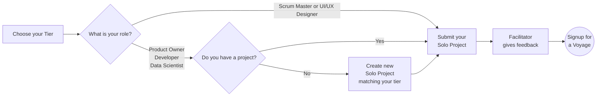

# Solo Project Guide

## Overview

The goal of the Solo Project is to help you and the Chingu team verify that
you've chosen a Tier that gives you the best chance of success in a Voyage. It
also gives you another app you can add to your portfolio.

When you are done and have submitted your Solo Project our team will 
evaluate your project and provide feedback you can use on both functionality 
as well as your UI/UX.

## Steps to Follow

### 1. Choose your Tier 1️⃣-2️⃣-3️⃣

You'll first need to choose a *_tier_* that matches your
current skill level. There are three tiers and you should select the one that
best matches your current skill level - beginner (Tier 1),
intermediate (Tier 2), or experienced (Tier 3).

For Developers

<table>
<tr>
<td><strong>Tier</strong></td>
<td><strong>Requirements</strong></td>
</tr>
<tr>
<td>Tier&nbsp;1</td>
<td>

This tier is for developers who are starting out in frontend web development.

<strong>Skills:</strong>
<ul>
    <li>Basic understanding of CSS and HTML.</li>
    <li>Ability to create simple apps using any frontend framework such as ReactJS, SvelteJS, VueJS, Angular, Django, etc.
    <li>Familiarity with at least one programming language (Python, Javascript, PHP, Ruby, etc.)</li>
    <li>Ability to create and deploy a webpage to the Internet that dynamically interacts with events such as buttons and form fields to alter the information displayed on the screen.</li>
</ul>
<strong>Tools</strong>
<ul>
    <li>Code Editor: Familiarity with a code editor such as Visual Studio Code, Neovim, Webstorm, etc.</li>
    <li>Git/GitHub: Basic understanding of how to use Git/GitHub. Familiarity with cloning repositories, committing changes, and pushing code.</li>
    <li>Web Development Tools: Basic use of browser developer tools for debugging HTML and CSS.</li>
    <li>Deployment Tools: Hosting services to deploy static web pages such as GitHub Pages, Netlify, Vercel, Render, Railway, etc.</li>
</ul>

Your Solo Project <strong><em>must</em></strong> be defined using CSS and HTML, which also uses logic (designed and written by you) which dynamically processes events and inputs to display or modify information on the screen.

In addition, Tier 1 Chingus will only use vanilla CSS/HTML + a programming language for Solo Projects and Voyages. Those using any form of FE framework such as React, VueJS, Svelte, etc. should apply for Tier 2 or higher.

</td>
</tr>
<tr>
<td>Tier&nbsp;2</td>
<td>

This tier is for developers who have a solid foundation in frontend web development.

<strong>Skills:</strong>
<ul>
    <li>Intermediate HTML and CSS.</li>
    <li>Intermediate or advanced programming experience with JavaScript/PHP/Python/Ruby/etc.</li>
    <li>Understanding of CSS preprocessors like SASS, LESS, Stylus, or TailwindCSS.</li>
    <li>Understanding of Responsive Web Design basics.</li>
    <li>Understanding of how to use an API to retrieve data from a backend system.</li>
    <li>Experience with either Web Components or a front-end framework such as React, Vue, Angular, etc.</li>
</ul>

<strong>Tools</strong>
<ul>
    <li>Advanced Code Editor Usage: Proficient use of code editors with advanced features such as integrated terminals, version control systems, and debugging tools.</li>
    <li>Git/GitHub: Familiarity with Git/GitHub concepts such as branching, merging, pull requests, and resolving conflicts.</li>
    <li>Web Development Tools: Intermediate use of browser developer tools for debugging HTML, CSS, and Javascript.</li>
    <li>Deployment Tools: Familiarity with deployment tools such as Netlify, Vercel, Railway, Render, or similar services<li>
</ul>

Your Solo Project <strong><em>must implement</em></strong> a front-end app as follows:

<ul>
    <li>Written using either Web Components or a framework such as React, Svelte, VueJS, etc.</li>
    <li>Implement logic (designed and written by you) which dynamically processes events and inputs to display or modify information on the screen.</li>
</ul>
</td>
</tr>

<tr>
<td>Tier&nbsp;3</td>
<td>

This tier is for developers with intermediate or advanced competency in web development technologies.

<strong>Skills:</strong>
<ul>
    <li>Intermediate or Advanced HTML and CSS</li>
    <li>Intermediate or advanced programming experience with JavaScript/PHP/Python/Ruby/etc.
    <li>Experience in a framework/library like React, Vue, Angular, etc.
    <li>Understanding of how to create and use APIs with REST or GraphQL API.
    <li>Ability to create a backend server which implements an API of your own design using packages such as Express.</li>
</ul>

<strong>Tools:</strong>

<ul>
    <li>Integrated Development Environment (IDE): Mastery of a full-fledged IDE like WebStorm or advanced usage of Visual Studio Code for full-stack development.</li>
    <li>API Development Tools: Advanced use of REST or GraphQL API tools, including API design and documentation tools like Swagger or Apollo.</li>
    <li>Database Management Tools: Familiarity with database tools and ORMs for interacting with SQL (like PostgreSQL, MySQL) or NoSQL databases (like MongoDB).</li>
</ul>

Your Solo Project <strong><em>must</em></strong> meet these criteria:

<ul>
    <li>Must include distinct files which separate the FE and BE application logic in a way the follows the Separation of Responsibility Principle (SRP).</li>
    <li>If the app accesses a database it must be accessed only from the BE logic. Applications that access databases from FE logic will not be accepted.</li>
    <li>The BE logic must implement an app-specific API that is only implemented in the BE. The FE must access the BE API to deliver services to the end user.</li>
    <li>Applications that use technology like Firebase only for authentication are not acceptable. Apps which couple this form of authentication with application specific API are acceptable.</li>
    <li>The FE logic must include logic developed by the Chingu that operates on the data to transform it, change it, or present it to the end userIt must implement a front-end application that accesses a back-end server that implements an API of your own design, optionally using a database such as a NoSQL DBMS like MongoDB or a SQL DBMS like PostgreSQL.</li>
    <li>Your backend must include CRUD (if using a database) or POST/READ/UPDATE/DELETE (for APIs).</li>
</ul>
</tr>
</table>

For UI/UX Designers

<table>

<tr>
<td><strong>Tier</strong></td>
<td><strong>Requirements</strong></td>
</tr>

<tr>
<td>Tier&nbsp;1</td>

<td>
<strong>Skills:</strong>
<ul>
    <li>Basic Design Principles: Understanding of basic design concepts like color theory, typography, layout, and composition.</li>
    <li>User Research: Basic knowledge of conducting user research, creating user personas, and understanding user needs.</li>
    <li>Wireframing and Prototyping: Familiarity with tools to create simple wireframes and prototypes.</li>
    <li>UI/UX Fundamentals: Entry-level understanding of user interface and user experience principles.</li>
    <li>Basic Accessibility Principles: Awareness of challenges faced by those with vision, hearing, motor, cognitive, etc. differences.</li>
</ul>

<strong>Tools:</strong>

<ul>
    <li>Design Software: Entry-level proficiency with user interface design tools like Figma or Sketch. Skills include using frames, groups, shapes, text entry, and font, color, size, and effect configuration.</li>
    <li>Prototyping Tools: Basic usage of tools like InVision, Marvel, or Figma to create simple prototypes.</li>
    <li>User Research Tools: Basic understanding of tools such as Google Forms or Typeform which may be used for conducting surveys or user interviews.</li>
</ul>
</td>
</tr>

<tr>
<td>Tier&nbsp;2</td>

<td>
<strong>Skills:</strong>
<ul>
    <li>Design Principles: Strong grasp of design principles, ability to create visually appealing and functional designs.</li>
    <li>User-Centered Design: Familiarity with user personas, conducting in-depth user research, and applying insights to design decisions.</li>
    <li>Information Architecture: Ability to structure information effectively for better user experiences.</li>
    <li>Usability Testing: Understanding and conducting usability testing to gather feedback and iterate designs.</li>
</ul>
<strong>Tools:</strong>

<ul>
    <li>Design Software: Familiarity using tools like Figma, Sketch, or similar tools for design tasks.</li>
    <li>Prototyping and Animation Tools: Ability to create interactive prototypes using advanced features in tools like Figma, Principle, or Adobe After Effects.</li>
</ul>
</td>
</tr>

<tr>
<td>Tier&nbsp;3</td>

<td>
<strong>Skills:</strong>
<ul>
    <li>Design Skills: Understanding of design principles, visual aesthetics, and creativity in problem-solving.</li>
    <li>User Research: Ability to conduct comprehensive user research, analyze data, and derive actionable insights.</li>
    <li>Design System Creation: Familiarity in developing and maintaining design systems for consistency and scalability.</li>
    <li>Leadership and Collaboration: Ability to lead design projects, collaborate with cross-functional teams, and communicate design rationale effectively.</li>
</ul>

<strong>Tools:</strong>

<ul>
    <li>User Testing Tools: Familiarity with tools like UserTesting.com, Maze, or Lookback for conducting user testing and gathering insights.</li>
    <li>Design Software: Mastery of tools like Figma, Sketch, or other industry-standard software.</li>
    <li>Prototyping and Animation Tools: Use of prototyping tools like Framer, Principle, or advanced animation features in design software.</li>
    <li>Collaboration Tools: Familiarity with team collaboration tools like Miro, Notion, or Trello for team coordination and project management.</li>
</ul>
</td>
</tr>
</table>

For Product Owners

 
All Product Owners are welcome at Chingu, regardless of whether they have training or a certification. However, participation is regulated to ensure they have the skills needed to guide Voyage teams in a effective manner.

> If you are a Product Owner requiring training or perhaps a refresher we recommend you consider [The Job Hackers](https://www.thejobhackers.org/). 

Product Owner duties and responsibilities are the same regardless of what tier they are placed in during a Voyage. For this reason PO's are't asked to choose a tier when submitting a Solo Project.

However, they should meet these requirements, which are the minimum needed to successfully guide a Voyage team.

<table>
<tr>
<td><strong>Requirements</strong></td>
</tr>

<tr>
<td>
<strong>Skills:</strong>
<ul>
    <li>Understanding Agile Principles: Grasp the basics of the Agile Methodology and Scrum.</li>
    <li>Communication: Ability to articulate ideas clearly and effectively.</li>
    <li>User Story Writing: Crafting user stories that are simple, clear, and understandable.</li>
    <li>Basic Product Management: Entry-level understanding of product development cycles.</li>
    <li>Analytics and Metrics: Basic understanding of key product metrics and how to measure them.</li>
    <li>Strategic Thinking: Ability to align the product roadmap with the company's overall strategy. This includes crafting product vision & goals, plus sprint goals.</li>
</ul>

<strong>Tools:</strong>
<ul>
    <li>Project Management Tools: Familiarity with tools like Trello, Asana, or Jira for basic task tracking.</li>
    <li>Prototyping Tools: Familiarity with tools like Figma, Sketch, etc. for basic prototyping.</li>
    <li>Communication Tools: Proficiency in Slack, Discord, or similar platforms for team communication.</li>
</ul>

<strong>Restrictions:</strong>
<ul>
    <li>Product Owners who are certified are eligible to guide Voyage teams once they complete their Solo Project</li>
    <li>Product Owners who are trained, but not certified must shadow another Product Owner in a Voyage before they can guide their own team in a subsequent Voyage</li>
    <li>Product Owners with no training and no certification may only shadow more experienced Product Owners in a Voyage</li>
    <li>If you have successfully completed the [AgileMBA program](https://www.thejobhackers.org/participant/) Chingu considers you to be the same as someone who is both trained and certified.</li>
</ul>
</td>
</tr>

</table>

For Scrum Masters

<table>
<tr>
<td><strong>Tier</strong></td>
<td><strong>Requirements</strong></td>
</tr>

<tr>
<td>Tier&nbsp;1</td>

<td>
<strong>Skills:</strong>
<ul>
    <li>Basic understanding of Scrum framework: Knowledge of key concepts, values, principles, and ceremonies.</li>
    <li>Facilitation: Able to guide and support team meetings like daily stand-ups and retrospectives.</li>
    <li>Communication: Clear and open communication with team members and stakeholders.</li>
    <li>Conflict Resolution: Ability to identify conflicts within the team and resolve them effectively.</li>
    <li>Time Management: Capability to manage meetings efficiently and keep the team on track.</li>
    <li>Listening: Attentive listening to team members' concerns and feedback.</li>
    <li>You have no formal training as a Scrum Master and you have not completed any certifications.</li>
</ul>

<strong>Tools:</strong>
<ul>
  <li>Project Management Tools: Familiarity with tools like Trello, Asana, or Jira for basic task tracking.</li>
  <li>Communication Tools: Proficiency in Slack, Discord, or similar platforms for team communication.</li>
  <li>Video conferencing: Platforms such as Discord, Zoom or Google Meet for remote meetings.</li>
  <li>Documentation: Familiarity with using tools like Google Drive for maintaining project documentation.</li>
</ul>

<strong>Restrictions:</strong>
<ul>
  <li>In a Voyage Tier 1 SM's may not lead teams. However, they will be assigned to "shadow" either a Tier 2 or a Tier 3 PO.</li>
</ul>
</td>
</tr>

<tr>
<td>Tier&nbsp;2</td>

<td>
<strong>Skills:</strong>
<ul>
    <li>Scrum knowledge: In-depth understanding of Scrum roles, artifacts, and ceremonies.</li>
    <li>Coaching: Ability to mentor and guide the team to improve processes and practices.</li>
    <li>Conflict Resolution: More advanced skills in handling team conflicts and fostering a collaborative environment.</li>
    <li>Continuous improvement: Promoting and implementing continuous improvement strategies.</li>
    <li>Metrics and Reporting: Use metrics (e.g., velocity, burndown charts) to track and improve team performance.</li>
    <li>Change Management: Navigating change and helping the team adapt to new circumstances.</li>
    <li>You have completed formal Scrum Master training, but you have not completed a certification.</li>

</ul>

<strong>Tools:</strong>
<ul>
    <li>Project Management Tools: Further proficiency in tools like Jira, Miro, ClickUp, etc..</li>
    <li>Advanced Agile project management: Utilizing tools like those above with plugins & with the ability to customize workflows.</li>
    <li>Collaboration tools: Use of platforms like Discord, with channels and threads, for improved team communication.</li>
    <li>Metrics and analytics tools: Utilizing burndown charts, velocity charts, and other reports for data-driven decision making.</li>
    <li>Visualization tools: Using tools like Miro or Lucidchart for process mapping and collaboration.</li>
</ul>
</td>
</tr>

<tr>
<td>Tier&nbsp;3</td>

<td>
<strong>Skills:</strong>
<ul>
    <li>Scrum Expertise: Use Scrum and Agile methodologies and the ability to adapt them to different teams and projects.</li>
    <li>Leadership and Mentorship: Inspiring teams to high performance. Guiding and mentoring junior team members.</li>
    <li>Strategic thinking: Developing strategies for improving team and organizational performance.</li>
    <li>Metrics and data analysis: Using data analytics to gain insights and drive improvement.</li>
    <li>Conflict Management: Understand how to resolve and prevent conflicts inside and outside the team</li>
    <li>You have completed formal Scrum Master training and you hold a certification as a Scrum Master.</li>
</ul>

<strong>Tools:</strong>
<ul>
    <li>Collaboration tools: Integrating various communication, task management, and reporting tools for optimized workflows.</li>
    <li>Data analytics tools: Utilizing advanced analytics tools and data visualization software to derive insights.</li>
</ul>
</td>
</tr>
</table>

For Data Scientists

<table>
<tr>
<td><strong>Tier</strong></td>
<td><strong>Requirements</strong></td>
</tr>

<tr>
<td>Tier&nbsp;1</td>

<td>
<strong>Skills:</strong>
<ul>
    <li>Basic understanding of programming (Python, R, Javascript, etc.)</li>
    <li>Fundamental knowledge of statistics and mathematics</li>
    <li>Ability to clean and preprocess data</li>
    <li>Basic knowledge of data visualization</li>
    <li>Familiarity with basic machine learning concepts</li>
    <li>Understand basic Web Development processes such as git/GitHub, Agile project management, etc.</li>
</ul>

<strong>Tools:</strong>
<ul>
    <li>Programming Languages: Python, R, or Javascript</li>
    <li>Data Manipulation: Pandas (Python), Pandas.js or Data-Forge (Javascript)</li>
    <li>Data Visualization: Matplotlib, Seaborn (Python), D3 (Javascript)</li>
    <li>IDEs: Jupyter Notebook</li>
</ul>
</td>

</tr>
<tr>
<td>Tier&nbsp;2</td>
<td>
<strong>Skills:</strong>
<ul>
    <li>Programming for data analysis and manipulation</li>
    <li>Understanding of statistical analysis and hypothesis testing</li>
    <li>Knowledge of data engineering principles</li>
    <li>Understanding of big data technologies and frameworks</li>
</ul>

<strong>Tools:</strong>
<ul>
    <li>Statistical Analysis: NumPy, SciPy (Python), Math.js, NumJS (Javascript), R</li>
    <li>Database Query Languages: SQL</li>
    <li>Advanced Visualization: Plotly, Tableau, D3, etc.</li>
</ul>
</td>
</tr>

<tr>
<td>Tier&nbsp;3</td>
<td>
<strong>Skills:</strong>
<ul>
    <li>Understanding of advanced machine learning algorithms and their implementation</li>
    <li>Ability to build and deploy complex models</li>
    <li>Expertise in data engineering and architecture</li>
    <li>Strong problem-solving and analytical skills</li>
    <li>Experience with machine learning algorithms and model evaluation</li>   
</ul>

<strong>Tools:</strong>
<ul>
    <li>Machine Learning Libraries: Scikit-learn (Python), TensorFlow.js (Javascript)</li>
    <li>Deep Learning Frameworks: TensorFlow, PyTorch, etc.</li>
    <li>Model Deployment: Flask, Docker, Kubernetes</li>
    <li>Cloud Platforms: AWS, Azure, Google Cloud Platform, etc.</li>
</ul>
</td>
</tr>
</table>

### 2. Submit a project that matches your tier 👍

You will need to submit a project that matches the requirements of the tier you've
chosen then go ahead and submit it for evaluation. Your project can be one 
you've completed on your own or as a part of a team. 

It **must** meet these criteria:
    
- Your project should match the requirements of the 
[tier you have chosen](#1-choose-your-tier)
- It should be original work (not copied from someone else, including tutorials
or AI-generated code)
- If created as part of a team you should be a major contributor to the project
- It has been developed within the last 12 months, or has a significant number 
of commits made by you within the last year.

Remember that you are required to produce original work! You should not copy and submit a solo project you did not personally author. For more information refer to our [Community Standards](../../gettingstarted/communitystds.md).

#### If you are a Developer or Data Scientist

You'll be asked to provide the URLs for both your GitHub repo and the [deployed application](../../resources/techresources/techstack.md#deployment-options) when you submit the [Solo Project Completion Form](https://forms.gle/VCpN1K6j341Vz1dq6) for your project.

Your project source code **must be hosted on GitHub** and your completed project must be deployed on the Internet.

#### If you are a Product Owner

If you are in the Product Owner role your Solo Project submission form includes a short quiz to help both you and Chingu assess your level of PO skill. You can find the quiz in the [Solo Project Completion Form](https://forms.gle/VCpN1K6j341Vz1dq6). The minimum passing score for the quiz is 80%. But, if you score below that we'll let you update your answers for the questions you missed. 

You will also be asked to provide the URL of a public website containing a sample product backlog you have created. This backlog can be in the service of your choice including GitHub Projects, Trello, Miro, ClickUp, Jira, or any similar tool.

Your sample product backlog doesn't need to be complicated, but it should demonstrate that you understand how to organize the project visually using a combination of Epics, User Stories, and Tasks. Including dependencies between these product backlog items as well as acceptance criteria, edge cases, and test criteria is a definite plus.

If you You don't have a project you can create a backlog from tis project specification.

| Project Name | Tier 1 | Tier 2 | Tier 3 |
| :--- | :--- | :--- | :--- | 
| Chingu Trivia | [Click here](https://github.com/chingu-voyages/soloproject-tier1-chingu-trivia-po) | [Click here](https://github.com/chingu-voyages/soloproject-tier2-chingu-trivia-po) | [Click here](https://github.com/chingu-voyages/soloproject-tier3-chingu-trivia-po) |

#### If you are a Scrum Master

If you are in the Scrum Master role your Solo Project submission form includes a short quiz to help both you and Chingu assess your level of PO skill. These include a combination of multiple choice and a few long form questions. You can find the quiz in the [Solo Project Completion Form](https://forms.gle/VCpN1K6j341Vz1dq6). 

The minimum passing score for the quiz is 80%. But, if you score below that we'll let you update your answers for the questions you missed. 

#### If you are a UI/UX Designer

You will also be asked to provide the URL of a public website containing a website design you have created. This could be a design hosted on Figma, AdobeXD, or in any other prototyping tool. It might also be a more formal study including things like the definition of personas and stakeholder goals as well as basic screen layout and navigation.

### 3. Submit a Solo Project Completion Form ✅
    
When you've completed your Solo Project you will need to submit the **[Solo Project Completion Form](https://forms.gle/bwPYEaco5a3KhMqU6)** before you can move on to the Voyage Project.

> You are encouraged to submit this form as soon as your Solo Project is done. There is no need to wait until the submission deadline if you finish earlier.
> 

Once you submit the Solo Project Completion Form your project will be 
evaluated within **_2 business_** days and a member our team will provide you with 
status in a Discord direct message (DM).

There is no need to resubmit the completion form once you've received 
feedback. If any rework is requested you can open a support ticket 
[here](https://discord.com/channels/330284646283608064/1105911757177888908)
when you are ready for your project to be retested.
    
## Solo Project Tips ✏️
    
1. It is more important to complete the project than it is to add features since completion is required before you can advance to the Voyage Project.
2. Concentrate on completing the required tasks for your tier and then work on bonus tasks only if time permits. Keep in mind that advancing to the Voyage phase of the Cohort depends on the completion of the required tasks listed in the project repo we've provided.
3. Choose tools you are comfortable and productive with. In the limited time available to complete the Solo Project it's not a good idea to try to use something you don't already know.
4. Unless otherwise noted in the required tasks for your tiers Solo Project the languages, tools, libraries, and frameworks you use are up to you. For example, all of the following approaches are acceptable paths to a successful project:
    - Using any language for web development, not just Javascript
    - Using Vanilla JS instead of a library or framework
    - Using a framework of your choice like React or Vue
    - Using a boilerplate or generator like Create React App (CRA)
    - Using a CSS library or creating your own CSS
5. Your repo should contain a well written [readme](https://medium.com/chingu/keys-to-a-well-written-readme-55c53d34fe6d).
6. Remember that your app should run error-free. There should be no errors in the browser or server console logs.
7. When you submit your project ***you must provide URL's for***: 
    - the publicly accessible repository containing your project (eg. Github).
    - the running version of your project where you have deployed it on an 
    Internet accessible host (eg. Github Pages, Netlify, etc.) so we can evaluate not
    just your code, but also your UI/UX.
8. You may **NOT** use a source code generator (like GitHub Co-Pilot) to 
create any part of your Solo Project.
9. Chingu is all about collaborative learning and supporting each other as
    we level up! Use our Discord channels to get help and advice.
