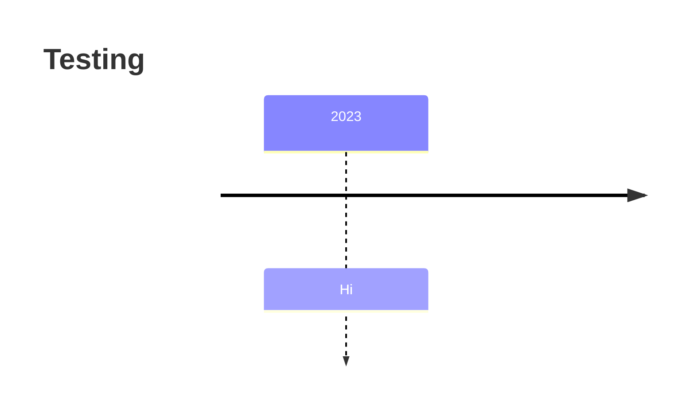

# Voyage Guide

### What are Voyages?

Voyages are 6-week long remote team projects where you'll level up your skills and experience to help you land your dream job by

- Putting the technical knowledge you've gained into practice.
- Improving "soft" skills like teamwork, collaboration, and project management.
- Being accountable to your commitments to your team and yourself.

# Before you Start

Voyages have specific requirements, milestones, and ***require a commitment of 8-12 hours per week*** from each team member. 

- Voyage Schedule



```mermaid
timeline
  title 2023
  Jan : Voyage 42
  Feb : 
  Mar : Voyage 43
  Apr : 
  May :  
  Jun :  
  Jul :  
  Aug : Voyage 45 
  Sep :  
  Oct : Voyage 46 
  Nov :  
  Dec : 
```   
    
    
    
    
    
- Team Member Roles
    
    The primary goal of all team members is to work together in a professional manner to identify, design, develop, and deploy the MVP for their team project.
    
    Team members contribute to the project in different ways, each having their own set of responsibilities depending on their role - Developer, UI/UX Designer, or Product Owner.
    
    All members of the team must commit to following the Agile methodology to develop the team project they've chosen. This involves actively participating in team meetings and discussions, sharing their daily status with the team, and completing the tasks they volunteer to work on in each Sprint.
    
    | Role Name | Role Description |
    | --- | --- |
    | Developer | Developers are focused on designing, writing code, testing what has been developed, and deploying it to the Internet. |
    | UI/UX Designer | UI/UX Designers help guide the team to create a project that follows UI/UX "best practices" to create apps that are both functional and pleasing to use.
    
    They create & maintain app sketches, storyboards, & prototypes, define styles and user interaction flows, and assist with Developer tasks as necessary. |
    | Product Owner | Product Owners guide the team through the Voyage using the Agile methodology as their roadmap. They are "servant leaders" who lead through teamwork & motivation since Chingu teams have a flat, rather than a hierarchical structure. |
    | Voyage Guide | Voyage Guides are experienced Chingus who have successfully completed 1 or more Voyages and have volunteered to help provide help and advice to Voyage teams.
    - Voyage Guides are NOT active participants. They don’t attend meetings and don’t contribute code to the project
    - Voyage Guides are available 1-2 hours per week to help answer questions and provide advice.
    - Team members should research questions they have BEFORE asking their Voyage Guide. |
    | Data Scientist | Data Scientists help the team to add value to the project by using advanced data analysis and/or ML to create dashboards and data visualizations based on data captured by the application. |
- How to Prepare for your Voyage
    
    [Pre-Voyage Preparation Steps](https://www.notion.so/ecab5ff738fd42cf951f00fb3486127f?pvs=21)
    
    - Brush up on your “Soft Skills”
        - [ ]  Complete a [Solo Project](https://www.notion.so/Solo-Projects-2a41ff900cc24a72a919f0eb5e79c42b?pvs=21) if this is your first Voyage
        - [ ]  Read **[How to be a Great Teammate](https://www.notion.so/How-to-be-a-Great-Teammate-ce30ff77eee74c2b9200a538761346a7?pvs=21)** (5 minutes)
        - [ ]  Read **[Soft Skills 101](https://www.notion.so/Soft-Skills-101-22e14f0c4ab7420d9835e5060ffa2a9a?pvs=21)** **for the type of communication skills you should practice here.** (5 minutes)
    - Familiarize yourself with Git
        - [ ]  Read **[What is Git](https://guides.github.com/introduction/git-handbook/)**
        - [ ]  Read **[Interactive Git Tutorial](https://learngitbranching.js.org/)**
        - [ ]  Read **[Git Cheatsheet](https://training.github.com/downloads/github-git-cheat-sheet/)**
    - Familiarize yourself with GitHub
        - [ ]  If you don’t already have a **[GitHub account](https://github.com/)** create one (5 minutes)
        - [ ]  Set up **[Git on your computer & hook it up to GitHub authentication](https://help.github.com/articles/set-up-git/)** (10 minutes)
        - [ ]  Study **[Introduction to GitHub](https://docs.github.com/en/get-started/quickstart/hello-world)**
        - [ ]  Study **[Uploading Your Project to GitHub](https://docs.github.com/en/get-started/using-git/pushing-commits-to-a-remote-repository)**
        - [ ]  Study **[Markdown](https://docs.github.com/en/get-started/writing-on-github/getting-started-with-writing-and-formatting-on-github/quickstart-for-writing-on-github)**
        - [ ]  Study **[Merge Conflicts](https://docs.github.com/en/pull-requests/collaborating-with-pull-requests/addressing-merge-conflicts/about-merge-conflicts)**
        - [ ]  Study **[Pull Requests](https://docs.github.com/en/pull-requests/collaborating-with-pull-requests/proposing-changes-to-your-work-with-pull-requests/about-pull-requests)**
- What Level of Commitment is Required for a Voyage?
    
    During this 6-week team effort you'll learn new technical skills, refine the skills you already have worked hard to build, and learn "soft" skills like teamwork, Agile Development, planning, & design. In other words, the skills that will help set you apart from other job candidates.
    
    But, while Chingu doesn't charge for organizing & managing Voyages it doesn't mean they are "free". Getting the most out of your Voyage requires dedication and commitment to be an active participant with your teammates and to finish what you start.
    
    - Be an active participant rather than a passive observer.
    - Set aside an average of 6-8 hours per week for your Voyage
    - Submit the weekly Voyage Checkin form we’ll provide each week to help us understand not just how you are doing, but how we can improve as well
    
    We know you can do this and you'll find the impact on your career will be worth the effort.
    
- How do I make a voice channel for my team?
    
    To create a temporary voice channel for your team, simply navigate to the Voice Channel HUB category and click on the channel named “Hub - Join to create”. This will create a voice channel in your name, and move you to that channel. Once everyone leaves the channel, the channel will be removed immediately.  
    
    
    
    If you can see the category or the HUB channel, you have to navigate to the bottom and click on “Show all”
    
    
    
    **Please respect everyone's privacy, so don't join voice channels that someone on your team hasn't made. Trolling, harassing, and other forms of disruptive behavior will not be tolerated.** 
    
    Why did you remove the private team channels that we had before?
    
    Because Discord allows for a limited amount of channels on a server, so by having temporary voice channels, it reduces the number of active channels and gives us more space. 
    

# The Voyage Process


- Sprint 1 - Getting off to a Solid Start
    - 1. Meet your team & schedule kickoff meeting
        
        **Objective**
        
        Teamwork is the foundation of any project and learning how to work effectively on a team is every bit as important as your technical knowledge. This is a skill that is valued by employers, so increasing your team skills is one way to set yourself above other job applicants.
        
        Your project’s success depends on how effective your team is at working together. In fact, this is more important than how much code you create or how fast you deploy it.
        
        **How**
        
        - Post an introduction in the team channel. Let your teammates know a bit about what you hope to achieve and more about you as a person as well as a Developer. Share your time commitments, available coding time per week, & goals with your teammates.
        - Use the Team Channel we've set up to schedule a time to meet up on a teleconferencing site such as Discord, Zoom, or TeamViewer.
        - Establish your shared goal for the Voyage as a team. Do you want to learn a new package like React? Do you want to learn a new feature like GraphQL for API’s?
        - Discuss your expectations for how the team will operate. Specifically, what does success look like for your team, how will you make decisions, and how will you deal with conflict?
        
        **Resources**
        
        [What Roles are there in a Voyage Team? (video)](https://youtu.be/f_TzehtBliE)
        
        [How to Select a Project video](https://youtu.be/5Xv0C5VAKZc)
        
        [Document Templates](https://drive.google.com/drive/folders/1uDjMWAzmmppDXnZKlhYHKCy1yxiQ90al?usp=sharing) (These will be copied to your team’s share document drive when the Voyage starts)
        
        [When2Meet](https://when2meet.com/)
        
        [How to Create a When2Meet Link (gif)](https://gfycat.com/minoryawningbasil)
        
    - 2. Conduct kickoff meeting
        
        **Objective**
        
        The Kickoff Meeting let’s you meet your team, review the goals & steps for Sprints 1 & 2, and gets you started on creating a solid foundation for your Voyage Project.
        
        **How**
        
        - The first person to arrive in the Team Channel on the first day of the Voyage should create a [When2Meet](https://www.when2meet.com/) event and post it’s URL in the channel. This will let everyone update it with their availability for the week so a Kickoff meeting can be scheduled.
        - Try to find a time as early as possible in Sprint 1 for your Kickoff meeting. Six weeks sounds like a long time, but it’s quite short and every day you delay in getting started counts!
        - Use the Voyage Kickoff meeting agenda template we’ve provided to guide you and as a place to record notes from the meeting. At the start of the Voyage a Google Drive directory for your team will be created, populated with document templates, and shared with the team.
        - ***Pro Tip!***
            
            You can use the audio/visual channel that’s been set up for your team for meetings. This channel supports not only audio & video in real time, but also screen sharing.
            
        
        **Resources**
        
        [Meeting template - Voyage Kickoff](https://docs.google.com/document/d/1ozP5lLj_R0kqCWdXEpFDR6sIlP9miXp74DFKZlJyktE/edit?usp=sharing)
        
    - 3. Choose a project & create a Vision Statement
    
    ** This is for Tier 3 teams only.** All Tier 1 & Tier 2 teams have been assigned a project and the link to its requirements and specification will be posted in your team channel.
        
        **Objective**
        
        Choose a project your team will be able to work together to complete during the Voyage. In addition to refining your technical skills you’ll also be learning new “soft” skills to help you advance your career. These include collaboration, communication, planning, & working in an Agile environment.
        
        **How**
        
        Exchange ideas and / or share screenshots and URLs of similar potential projects. Look at the referenced below to get ideas or create a project you and the team are passionate about.
        
        - Collect ideas from the team
        - Brainstorm with your team
        - Vote to select one idea
        - Decide on the technical stack you’ll use to construct it in
        
        Once you’ve agreed on a Project, create a short vision statement to capture what it does and the benefit it will bring to its users.
        
        **Resources**
        
        [How to Select a Voyage Project video](https://youtu.be/5Xv0C5VAKZc)
        
        [Voyage Project Showcase article](https://medium.com/chingu/chingu-fall-project-showcase-c6bf0f8210ab) (2020)
        [Voyage Project Showcase article (2021)](https://dev.to/chingu/build-collaborate-learn-remote-developer-projects-showcase-3bad)
        
        [Project Ideas template](https://docs.google.com/spreadsheets/d/1tDVXZoFYzc47cnCJJy9OIJdsuHFEVSLSIpaci6pWyxg/edit?usp=sharing)
        
        [Project Vision and Feature Planning template](https://docs.google.com/document/d/1pG-6ihL47P6IpMtcgVeb5_DWoatZcsMTwx_lGDmfh9o/edit?usp=sharing)
        
    - 4. Define & prioritize MVP features
        
        **Objective**
        
        Your [](https://docs.chingu.io/glossary#mvp-minimum-viable-product)[MVP (Minimum Viable Product)](https://www.notion.so/Glossary-c0b10b9e0c9a4e80a0c3482433fb08a4?pvs=21) is the minimum number of features your users need to get a solid understanding of your project.
        
        **How**
        
        - [ ]  Each team member should add their ideas to the Project Vision & Feature Planning template before the team meeting
        - [ ]  Prioritize each feature - *Must Have*, *Should Have*, *Nice to Have*
        - [ ]  Meet with the team to review each feature & refine priorities
        
        Once you’ve agreed on the features and their priorities you can add them to the Project Backlog.
        
        *Must Have*
        
        features define your MVP, while features in the other two priorities are “stretch goals'' to be worked on when you’ve implemented all the *Must Have*’s.
        
        **Resources**
        
        [Project Vision and Feature Planning Template](https://docs.google.com/document/d/1hod0AJXVe1T9HDqSwLr6VGXBz0HJ-HG4aM8JKoeBB00/edit?usp=sharing)
        
    
    [Sprint 1 Tasks at a Glance](https://www.notion.so/10fb8243444445a987f82f429a593c84?pvs=21)
    
- Sprint 2 - Getting off to a Solid Start
    - 5. Create a low-fidelity wireframe
        
        **Objective**
        
        Establish a common understanding across the team of what information is in each screen and the actions that may be invoked from each screen.
        
        **How**
        
        - [ ]  Using the features you added to the the Feature Planning template in step 4 identify the screens you’ll need and the information on each one.
        - [ ]  Map the actions users will be able to perform from each screen and the navigation from screen-to-screen
        - [ ]  Create a low-fidelity wireframe using a tool like [Figma](https://www.figma.com/) or even pencil and paper.
        
        **Resources**
        
        [How To Wireframe A Website in 3 Easy Steps](https://elementor.com/blog/wireframe-website/)
        
    - 6. Setup Project Backlog
        
        **Objective**
        
        The [Project Backlog](https://www.notion.so/Glossary-c0b10b9e0c9a4e80a0c3482433fb08a4?pvs=21) is where you track the work that needs to be completed to finish the project.
        
        **How**
        
        - [ ]  Identify & prioritize features
        - [ ]  Create an epic for each feature
        - [ ]  Choose the highest priority epics & divide them into user stories
        - [ ]  Add your epics & user stories to a backlog tool. Due to it’s tight integration with GitHub we suggest using ZenHub (it’s free for teams using public repositories)
        - [ ]  Prioritize the user stories
        
        During the Voyage you’ll refine the Project Backlog and in every Sprint you’ll move tasks from it to the Sprint Backlog. This is part of the Agile process helps you and your team concentrate only on the tasks that must be completed in that Sprint.
        
        **Resources**
        
        [Define Your MVP](https://www.notion.so/Glossary-c0b10b9e0c9a4e80a0c3482433fb08a4?pvs=21)
        
        [How to Create a Project Backlog (video)](https://youtu.be/FaoT-DTtXyA)
        
        [Agile Methodology 101 (article)](https://www.notion.so/Agile-Methodology-101-f9e0ccc88d894f609a652d6d8a4c0df6?pvs=21)
        
        [ZenHub website](https://www.zenhub.com/)
        
        [Install ZenHub browser extension](https://tinyurl.com/yfpcf7ke)
        
    - 7. Setup your team workflow
        
        **Objective**
        
        Define how you plan to work together as a team. This includes how often you’ll share status, coding standards, git/GitHub processes, and deciding how many meetings you need each week and when and where they’ll take place.
        
        **How**
        
        - [ ]  Decide on the coding standards the team must follow.
        - [ ]  Define the characteristics of your repo including the number of branches, branch names, & the workflow everyone must follow.
        - [ ]  Agree on the format of commit messages, how Pull Requests will be reviewed, and GitHub branch protection rules.
        - [ ]  Decide on where you’ll deploy your app and the branch to be considered as ‘production’ you’ll be deploying from.
        - [ ]  Decide on what meetings you’ll need each week and to save time, schedule them as recurring meetings. You might want to look ahead to to learn more about the types of meetings you’ll need.
        - [ ]  [Develop the App](https://www.notion.so/Voyage-Guide-1e528dcbf1d241c9a93b4627f6f1c809?pvs=21)
        
        **Resources**
        
        [Javascript Style Guides](https://codeburst.io/5-javascript-style-guides-including-airbnb-github-google-88cbc6b2b7aa)
        
        [Defining a Git Workflow (Chingu Handbook)](https://www.notion.so/Git-Workflow-d5fba28e1d3043e1910b7d2eb8999793?pvs=21)
        
        [Git Branches (Chingu Handbook)](https://www.notion.so/Git-Branches-7ccbd0a34e1c4b87af583e3760632727?pvs=21)
        
        [Git Commits (Chingu Handbook)](https://www.notion.so/Git-Commits-6334daca89f840f381ee1e57243091ad?pvs=21)
        
        [Git Pull Requests (Chingu Handbook)](https://www.notion.so/Git-Pull-Requests-6eeda3f9342941ef9a06d1057f0b87a6?pvs=21)
        
    
    [Sprint 2 Tasks at a Glance](https://www.notion.so/e02745c27a774a21a9a47c49d740db61?pvs=21)
    
- Sprint 3-5 - Reaching your MVP
    
    **Objective**
    
    Incrementally create your app by following the using Scrum, and Agile framework.
    
    **How**
    
    
    
    - *Sprint Planning* - Meet at the start of the sprint to select the highest priority tasks the team can realistically complete in this sprint
    - *Post Daily Status* - Communicating & collaborating with your team is the most important factor to success. Post answers to these questions every day:
        - What tasks have I completed?
        - What am I currently working on and what will I work on next?
        - What issues or blockers do I need help with and from who?
    - *PR & Deploy* - As team members complete tasks they should create PR’s for review and deploy the app
    - *Sprint Review & Retrospective*
        - At the end of the sprint review how the team worked together & the processes you used. Make modifications as necessary to improve what didn’t work well and reinforce what did work well.
    
    Many teams have found the following meeting schedule helpful:
    
    - As early in the Sprint as possible, ideally every Monday or Tuesday, schedule a combined Sprint Review & Retrospective + Sprint Planning meeting
    - Schedule a second meeting on Wednesday or Thursday to address any changes to the Sprint plan. These changes could be the result of problems, bugs, differences of opinion, or the fact that you’ve completed all the tasks for this Sprint and need to select ones to work on next.
    - ***Pro Tip!*** Schedule your meetings to repeat on the same day and time in each Sprint so you only have to spend time scheduling them once.
    - Post your status daily in your Team Channel and use the audio/video channel we’ve created for you team for team meetings, ad hoc discussions, and pair programming.
    
    **Resources**
    
    [Agile Methodology 101 (Chingu Handbook)](https://www.notion.so/Agile-Methodology-101-f9e0ccc88d894f609a652d6d8a4c0df6?pvs=21)
    
    [How to Plan a Sprint (video)](https://www.youtube.com/watch?v=lumOOOKZzto)
    
    [Team Decision Log template](https://docs.google.com/spreadsheets/d/17DaEuYxFscWxe54YAHSr5jywpG8KvsBYVfwZTuIAyjo/edit?usp=sharing) ^
    
    [When2Meet website](https://when2meet.com/)
    
    [How to Create a When2Meet Link (gif)](https://gfycat.com/minoryawningbasil)
    
    [Meeting template - Sprint Review, Retrospective, & Planning](https://docs.google.com/document/d/1N0rMPGzjR2kPJrMOBKJMUmTx8KCMejJ46pQSRqzHckk/edit?usp=sharing) ^
    
    [Meeting template - Open Topic](https://docs.google.com/document/d/1AXboDCFO88yBXsavl83-LTgSzKROTuA8XPZqZqdj3Z8/edit?usp=sharing) ^
    
    ^  These are read only templates. Versions you can update are in your teams Google Drive directory that is available after your Voyage starts.
    
- Sprint 6 - Project Closure
    
    **Objective**
    
    The team’s goal in Sprint 6 is to wrap up the project & celebrate your success
    
    **How**
    
    - [ ]  Complete MVP functionality following the same processes you used in Sprints 1-5
    - [ ]  Ensure the Readme is up to date
    - [ ]  Do the final deployment of the application to a hosting site (note that this should be done at the end of each sprint)
    - [ ]  Optional: Create a Showcase video on YouTube!
        1. No more than 5 minutes long
        2. It should be available via a publicly accessible URL
        3. Answer these simple questions:
            1. What did we build?
            2. Who participated in the team?
            3. What technology stack did we use?
            4. What did we create? Demo the app
    - [ ]  Optional: Write an article about your experience for the Chingu page on [Dev.to](http://Dev.to) or Hashnode (see Resources below)
    - [ ]  Submit your completed project using the [Project Submission form](https://forms.gle/V8gfttw9VnoqumeaA)
    - [ ]  Celebrate your success as a team!
    - [ ]  Receive your Voyage Completion Certificate
    - [ ]  Update your resume, LinkedIn profile, portfolio page, etc. to include your Voyage experience, Completion Certificate, and your Showcase video or article if you’ve written one.
    
    **Resources**
    
    [Chingu Content Creators Guide](https://dev.to/chingu/chingu-content-creators-guide-3k6h)