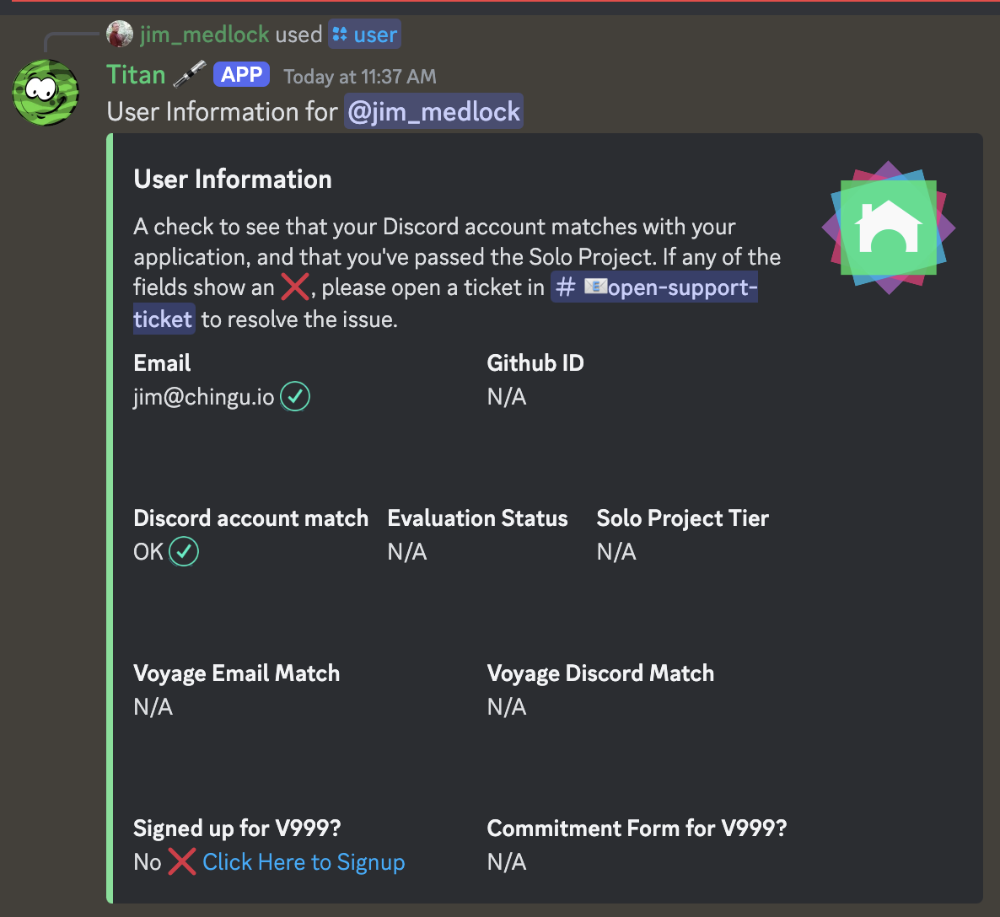

# How do I check my Voyage Status?

You can use the `/user` command in any Discord channel to find out if you
have completed your Solo Project and signed up for the next Voyage. You
can learn more [here](../../../docs/resources/techresources/titan.md#getting-your-chingu-status-information).

