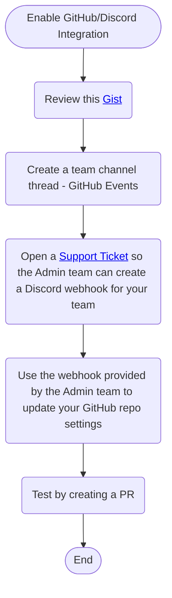

# How can you integrate GitHub & Discord?

Having GitHub status messages automatically posted in Voyage team Discord channels for
significant events, such as when PR's are created, is something that can be very helpful
for teams. For example, knowing that a PR has been created allows team members to act
quickly to help review it.

Follow the following these steps if this is something your team would like to use.

You can find more information and screenshots in [this Gist](https://gist.github.com/jagrosh/5b1761213e33fc5b54ec7f6379034a22).