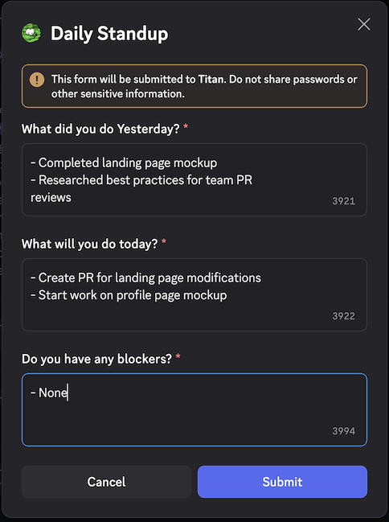
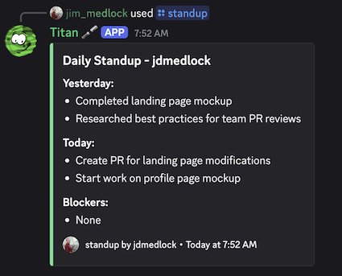

# How can I share Daily Standup status in my Team Channel❓

Every Voyage team should hold a daily Scrum Standup event so teammates can understand
what the teams progress is, task dependencies, and issues blocking progress.

Standups are ideally conducted as realtime meetings lasting no more than 15 minutes where
each team member answers 3 questions:

1. What did I do yesterday?
2. What will I do today?
3. What things are blocking my progress?

If your team can do this daily in realtime then great! But, if you aren't able to find
a common time for a realtime meeting every teammate should at least post their status daily
in your Discord team channel. We recommend using the `/standup` command for this.

This command creates an dialog you can use to enter your status,

Once you have entered your status in the dialog it will be displayed so your team can see it.

