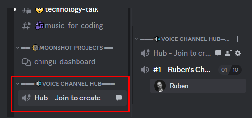
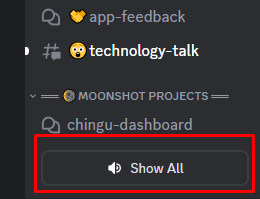
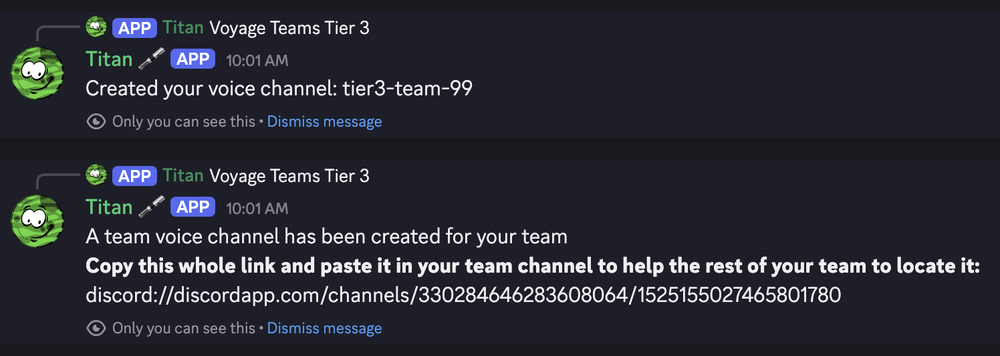

# How do I make a voice channel for my team❓

Communication and collaboration are the most important factors to a teams success. Because of
this we've created a way for Voyage Teams to create temporary voice channels in Discord, which
support voice, video, and screen sharing.
  
To create a temporary voice channel, navigate to the `Voyage Voice HUB` category (right above your
teams text Channel) and click on the channel named “#create-voice”.

Next, select your
tier and team from the list to create a voice channel for your team. The new voice channel will
show up right below your teams text channel. It will be removed automatically
after everyone leaves, or after 1 minute if nobody joins.  

If you can’t see the category or the `#create-voice` channel, you have to navigate to the top-menu 
and click on “Show All Channels”

If you dont see the voice channel, you have to navigate all the way to the bottom and click
"Show All"

When you create a voice channel, Titan will provide a link you can paste into
a browser to join the channel.

