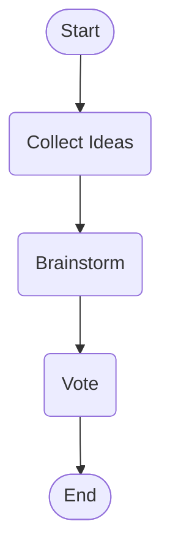
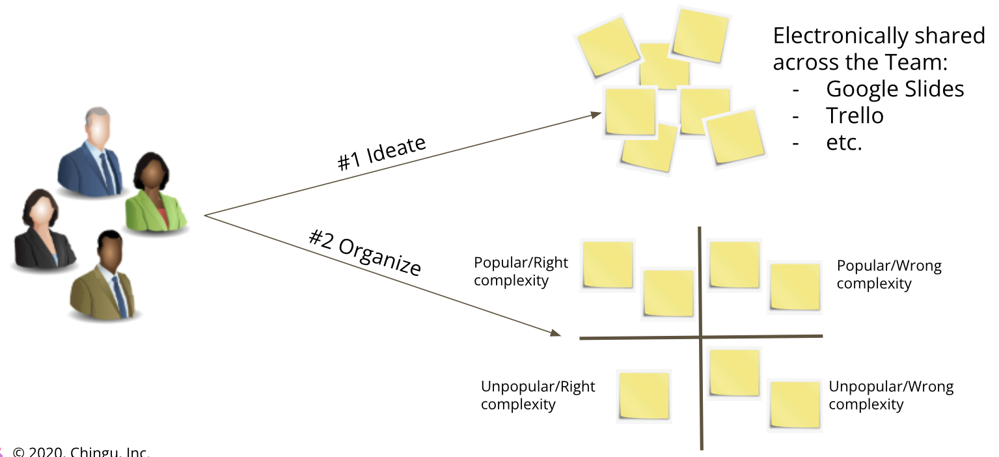
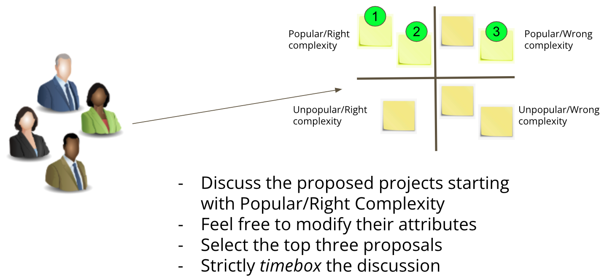
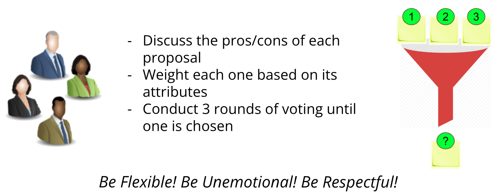

# How should my Team select a project?

If you are in a **Tier 1 or Tier 2** team this is easy! In your team channel we
have provided the requirements and specifications for the project you must
build.

If you are in a **Tier 3** team you have a choice to make as a team - build the
project we have provided requirements and specifications for or build your
own set of requirements and specifications for the project you wish to create.

If, as a Tier 3 team, you decide to build your own project here is a process
for making that decision. Remember this is a team decision and not a decision
any single team member can make.

### Collect ideas from the team

### Brainstorm with your team

### Vote to select one idea

