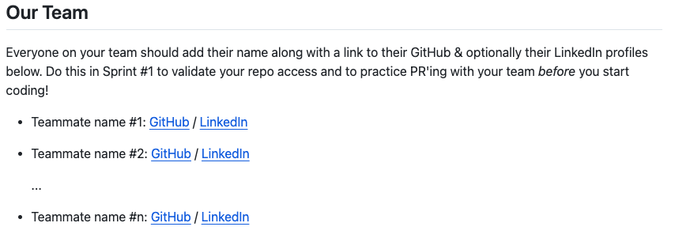

# Voyage


## All About Your Voyage

 1. [What are Voyages](#what-are-voyages)
 2. [Before you Start](#before-you-start)
 3. [The Voyage Process](#the-voyage-process)
 4. [Voyage Tips](#voyage-tips)

---

## What are Voyages❓

Voyages are 6-week long remote team projects where you'll level up your skills and build experience to help you land your dream job. This is by:

- Putting the technical knowledge you've gained into practice.
- Improving "soft" skills like teamwork, collaboration, and project management.
- Being accountable to your commitments to your team and yourself.
- Adding new skills like Agile & Scrum.

## Before you Start

Voyages have specific requirements, milestones, and ***require a commitment of 8-12 hours per week*** from each team member. 

Chingu doesn't charge for organizing & managing Voyages, but that doesn't mean they are "free". Getting the most out of your Voyage requires dedication and commitment on your part to be an active participant and to finish what you start.

### Voyage Schedule 🗓️
| Milestone | Voyage 59 | Voyage 60 | Voyage 61 |
| :--- | :--- | :--- | :--- |
| Solo Project Deadline | December 31, 2025 | March 11 | May 20 |
| Voyage Launch | January 12 | March 23 | June 1 |
| Weekly Checkin due | Every Monday | Every Monday | Every Monday |
| Voyage ends & projects due | February 22 | May 10 | July 19 |
| Demo Day presentations due | February 23 | May 11 | July 20 |
| Demo Day | February 25 | May 13 | July 22 |
| Completion Certificates issued | March 4 |  May 20 | July 29 |
| Showcase article available | March 4 | May 20 | July 29 |
### How to Prepare for your Voyage 📝

We know you have a lot of questions about our Voyages. Here are a few of those we hear most frequently.

[What Level of Commitment is Required for a Voyage](./topics/voyage_commitment.md)</br>
[What are the criteria for successfully completing a Voyage?](./topics/voyage_success_criteria.md)</br>
[How do I check my Voyage Status?](./topics/check_voyage_status.md)</br>
[What Does a Voyage Cost?](./topics/voyage_cost.md)</br>
[How should PO's and Scrum Masters work together?](./topics/voyage_posm_teamwork.md)</br>
[What are the roles in a Voyage team?](./topics/voyage_roles.md)</br>
[What are the tiers in a Voyage?](./topics/voyage_tiers.md)</br>
[How can I choose my Timeblock?](./topics/voyage_timeblocks.md)</br>
[How are Voyage teams formed?](./topics/voyage_teams.md)</br>
[What "Soft Skills" are needed?](./topics/voyage_soft_skills.md)</br>
[What if I need more skills?](./topics/voyage_skills.md)</br>
[What git & GitHub knowledge will I need?](./topics/voyage_git_github.md)</br>
[How should my Team select a project?](./topics/voyage_project.md)</br>
[How should PO's and Scrum Masters monitor the project?](./topics/voyage_project_monitoring.md)</br>

## The Voyage Process

```mermaid
---
config:
  layout: elk
  theme: dark
---
  block-beta
    columns 11

    block:B0:1
      columns 1
      block:B0TOP
        columns 11
        A1(("&nbsp;&nbsp;&nbsp; 1 &nbsp;&nbsp;"))
        space
        A2(("&nbsp;&nbsp;&nbsp; 2 &nbsp;&nbsp;"))
        A6(("&nbsp;&nbsp;&nbsp; 6 &nbsp;&nbsp;"))
        space
        A7(("&nbsp;&nbsp;&nbsp; 7 &nbsp;&nbsp;"))
        A9(("&nbsp;&nbsp;&nbsp; 9 &nbsp;&nbsp;"))
        A10(("&nbsp;&nbsp;&nbsp; 10&nbsp;&nbsp;"))
        A11(("&nbsp;&nbsp;&nbsp;11&nbsp;"))
      end
      space
      space
      space
      block:B0CENTER
        columns 11
        SPRINT0("&nbsp;Sprint 0&nbsp;")
        space
        SPRINT1("&nbsp;Sprint 1&nbsp;")
        space
        SPRINT2("&nbsp;Sprint 2&nbsp;")
        space
        SPRINTS35("&nbsp;Sprint 3-5&nbsp;")
        space
        SPRINT6("&nbsp;Sprint 6&nbsp;")
      end
      space
      block:B0BOTTOM
        columns 5
        A3(("&nbsp;&nbsp;&nbsp; 3 &nbsp;&nbsp;"))
        A4(("&nbsp;&nbsp;&nbsp; 4 &nbsp;&nbsp;"))
        A5(("&nbsp;&nbsp;&nbsp; 5 &nbsp;&nbsp;"))
        A8(("&nbsp;&nbsp;&nbsp; 8 &nbsp;&nbsp;"))
      end
      space

      A1 -- "<a style="background-color:#292d30" href="https://github.com/chingu-voyages/Handbook/blob/main/docs/guides/voyage/voyage.md#1-meet-your-team--schedule-kickoff-meeting-">Meet team &</br>schedule</br>Kickoff</a>" --> SPRINT0
      A2 -- "<a style="background-color:#292d30" href="https://github.com/chingu-voyages/Handbook/blob/main/docs/guides/voyage/voyage.md#2-conduct-kickoff-meeting-">Hold</br>Kickoff</br>Mtg.</a>" --> SPRINT0
      A3 -- "<a style="background-color:#292d30" href="https://github.com/chingu-voyages/Handbook/blob/main/docs/guides/voyage/voyage.md#3-setup-your-teams-working-agreements-">Create</br>team</br>working</br>agreements</a>" --> SPRINT0
      A4 -- "<a style="background-color:#292d30" href="https://github.com/chingu-voyages/Handbook/blob/main/docs/guides/voyage/voyage.md#4-choose-a-project--create-a-vision-statement-">Choose</br>project &</br>create</br>vision</br>stmt.</a>" --> SPRINT0
      A5 -- "<a style="background-color:#292d30" href="https://github.com/chingu-voyages/Handbook/blob/main/docs/guides/voyage/voyage.md#5-select-a-tech-stack">Select a</br>tech</br>stack</a>" --> SPRINT1
      A6 -- "<a style="background-color:#292d30" href="https://github.com/chingu-voyages/Handbook/blob/main/docs/guides/voyage/voyage.md#6-add-your-info-to-the-team-list-in-your-readmemd-%EF%B8%8F">Update</br>readme.md</br>team list<a/>" --> SPRINT1
      A7 -- "<a style="background-color:#292d30" href="https://github.com/chingu-voyages/Handbook/blob/main/docs/guides/voyage/voyage.md#7-define--prioritize-mvp-features-">Define &</br>prioritize</br>features</a>" --> SPRINT1
      A8 -- "<a style="background-color:#292d30" href="https://github.com/chingu-voyages/Handbook/blob/main/docs/guides/voyage/voyage.md#8-setup-product-backlog-">Create</br>Product</br>Backlog</a>" --> SPRINT1
      A9 -- "<a style="background-color:#292d30" href="https://github.com/chingu-voyages/Handbook/blob/main/docs/guides/voyage/voyage.md#9-create-a-low-fidelity-wireframe-%EF%B8%8F">Create</br>UI/UX design</a>" --> SPRINT2
      A10 -- "<a style="background-color:#292d30" href="https://github.com/chingu-voyages/Handbook/blob/main/docs/guides/voyage/voyage.md#10-sprint-3-5---reaching-your-mvp-">Design, code,</br>test & deploy</a>" --> SPRINTS35
      A11 -- "<a style="background-color:#292d30" href="https://github.com/chingu-voyages/Handbook/blob/main/docs/guides/voyage/voyage.md#11-sprint-3-5---reaching-your-mvp-">Project Closure</a>" --> SPRINT6
    end

    SPRINT0 --> SPRINT1
    SPRINT1 --> SPRINT2
    SPRINT2 --> SPRINTS35
    SPRINTS35 --> SPRINT6

    style B0TOP stroke:#292d30,fill:#292d30
    style B0CENTER stroke:#292d30,fill:#292d30
    style B0BOTTOM stroke:#292d30,fill:#292d30
        
    style A1 color:#f0f6fc,fill:#1d8348
    style A2 color:#f0f6fc,fill:#1d8348
    style A3 color:#f0f6fc,fill:#1d8348
    style A4 color:#f0f6fc,fill:#1d8348
    style A5 color:#f0f6fc,fill:#1d8348
    style A6 color:#f0f6fc,fill:#1d8348
    style A7 color:#f0f6fc,fill:#1d8348
    style A8 color:#f0f6fc,fill:#1d8348
    style A9 color:#f0f6fc,fill:#1d8348
    style A10 color:#f0f6fc,fill:#1d8348
    style A11 color:#f0f6fc,fill:#1d8348

    style SPRINT0 color:#f0f6fc,fill:#b9770e
    style SPRINT1 color:#f0f6fc,fill:#b9770e
    style SPRINT2 color:#f0f6fc,fill:#b9770e
    style SPRINTS35 color:#f0f6fc,fill:#b9770e
    style SPRINT6 color:#f0f6fc,fill:#b9770e
```



A team channel is provided in Discord to every team at the start of the Voyage. You should use this to communicate and collaborate with your teammates. Access to this channel is restricted to your team, so it's the best place for open, frank, and respectful communication with your teammates. 

**_Your team must not create your own Discord server, Slack channel, etc. to communicate with each other about your project._** Doing this means we won't be able to provide assistance when you
need it.

You will also be provided with a GitHub repo for your project. This is created for you in the `chingu-voyages` organization and everyone on your team is granted `admin`
access to it. But, **you must***:

- leave this as a public repo
- not rename the repo we've provided
- not create any additional repos on your own

If you need another repo, [open a ticket](https://discord.com/channels/330284646283608064/1105911757177888908) and a member of the Chingu Admin team will be happy to create it for you.

### Sprint 1 - Getting off to a Solid Start

https://github.com/user-attachments/assets/8e6d2c0f-02f2-484f-9a75-ff4b4c82ebfe

---
  #### 1. Meet your team & schedule kickoff meeting 📅
  
  **Objective**
  
  The foundation of any project is **teamwork** and learning how to work as a team is
  just as important as your technical knowledge. This is valued by employers, so increasing your team skills is one way to set you apart from other job applicants.
  
  Your project’s success depends on how effective your team is at working together.
  In fact, this is more important than how much code you create or how fast you deploy it.

  The first two sprints are devoted to create a solid foundation for your team. In
  these sprints you'll get to know your teammates, perform the highlevel design of 
  both you project, establish a working agreement with your team, and build the Product 
  Backlog to guide you in the remaining sprints.
  
  **How**
  
  - [ ]  ***Start by introducing yourself*** to your team. Post an introduction in your 
  team channel to let your teammates know about you as a professional and an individual.
  Share your availability, goals, and expectations with your teammates.
  - [ ]  ***Create a working agreement*** to define your shared goals for the Voyage and 
  expections. How will your share status information, how often will you meet, what are 
  your expectations, what does success look like for your team, how will you make 
  decisions, and how will you deal with conflict? Use this discussion to build a 
  _working agreement_ for how you'll go about building and maintaining the project.
  
  **Resources**
  
  [What the different roles in a Voyage team?](./topics/voyage_roles.md)</br>
  [Schej meeting availability tool](https://schej.it/home)</br>
  [Document Templates](https://github.com/chingu-voyages/voyage-template/tree/main/docs)
  (These read-only templates will be copied to the `docs` subdirectory in your
  team’s repo when the Voyage starts)

  ---
  #### 2. Conduct kickoff meeting 🫱🏼‍🫲🏽
    
  **Objective**
  
  In the Kickoff Meeting you will meet your teammates, review the goals & steps
  to follow in Sprints 1 & 2, discuss the project you will be building, agree on a
  working agreementand, plus anything else to create a solid foundation for teamwork.
  
  **How**
  
  - [ ]  When the Voyage starts, the first person in the Team Channel should create a 
  [Schej meeting availability event](https://schej.it/home) and post it in the channel. 
  Everyone can update add their availability so a Kickoff meeting can be scheduled.
  - [ ]  Find a time as early as possible in Sprint 1 for your Kickoff meeting. Six 
  weeks sounds like a long time, but it’s quite short and every day you delay in getting 
  started counts!
  - [ ]  Use the Voyage Kickoff meeting agenda template to guide you and as a place to 
  record notes and decisions. This and other helpful document templates ar in the `docs` 
  subdirectory in your team's repo.
  
  **Pro Tip!** Use the [audio/visual channel]() for your team for meetings. This 
  supports not only audio & video in real time, but also screen sharing.
      
  **Resources**
  
  [Meeting template - Voyage Kickoff](https://github.com/chingu-voyages/voyage-template/tree/main/docs) (These read-only templates will be copied to the `docs` subdirectory in your
  team’s repo when the Voyage starts)

  ---
  #### 3. Add your info to the team list in your README.md ✏️

  **Objective**
  
  Your team repo is a public GitHub repo where your team will maintain the source
  code for your project. Only you and your teammates have update access to it.

  Every member of the team should verify that they have update access
  to this repo. This includes Product Owners, Scrum Masters, UI/UX 
  Designers, and Developers.

  **How**

  

  - [ ] The `README.md` in your team repo has been pre-populated with a section titled
  "Our Team". Before the end of Sprint 1 every team member should add their
  infomation to it.

  This shows not only who is on the team, but it is also a quick and easy
  way to verify that everyone has update access.

  **Resources**

  [Defining a Git Workflow (Chingu Handbook)](../../resources/techresources/gitgithub.md#the-workflow)

  ---
  #### 4. Choose a project & create a Vision Statement 👓

  **This is for Tier 3 teams only.** All Tier 1 & Tier 2 teams have been assigned a project along with a link to its requirements and specifications in the team channel.
  
  **Objective**
  
  Choose a project your team will build during the Voyage. In addition to refining your technical skills you’ll also be learning new “soft” skills to help you advance your career. These include collaboration, communication, planning, & working in an Agile environment.
  
  **How**
  
  - [ ]  **Exchange ideas** and share screenshots or URLs of projects you would like to build.
  Look at the references below to get ideas or create a project you and the team are passionate about.
  
    - Collect ideas from the team
    - Brainstorm with your team
    - Vote to select one idea
    - Decide on the technical stack you’ll use to construct it in
  
  - [ ]  **Create a short vision statement** to capture what it does and the benefit it will bring to its users.

  This should be completed by the end of Sprint 1. Keep in mind that since the Voyage is
  only 6-weeks long it's important to get started quickly. In addition, you'll learn and
  build experience no matter what project you decide to create.
  
  **Resources**
  
  [How to Select a Project](./topics/voyage_project.md)</br>
  [Voyage Project Showcase articles (Dev.to)](https://dev.to/chingu)

  These read-only document templates will be placed in the `docs`
  subdirectory of your team’s repo at the start of the Voyage.

  * [Project Ideas template](https://github.com/chingu-voyages/voyage-template/tree/main/docs)
  
  * [Project Vision and Feature Planning template](https://github.com/chingu-voyages/voyage-template/tree/main/docs)

  ---
  #### 5. Define & prioritize MVP features 🔢
    
  **Objective**
  
  The [Minimum Viable Product (MVP)](../../resources/glossary/glossary.md) is the minimum number of features your users need to be able to use and get value from through your app.
  
  **How**
  
  - [ ]  Everyone should **add ideas** to the Project Vision & Feature Planning template
  **before** the team meeting
  - [ ]  **Prioritize each feature** - *Must Have*, *Should Have*, *Nice to Have*
  - [ ]  Meet with the team to **review** each feature & refine priorities
  
  Once you’ve agreed on the features and their priorities you will be ready to add them to the 
  Product Backlog.
  
  *Must Have* features define your MVP, while features in the other two priorities are “stretch goals'' to be worked on when you’ve implemented all the *Must Have*s.
  
  **Resources**

  [Project Vision and Feature Planning Template](https://github.com/chingu-voyages/voyage-template/tree/main/docs) (These read-only templates will be copied to the `docs` subdirectory in your
  team’s repo when the Voyage starts)

### Sprint 2 - Getting off to a Solid Start

https://github.com/user-attachments/assets/294995d7-2a55-4e29-8829-c5315b87ded6

  ---
  
  #### 6. Setup Product Backlog 📋
      
  **Objective**
  
  The [Product Backlog](../../resources/glossary/glossary.md) defines what needs to be
  completed to finish the project and to track your progress.

  > If you are creating your Voyage project based on specifications provided by
  Chingu you don't need to wait until Sprint 2 to start this task. Instead,
  get ahead and start it during Sprint 1.
  
  **How**
  
  - [ ]  Identify & prioritize features
  - [ ]  Create an epic for each feature
  - [ ]  Choose the highest priority epics & divide them into user stories
  - [ ]  Add your epics & user stories to a backlog tool. In prior Voyages, teams have used tools like Jira, Miro, GitHub Projects, Trello, and others as well.
  - [ ]  Prioritize the user stories
  
  In every Sprint you’ll refine the Product Backlog as you refine your requirements
  and as you discover more about your technology stack.
  
  **Resources**
  
  [Define Your MVP]((../../resources/glossary/glossary.md))</br>
  [How to Create a Product Backlog (video)](https://youtu.be/FaoT-DTtXyA)</br>
  [Agile Methodology 101 (article)](../../resources/projresources/agile101.md)</br>
  
  ---
  #### 7. Create a low-fidelity wireframe 🖼️

  **Objective**
  
  Create a common understanding of the information and actions on each screen.

  > If you are creating your Voyage project based on specifications provided by
  Chingu you don't need to wait until Sprint 2 to start this task. Instead,
  get ahead of the game and start it during Sprint 1.
  
  **How**
  
  - [ ]  Decide what screens you’ll need and the information on each one based on the features you have identified.
  - [ ]  Map the actions users will use to perform activities and navigate from screen-to-screen.
  - [ ]  Create a low-fidelity wireframe using pencil and paper or a tool like [Figma](https://www.figma.com/).
  
  **Resources**

  If you are in a Voyage team without a UI/UX Designer <a href="../../resources/techresources/uiux.md">this guide</a> can help your team create a design.
  
  [How To Wireframe A Website in 3 Easy Steps](https://elementor.com/blog/wireframe-website/)
      
  ---
  #### 8. Setup your teams Working Agreements 🌊
      
  **Objective**
  
  Define how you plan to work together as a team. This includes how often you’ll share status, coding standards, git/GitHub processes, and deciding how many meetings you need each week.
  
  **How**
  
  - [ ]  Decide on the coding standards the team must follow.
  - [ ]  Define the characteristics of your repo including the number of branches, branch names, & the working agreement everyone must follow.
  - [ ]  Agree on the format of commit messages, how Pull Requests will be reviewed, and GitHub branch protection rules.
  - [ ]  Decide on where you’ll [deploy your app](../../resources/techresources/appdeployment.md) and the branch to be considered as ‘production’ you’ll be deploying from. We strongly recommend you deploy your `development` branch to the same Web host as your `main` branch, so you have a place to perform integration testing that's in an environment that is 
  similar to your production environment. You should also deploy your app 
  changes to your `main` branch and test them in the Web host it is deployed 
  to **_in each and every sprint_** even before the MVP is complete. 
  - [ ]  Decide on what meetings you’ll need each week and to save time, schedule them as recurring meetings. You might want to look ahead to learn more about the types of meetings you’ll need.
  - [ ]  [Develop the App](#sprint-3-5---reaching-your-mvp)
  
  **Resources**
  
  [Javascript Style Guides](https://codeburst.io/5-javascript-style-guides-including-airbnb-github-google-88cbc6b2b7aa)</br>
  [Defining a Git Workflow (Chingu Handbook)](../../resources/techresources/gitgithub.md#the-workflow)</br>
  [Git Branches (Chingu Handbook)](../../resources/techresources/gitgithub.md#git-branches)</br>
  [Git Commits (Chingu Handbook)](https://chiamakaikeanyi.dev/how-to-write-good-git-commit-messages)</br>
  [Conventional Commits](https://www.conventionalcommits.org/en/v1.0.0/)</br>
  [Git Pull Requests (Chingu Handbook)](../../resources/techresources/gitgithub.md#git-pull-requests)</br>
  [Chingu Video: How to use git & GitHub in a Team](https://youtu.be/0HizvYgNPA0)</br>
    
### 9. Sprint 3-5 - Reaching your MVP 🪜

https://github.com/user-attachments/assets/d40866ff-101b-49f9-8a39-aea747962562
  
  **Objective**
  
  Create your app by using Agile and the Scrum framework. At the end of each sprint you
  should deploy your app to the `main` branch in your team repo and to your production
  webhost.
  
  **How**

  
    
  - *Sprint Planning* - Select the highest priority tasks the team can realistically
  complete in the sprint
  - *Post Daily Status* - Communicating & collaborating with your team is the
  most important factor to success. Post answers to these questions in your team channel 
  every day:
      - What tasks have I completed?
      - What am I currently working on and what will I work on next?
      - What issues or blockers do I need help with and from who?
  - *PR & Deploy* - As team members complete tasks they should create PRs for
  review and deploy the app. Remember that at the end of each and every sprint
  you should PR completed changes from your `development` branch into the
  `main` branch and [deploy it](../../resources/techresources/appdeployment.md)
  to the Internet web host you've chosen.
  - *Sprint Review & Retrospective* - Meet at the end of each sprint to review
  how the team worked together and the processes you used. Make modifications as
  necessary to improve what didn’t work well and reinforce what did work well.
  
  Many teams have found the following meeting advice helpful:
  
  - Schedule a Sprint Planning meeting at the beginning of each sprint, ideally on Monday, which is the first day of every sprint.
  - Schedule a second meeting later in the Sprint for a combined Sprint Review and Sprint Retrospective. Remember these are two separate meetings, so take a five minute break between them and have separate agenda for each.
  - Post your status ***daily*** in your Team Channel and use the audio/video channel we’ve created for your team for team meetings, ad hoc discussions, and pair programming.
  
  ***Pro Tip!*** Schedule meetings to repeat on the same day and time in each Sprint so you only have to schedule them once.

  **Resources**
  
  [How can I share Daily Standup status in my Team Channel?](./topics/tips_standup_cmd.md)</br>
  [Agile Methodology 101 (Chingu Handbook)](../../resources/projresources/agile101.md)</br>
  [How to Plan a Sprint (video)](https://www.youtube.com/watch?v=lumOOOKZzto)</br>
  [Schej meeting availability tool](https://schej.it/home)</br>
  [Plagarism caution & advice](../../resources/glossary/glossary.md#plagarism)</br>
  
  The following read-only document templates will be placed in your repos `docs` subdirectory at the start of the Voyage.

  - [Team Decision Log template](https://github.com/chingu-voyages/voyage-template/tree/main/docs)</br>
  - [Meeting templates - Sprint Review, Retrospective, & Planning](https://github.com/chingu-voyages/voyage-template/tree/main/docs)</br>
  - [Meeting template - Open Topic](https://github.com/chingu-voyages/voyage-template/tree/main/docs)

### 10. Sprint 6 - Project Closure 🏁

https://github.com/user-attachments/assets/739d36f6-eba6-41ed-b8b4-4cde608e3ea7
  
  **Objective**
  
  The team’s goal in Sprint 6 is to wrap up the project & celebrate your success.
  
  **How**

  ```mermaid
flowchart TB
   A(["Complete your MVP"]) --> B(Join the Chingu</br>Discord Server);
   B --> C(Make sure your readme.md is updated);
   C --> D{PO & SM: Agile Leadership mini Course on EdApp completed?};
   D -- Yes --> E(Final deployment your Internet host);
   D -- No --> F(PO & SM: Complete your the course);
   F --> E;
   E --> H(Submit your</br><a href='https://forms.gle/zjc4F3fauDiwiz1H9' target='_blank'>team project</a> for review);
   H --> I(Submit your</br><a href='https://docs.google.com/forms/d/1U9WxiY4QSSkIwYJTDyHQBV02NSzvi0Lj_3wWo9GlLrM/' target='_blank'>presentation</a> for Demo Day);
   I --> J(Share your success on LinkedIn and other social media);
   J --> Z([End]);
```
  
Only one Voyage Project form is required per team and any teammate may submit it. This is separate from Final Project Presentation, which is only applicable to Scrum Masters and Product Owners. More information is shared in the [Agile Leaders channel on Discord](https://discord.com/channels/330284646283608064/682217749967142991).

Chingu's Agile Leadership team will post information about our Demo Day event, including its schedule and location, in Discord during Sprint 6.

Two other optional activities you should consider to share your success with others, including potential employers, are: 
  1. Create a Showcase video on YouTube!
      * No more than 5 minutes long
      * It should be available via a publicly accessible URL
      * Answer these simple questions:
          1. What did we build?
          2. Who participated in the team?
          3. What technology stack did we use?
          4. What did we create? Demo the app
  2. Write an article about your experience for the Chingu page on [Dev.to](http://Dev.to) or Hashnode (see Resources below)
  
  **Resources**
  
  [Chingu Content Creators Guide](https://dev.to/chingu/chingu-content-creators-guide-3k6h)

## Voyage Tips

### Tips for all teammates ✏️

[How do I make a voice channel for my team?](./topics/tips_voice_channel.md)</br>
[What should I do if I don't have access to my team repo?](./topics/tips_repo_access.md)</br>
[How can I share Daily Standup status in my Team Channel?](./topics/tips_standup_cmd.md)</br>
[How can I “pin” messages to my Team Channel?](./topics/tips_pin_messages.md)</br>
[Which team role is the most important one?](./topics/tips_voyage_role.md)</br>
[My team doesn't have a Product Owner. What should we do?](./topics/tips_no_po.md)</br>
[Titan - User Status & Ticketing System](./topics/tips_titan.md)

### Tips for Product Owners ✏️

[Do PO's need to be able to develop code?](./topics/tips_po_code.md)</br>
[How can PO's keep from getting overwhelmed?](./topics/tips_po_code.md)</br>
[How can you improve your approach and identify areas for growth?](./topics/tips_po_growth.md)</br>

### Tips for UI/UX Designers ✏️

Stay tuned for new content!

### Tips for Developers ✏️

[How can you integrate GitHub & Discord?](./topics/tips_dev_github_discord.md)</br>
