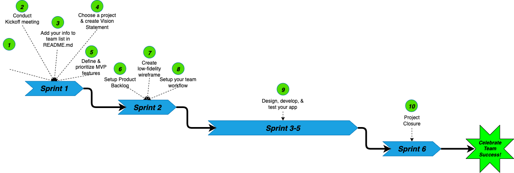
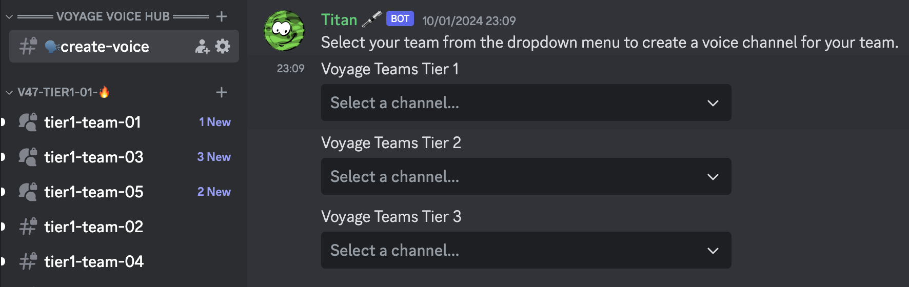
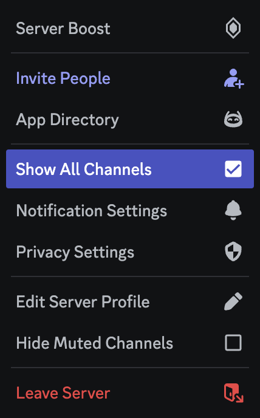
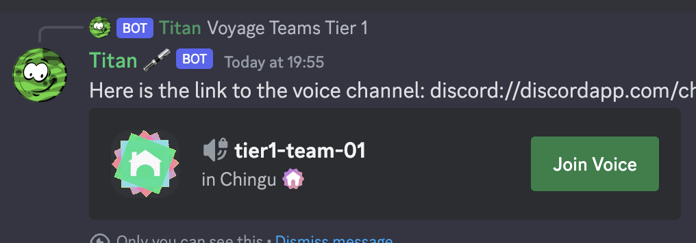

# Voyage Guide

## What are Voyages❓

Voyages are 6-week long remote team projects where you'll level up your skills and experience to help you land your dream job by:

- Putting the technical knowledge you've gained into practice.
- Improving "soft" skills like teamwork, collaboration, and project management.
- Being accountable to your commitments to your team and yourself.

## Before you Start

Voyages have specific requirements, milestones, and ***require a commitment of 8-12 hours per week*** from each team member. 

### Voyage Schedule 🗓️

    
| Milestone | Voyage 51 | Voyage 52 | Voyage 52 |
| :--- | :--- | :--- | :--- |
| Create & submit Solo Project | Prior to deadline | Prior to deadline | Prior to deadline |
| Solo Project Deadline | August 25, 2024 | October 27, 2024 | December 29, 2024 |
| Voyage Launch | September 4 | November 4 | January 6 |
| Weekly Checkin due | Every Monday | Every Monday | Every Monday |
| Voyage ends & projects due | October 13 | December 15 | February 16 |
| Completion Certificates issued | October 20 | December 22 | February 23 |
| Voyage Showcase article published | October 27 | December 27 | March 2 |
    
### How to Prepare for your Voyage 📝

  
How do I check my Voyage Signup status?

   

  You can use the `/user` command in any Discord channel to find out if you
  have completed your Solo Project and signed up for the next Voyage. You
  can learn more [here](../../../docs/resources/techresources/titan.md#getting-your-chingu-status-information).

  
What Does a Voyage Cost? 💰💰💰

   

  1. **Voyages are free**, but you will need to pay to receive the Voyage Completion Certificate.
  2. Voyage Completion Certificates can be purchased by signing up for a **_monthly subscription_** at $2.99/month **_OR_** purchasing a Voyage Completion Certificate **_product_** as needed for $3.99.
  3. You can sign up for Subscriptions or Products in our [Discord Server Shop](https://discord.com/channels/330284646283608064/shop) 
  4. You can also sign up for [Subscriptions](https://buy.stripe.com/7sIaHh0Ev5oY3BecMN) and [Products](https://buy.stripe.com/bIY5mXevl5oYgo0fYY) in Stripe.
  
  When you sign up for a monthly subscription you will get access to an exclusive _Superstars channel + your Voyage Completion Certificate_ at no additional charge. You may cancel this at any time. 
  
  You’ll still be able to purchase [Chingu swag](https://chingu.myspreadshop.com/) and make one-time contributions via [Buy us a Coffee](https://www.buymeacoffee.com/chingu). Past and future contributors using Buy Me a Coffee will automatically be added to the Superstars channel.

  If you have questions we can help answer them in our weekly Roundtable discussions and in the [#admin-feedback](https://discord.com/channels/330284646283608064/906906045077671986) channel.

  
Team Member Roles 🧑🏾‍🤝‍🧑🏻🧑🏻‍🤝‍🧑🏽

   

  The primary goal of all team members is to work together in a professional manner to identify, design, develop, and deploy the MVP for their team project. Team members contribute to the project in different ways, each having their own set of responsibilities depending on their role.

  All members of the team must commit to following the Agile methodology to develop the team project they've chosen. This involves actively participating in team meetings and discussions, sharing their daily status with the team, and completing the tasks they volunteer to work on in each Sprint.ß
  <table>
    <tr>
    <td><strong>Role Name</strong></td>
    <td><strong>Description</strong></td>
    </tr>
    <tr>
      <td><strong>Product Owner</strong></td>
      <td>The Product Owner is accountable for maximizing the value of the product resulting from the work of the Scrum Team. Product Owners guide the team through the Voyage using the Agile methodology as their roadmap. They are "servant leaders" who lead through teamwork & motivation.  Specific PO responsibilities include:
      <ul>
        <li>Developing and explicitly communicating the Product Goal through a Product Roadmap and 
        Product Backlog</li>
        <li>Defining, prioritizing, and clearly communicating items the product backlog</li>
        <li>Ensuring that the Product Backlog is transparent, visible and understood</li>
        <li>Making sure all stakeholders are represented and have a "voice" in the project</li>
      </ul>
      The PO also works closely with the Scrum Master by:
      <ul>
        <li>Participating in Sprint Planning, Review, and Retrospective meetings</li>
        <li>Actively listening to all ideas and concerns from the team</li>
        <li>Quickly resolving any issues or suggestions related to the backlog</li>
        <li>Working closely together to ensure that the needs of all stakeholders, 
        including the development team, are met</li>
      </ul>
      PO's should ensure that the backlog is visible to all team members and open to their ideas, suggestions, and revisions. Regardless, of this the PO is accountable for these.  But, it is important that everyone on the team support them with active participation and feedback, and their decisions must be respected. These decisions must be visible the Product Backlog, and shared in the Scrum events.  PO's are individuals, not committees. Teammates wanting to change the Product Backlog must do so through the PO, but they must trust the PO's final decision.  Because so many of the issues are technical issues, Product Owners who have a strong background in technology, or who are also a developer, are often referred to as a <em>Technical Product Owner (TPO)</em>. You can learn more about this variant of the PO role in the <a href="https://github.com/chingu-voyages/Handbook/blob/main/docs/resources/glossary/glossary.md#glossary">Glossary</a>.</td>
    </tr>
    <tr>
      <td><strong>Scrum Master</strong></td>
      <td>
        The <em>Scrum Master (SM)</em> is accountable for helping the team understand Scrum theory and practice, as defined in the <a href="https://scrumguides.org/scrum-guide.html">Scrum Guide</a>. SM's are also accountable for the effectiveness of the team by enabling them to improve their practices, within the Scrum framework.
        The SM serves the team in the following ways:
        <ul>
          <li>Coaching team members in self-management and cross-functionality</li>
          <li>Helping the team focus on creating high-value increments that meet the Definition of Done</li>
          <li>Helping to avoid and remove blockers to team’s progress</li>
          <li>Ensuring that all Scrum events take place and are positive, productive, and timeboxed</li>
        </ul>
        The Scrum Master also works closely with the Product Owner by:
        <ul>
          <li>Helping find techniques for effective Product Goal definition and Product Backlog management</li>
          <li>Helping the Scrum Team understand the need for clear and concise Product Backlog items</li>
          <li>Helping establish empirical product planning for a complex environment</li>
          <li>Facilitating stakeholder collaboration as requested or needed</li>
        </ul>
      </td>
    </tr>
    <tr>
      <td><strong>Developer</strong></td>
      <td>Developers are focused on designing, writing code, testing what has been developed, and deploying it to the Internet.</td>
    </tr>
    <tr>
      <td><strong>UI/UX Designer</strong></td>
      <td>UI/UX Designers help guide the team to create a project that follows UI/UX "best practices" to create apps that are both functional and pleasing to use. They create & maintain app sketches, storyboards, & prototypes, define styles and user interaction flows, and assist with Developer tasks as necessary. </td>
    </tr>
    <tr>
      <td><strong>Data Scientist</strong></td>
      <td>Data Scientists use their skills to perform deep analysis and visualization of data in Data Science specfic projects. This includes all forms of Data Science including analytics, machine learning, and deep learning.</td>
    </tr>
    <tr>
      <td><strong>Voyage Guide</strong></td>
      <td>Voyage Guides are experienced Chingus who have successfully completed 1 or more Voyages and have volunteered to provide help and advice to Voyage teams. 
        <ul>
          <li>Voyage Guides are NOT active participants. They don’t attend meetings and don’t contribute code to the project</li>
          <li>Voyage Guides are available 1-2 hours per week to help answer questions and provide advice.</li>
          <li>Team members should research questions they have BEFORE asking their Voyage Guide.</li>
          <li>If your team has a Product Owner or Scrum Master direct questions about Agile/Scrum to them</li>
        </ul>
        If a Voyage Guide has time available they may choose to more actively mentor and coach team members on technical topics.
      </td>
    </tr>
  </table>

  
Tier Definitions 🪜

   

  At Chingu we use three _tiers_ to group people into teams based on their
  current general level of skill and expertise. Our tiers are:

  * **Tier 1** - Getting started in your role
  * **Tier 2** - Intermediate skill level in your role
  * **Tier 3** - Experienced skill level in your role

  However, the specific requirements for each of these varies by role. You can
  find the definition of what's required to be in each tier based on your role
  [here](https://github.com/chingu-voyages/Handbook/blob/main/docs/guides/soloproject/soloproject.md#1-choose-your-tier-1%EF%B8%8F%E2%83%A3-2%EF%B8%8F%E2%83%A3-3%EF%B8%8F%E2%83%A3).

  
Brush up on your “Soft Skills” 🖌️

   

  - [ ] If this is your first Voyage, **complete a [Solo Project](../soloproject/soloproject.md)**
  - [ ] Read **[How to be a Great Teammate](../../resources/projresources/greatteammate.md)** (5 minutes)
  - [ ] Read **[Soft Skills 101](../../resources/projresources/softskills101.md)** **for the type of communication skills you should practice here.** (5 minutes)

  
Familiarize yourself with Git & GitHub

   

  - [ ] Read **[What is Git](https://guides.github.com/introduction/git-handbook/)**
  - [ ] Read **[Interactive Git Tutorial](https://learngitbranching.js.org/)**
  - [ ] Read **[Git Cheatsheet](https://training.github.com/downloads/github-git-cheat-sheet/)**
  - [ ] If you don’t already have a **[GitHub account](https://github.com/)** create one (5 minutes)
  - [ ] Set up **[Git on your computer & hook it up to GitHub authentication](https://help.github.com/articles/set-up-git/)** (10 minutes)
  - [ ] Study **[Introduction to GitHub](https://docs.github.com/en/get-started/quickstart/hello-world)**
  - [ ] Study **[Uploading Your Project to GitHub](https://docs.github.com/en/get-started/using-git/pushing-commits-to-a-remote-repository)**
  - [ ] Study **[Markdown](https://docs.github.com/en/get-started/writing-on-github/getting-started-with-writing-and-formatting-on-github/quickstart-for-writing-on-github)**
  - [ ] Study **[Merge Conflicts](https://docs.github.com/en/pull-requests/collaborating-with-pull-requests/addressing-merge-conflicts/about-merge-conflicts)**
  - [ ] Study **[Pull Requests](https://docs.github.com/en/pull-requests/collaborating-with-pull-requests/proposing-changes-to-your-work-with-pull-requests/about-pull-requests)**
  - [ ] View **[Chingu Video: How to use git & GitHub in a Team](https://youtu.be/0HizvYgNPA0)**
  - [ ] View **[Chingu Video: How to Undo a git commit](https://youtu.be/ZoIBdFuj8_M)**
  - [ ] View **[Chingu Video: How to Delete git commits](https://youtu.be/Wjd8iEcCSM4)**

  
What Level of Commitment is Required for a Voyage? 🛳️

   

  During this 6-week team effort, you'll learn new technical skills, refine the skills you already have worked hard to build, and learn "soft" skills like teamwork, Agile Development, planning, & design. In other words, the skills that will help set you apart from other job candidates.
  
  While Chingu doesn't charge for organizing & managing Voyages, it doesn't mean they are "free". Getting the most out of your Voyage requires dedication and commitment to be an active participant with your teammates and to finish what you start.
  
  - Be an active participant rather than a passive observer.
  - Set aside an average of 8-12 hours per week for your Voyage.
  - Share your status daily in your Team channel.
  - Submit the weekly Voyage Checkin form we’ll provide each week to help us understand not just how you are doing, but how we can improve as well.
  
  We know you can do this and you'll find the impact on your career will be worth the effort.

  
How are Voyage teams formed? 🫱🏻‍🫲🏼

   

  You will be assigned to a team by the Chingu Admins based on the following criteria, from highest-to-lowest priority:

  1. Tier

     All participants in a team will be from the same tier. This is the tier you selected on the [Voyage Signup form](https://forms.gle/NkSP7DS3oz4sEzdh8).

  2. Timezone

     We try to match teams so no two teammates will be more than 2 timezones away from one another. This makes it easier to find times for meetings and pair programming sessions.

  3. Chingu Superstars

     We also try to match Chingu Superstars, those who have donated to Chingu, in the same teams. Although donations aren't required Chingu's who do contribute have a lower probability of dropping out of a Voyage.

  4. Technical Stack preferences

     We also try to match team members on their technical stack preferences. However, in the course of organizing Voyages over a period of years we've learned that communication & collaboration are better indicators of success. We'll reach out to you prior to the start of your Voyage if we aren't able to match you to a team with the same tech stack preferences as yours.

  5. Role-based teams

     Teams are also matched based on the roles participants signup with. Based on your role you'll be added to one of the following types of teams:

     * **Web Development** teams consist of a Product Owner, a Scrum Master, 3-5 Web Developers, and a UI/UX Designer.
     * **Data Science** teams consist of a Product Owner, a Scrum Master, and 3-5 Data Scientists

     Keep in mind that assigning Product Owners, Scrum Masters and UI/UX Designers to teams depend on how many Chingus in those roles sign up for a Voyage. In addition, for Data Science teams, we'll reach out to Data Scientists if we don't have enough in your tier and timezone to form a team. In this case you'll be given the option to join a Web Development team or to wait until the next Voyage. 

       
## The Voyage Process

When your Voyage starts, you will see that we have provided your team with your own team channel in Discord. You should use this to communicate and collaborate with one another on your project. Access to this channel is restricted to your team, so it's the best place for open, frank, and respectful communication with your teammates. **_Your team must not create your own Discord server, Slack channel, etc. to communicate with each other about your project._**

You will also be provided with a GitHub repo in the `chingu-voyages` 
organization for your project code. Everyone on your team will have `admin`
access to this repo so you'll be able to adjust settings. But, **_you must
leave this as a public repo and you must not rename the repo we've created or
create your own repo_**.

If you need another repo, [open a ticket](https://discord.com/channels/330284646283608064/1105911757177888908) and a member of the Chingu Admin team will be happy to create it for you. 

### Sprint 1 - Getting off to a Solid Start

---
  #### 1. Meet your team & schedule kickoff meeting 📅
  
  **Objective**
  
  Teamwork is the foundation of any project and learning how to work effectively in a team is every bit as important as your technical knowledge. This is a skill that is valued by employers, so increasing your team skills is one way to set yourself above other job applicants.
  
  Your project’s success depends on how effective your team is at working together. In fact, this is more important than how much code you create or how fast you deploy it.
  
  **How**
  
  - Post an introduction in the team channel. Let your teammates know a bit about what you hope to achieve and more about you as a person as well as a Developer. Share your time commitments, available coding time per week, & goals with your teammates.
  - Use the Team Channel we've set up to schedule a time to meet up on a teleconferencing site such as Discord, Zoom, or TeamViewer.
  - Establish your shared goal for the Voyage as a team. Do you want to learn a new package like React? Do you want to learn a new feature like GraphQL for API’s?
  - Discuss your expectations for how the team will operate. Specifically, what does success look like for your team, how will you make decisions, and how will you deal with conflict?
  
  **Resources**
  
  [What Roles are there in a Voyage Team? (video)](https://youtu.be/f_TzehtBliE)
  
  [How to Select a Project video](https://youtu.be/5Xv0C5VAKZc)
  
  [Document Templates](https://github.com/chingu-voyages/voyage-template/tree/main/docs) (These will be copied to the `docs` subdirectory in your team’s repo when the Voyage starts) ^
  
  [Schej meeting availability tool](https://schej.it/home)  
  ^ These are read only templates.

  ---
  #### 2. Conduct kickoff meeting 🫱🏼‍🫲🏽
    
  **Objective**
  
  The Kickoff Meeting lets you meet your team, review the goals & steps for Sprints 1 & 2, and gets you started on creating a solid foundation for your Voyage Project.
  
  **How**
  
  - The first person to arrive in the Team Channel on the first day of the Voyage should create a [Schej meeting availability](https://schej.it/home) event and post its URL in the channel. This will let everyone update it with their availability for the week so a Kickoff meeting can be scheduled.
  - Try to find a time as early as possible in Sprint 1 for your Kickoff meeting. Six weeks sounds like a long time, but it’s quite short and every day you delay in getting started counts!
  - Use the Voyage Kickoff meeting agenda template we’ve provided to guide you and as a place to record notes from the meeting. At the start of the Voyage, all document templates will be copied to the `docs` subdirectory in your team's repo.

  - **Pro Tip!** You can use the audio/visual channel that’s been set up for your team for meetings. This channel supports not only audio & video in real time, but also screen sharing.
      
  **Resources**
  
  [Meeting template - Voyage Kickoff](https://github.com/chingu-voyages/voyage-template/tree/main/docs) (This and other document templates will be copied to the `docs` subdirectory in your team’s repo when the Voyage starts) ^

  ^ These are read only templates.
    
  ---
  #### 3. Add your info to the team list in your README.md ✏️

  **Objective**
  
  Your team repo is a public repo and any GitHub user has read-only access to
  it. However, only members of your team have been granted update access to it.

  It's important that every member of the team verify they have update access
  to their teams repo. This includes Product Owners, Scrum Masters, UI/UX 
  Designers, Developers, and Data Scientists on the team.

  **How**

  

  We populate your team repo with a template which includes a section titled
  "Our Team". Before the end of Sprint 1 every team member should update this
  section with their infomation.

  This shows not only who is on the team, but it is also a quick and easy
  way to verify everyone has update access.

  **Resources**

  [Defining a Git Workflow (Chingu Handbook)](../../resources/techresources/gitgithub.md#the-workflow)

  ---
  #### 4. Choose a project & create a Vision Statement 👓

  ** This is for Tier 3 teams only.** All Tier 1 & Tier 2 teams have been assigned a project and the link to its requirements and specification will be posted in your team channel.
  
  **Objective**
  
  Choose a project your team will be able to work together to complete during the Voyage. In addition to refining your technical skills you’ll also be learning new “soft” skills to help you advance your career. These include collaboration, communication, planning, & working in an Agile environment.
  
  **How**
  
  Exchange ideas and / or share screenshots and URLs of similar potential projects. Look at the references below to get ideas or create a project you and the team are passionate about.
  
  - Collect ideas from the team
  - Brainstorm with your team
  - Vote to select one idea
  - Decide on the technical stack you’ll use to construct it in
  
  Once you’ve agreed on a Project, create a short vision statement to capture what it does and the benefit it will bring to its users.
  
  **Resources**
  
  [How to Select a Voyage Project video](https://youtu.be/5Xv0C5VAKZc)
  
  [Voyage Project Showcase article (2020)](https://medium.com/chingu/chingu-fall-project-showcase-c6bf0f8210ab)

  [Voyage Project Showcase article (2021)](https://dev.to/chingu/build-collaborate-learn-remote-developer-projects-showcase-3bad)
  
  [Project Ideas template](https://github.com/chingu-voyages/voyage-template/tree/main/docs) (This and other document templates will be copied to the 
  `docs` subdirectory in your team’s repo when the Voyage starts) ^
  
  [Project Vision and Feature Planning template](https://github.com/chingu-voyages/voyage-template/tree/main/docs) (This and other document templates will be copied to the `docs` subdirectory in your team’s repo when the Voyage starts) ^

  ^ These are read only templates.
    
  ---
  #### 5. Define & prioritize MVP features 🔢
    
  **Objective**
  
  Your [Minimum Viable Product (MVP)](../../resources/glossary/glossary.md) is the minimum number of features your users need to get a solid understanding of your project.
  
  **How**
  
  - [ ]  Each team member should add their ideas to the Project Vision & Feature Planning template before the team meeting
  - [ ]  Prioritize each feature - *Must Have*, *Should Have*, *Nice to Have*
  - [ ]  Meet with the team to review each feature & refine priorities
  
  Once you’ve agreed on the features and their priorities you can add them to the Product Backlog.
  
  *Must Have* features define your MVP, while features in the other two priorities are “stretch goals'' to be worked on when you’ve implemented all the *Must Have*s.
  
  **Resources**
  
  [Project Vision and Feature Planning Template](https://github.com/chingu-voyages/voyage-template/tree/main/docs) (This and other document templates will be copied to the `docs` subdirectory in your team’s repo when the Voyage starts) ^
  
  ^ These are read only templates.

### Sprint 2 - Getting off to a Solid Start

  ---
  
  #### 6. Setup Product Backlog 📋
      
  **Objective**
  
  The [Product Backlog](../../resources/glossary/glossary.md) is where you 
  track the work that needs to be completed to finish the project.

  > If you are creating your Voyage project based on specifications provided by
  Chingu you don't need to wait until Sprint 2 to start this task. Instead, 
  get ahead of the game and start it during Sprint 1. 
  
  **How**
  
  - [ ]  Identify & prioritize features
  - [ ]  Create an epic for each feature
  - [ ]  Choose the highest priority epics & divide them into user stories
  - [ ]  Add your epics & user stories to a backlog tool. In prior Voyages, teams have used tools like Jira, Miro, GitHub Projects, ZenHub, and others as well.
  - [ ]  Prioritize the user stories
  
  During the Voyage you’ll refine the Product Backlog and in every Sprint you’ll move tasks from it to the Sprint Backlog. This is part of the Agile process which helps you and your team concentrate only on the tasks that must be completed in that Sprint.
  
  **Resources**
  
  [Define Your MVP]((../../resources/glossary/glossary.md))
  
  [How to Create a Product Backlog (video)](https://youtu.be/FaoT-DTtXyA)
  
  [Agile Methodology 101 (article)](../../resources/projresources/agile101.md)
  
  [ZenHub website](https://www.zenhub.com/)
  
  [Install ZenHub browser extension](https://tinyurl.com/yfpcf7ke)
      
  ---
  #### 7. Create a low-fidelity wireframe 🖼️
      
  **Objective**
  
  Establish a common understanding across the team of what information is on each screen and the actions that may be invoked from each screen.

  > If you are creating your Voyage project based on specifications provided by
  Chingu you don't need to wait until Sprint 2 to start this task. Instead, 
  get ahead of the game and start it during Sprint 1.
  
  **How**
  
  - [ ]  Using the features you added to the Feature Planning template in step 4 identify the screens you’ll need and the information on each one.
  - [ ]  Map the actions users will be able to perform from each screen and the navigation from screen-to-screen.
  - [ ]  Create a low-fidelity wireframe using a tool like [Figma](https://www.figma.com/) or even pencil and paper.
  
  **Resources**
  
  [How To Wireframe A Website in 3 Easy Steps](https://elementor.com/blog/wireframe-website/)
      
  ---
  #### 8. Setup your team workflow 🌊
      
  **Objective**
  
  Define how you plan to work together as a team. This includes how often you’ll share status, coding standards, git/GitHub processes, and deciding how many meetings you need each week and when and where they’ll take place.
  
  **How**
  
  - [ ]  Decide on the coding standards the team must follow.
  - [ ]  Define the characteristics of your repo including the number of branches, branch names, & the workflow everyone must follow.
  - [ ]  Agree on the format of commit messages, how Pull Requests will be reviewed, and GitHub branch protection rules.
  - [ ]  Decide on where you’ll [deploy your app](../../resources/techresources/appdeployment.md) and the branch to be considered as ‘production’ you’ll be deploying from. We strongly recommend you deploy your `development` branch to the same Web host as your `main` branch, so you have a place to perform integration testing that's in an environment that is 
  similar to your production environment. You should also deploy your app 
  changes to your `main` branch and test them in the Web host it is deployed 
  to **_in each and every sprint_** even before the MVP is complete. 
  - [ ]  Decide on what meetings you’ll need each week and to save time, schedule them as recurring meetings. You might want to look ahead to learn more about the types of meetings you’ll need.
  - [ ]  [Develop the App](#sprint-3-5---reaching-your-mvp)
  
  **Resources**
  
  [Javascript Style Guides](https://codeburst.io/5-javascript-style-guides-including-airbnb-github-google-88cbc6b2b7aa)
  
  [Defining a Git Workflow (Chingu Handbook)](../../resources/techresources/gitgithub.md#the-workflow)
  
  [Git Branches (Chingu Handbook)](../../resources/techresources/gitgithub.md#git-branches)
  
  [Git Commits (Chingu Handbook)](https://chiamakaikeanyi.dev/how-to-write-good-git-commit-messages)
  
  [Git Pull Requests (Chingu Handbook)](../../resources/techresources/gitgithub.md#git-pull-requests)

  [Chingu Video: How to use git & GitHub in a Team](https://youtu.be/0HizvYgNPA0)
    
### 9. Sprint 3-5 - Reaching your MVP 🪜

  
  
  **Objective**
  
  Incrementally create your app by using Scrum and Agile frameworks.
  
  **How**
    
  - *Sprint Planning* - Meet at the start of each sprint to select the highest 
  priority tasks the team can realistically complete in the sprint
  - *Post Daily Status* - Communicating & collaborating with your team is the 
  most important factor to success. Post answers to these questions every day:
      - What tasks have I completed?
      - What am I currently working on and what will I work on next?
      - What issues or blockers do I need help with and from who?
  - *PR & Deploy* - As team members complete tasks they should create PRs for 
  review and deploy the app. Remember that at the end of each and every sprint you should PR completed changes from your `development` branch into the `main` branch and [deploy it](../../resources/techresources/appdeployment.md) to the Internet web host you've chosen. 
  - *Sprint Review & Retrospective*
      - Meet at the end of each sprint to review how the team worked together & the processes you used. Make modifications as necessary to improve what didn’t work well and reinforce what did work well.
  
  Many teams have found the following meeting schedule helpful:
  
  - Schedule a meeting at the beginning of each sprint, ideally on Mondays or Tuesdays. This will be a combined session for the Sprint Review & Retrospective and the Sprint Planning meeting.
  - Schedule a second meeting on Wednesday or Thursday to address any changes to the Sprint plan. These changes could be the result of problems, bugs, differences of opinion, or the fact that you’ve completed all the tasks for this Sprint and need to select ones to work on next.
  - ***Pro Tip!*** Schedule your meetings to repeat on the same day and time in each Sprint so you only have to spend time scheduling them once.
  - Post your status daily in your Team Channel and use the audio/video channel we’ve created for your team for team meetings, ad hoc discussions, and pair programming.
  
  **Resources**
  
  [Agile Methodology 101 (Chingu Handbook)](../../resources/projresources/agile101.md)
  
  [How to Plan a Sprint (video)](https://www.youtube.com/watch?v=lumOOOKZzto)
  
  [Team Decision Log template](https://github.com/chingu-voyages/voyage-template/tree/main/docs) (This and other document templates will be copied to the `docs` subdirectory in your team’s repo when the Voyage starts) ^
  
  [Schej meeting availability tool](https://schej.it/home)
  
  [Meeting template - Sprint Review, Retrospective, & Planning](https://github.com/chingu-voyages/voyage-template/tree/main/docs) (This and other document templates will be copied to the `docs` subdirectory in your team’s repo when the Voyage starts) ^
  
  [Meeting template - Open Topic](https://github.com/chingu-voyages/voyage-template/tree/main/docs) (This and other document templates will be copied to the `docs` subdirectory in your team’s repo when the Voyage starts) ^

  [Plagarism caution & advice](../../resources/glossary/glossary.md#plagarism)

  
  ^ These are read only templates.
    
### 10. Sprint 6 - Project Closure 🏁
  
  **Objective**
  
  The team’s goal in Sprint 6 is to wrap up the project & celebrate your success
  
  **How**
  
  - [ ]  Complete MVP functionality following the same processes you used in Sprints 1-5
  - [ ]  Ensure the Readme is up to date
  - [ ]  Do the final deployment of the application to a hosting site (note that this should be done at the end of each sprint)
  - [ ]  Optional: Create a Showcase video on YouTube!
      1. No more than 5 minutes long
      2. It should be available via a publicly accessible URL
      3. Answer these simple questions:
          1. What did we build?
          2. Who participated in the team?
          3. What technology stack did we use?
          4. What did we create? Demo the app
  - [ ]  Optional: Write an article about your experience for the Chingu page on [Dev.to](http://Dev.to) or Hashnode (see Resources below)
  - [ ]  Submit your completed project using the [Project Submission form](https://forms.gle/V8gfttw9VnoqumeaA)
  - [ ]  Celebrate your success as a team!
  - [ ]  Receive your Voyage Completion Certificate
  - [ ]  Update your resume, LinkedIn profile, portfolio page, etc. to include your Voyage experience, Completion Certificate, and your Showcase video or article if you’ve written one.
  
  **Resources**
  
  [Chingu Content Creators Guide](https://dev.to/chingu/chingu-content-creators-guide-3k6h)

## Voyage Tips

### Tips for all teammates ✏️

  
How do I make a voice channel for my team❓

   
  
  To create a temporary voice channel for your team, simply navigate to the Voyage Voice HUB category (Should be right above you Team Text Channel) and click on the channel named “#create-voice”. In this channel, select your tier and team from the list. This will create a voice channel for your team right below your teams text channel. The voice channel will be removed automatically shortly after everyone leaves, or after 1min if nobody joins it.  

  

  If you can’t see the category or the #create-voice channel, you have to navigate to the top-menu and click on “Show All Channels”

  

  If you dont see the voice channel, you have to navigate all the way to the bottom and click "Show All"

  

  When you create a voice channel, Titan will also supply you with a link to join the channel

  

  If some of your teammates struggle to find the voice channel, you can right click on the voice channel and click "Copy Link", and then paste that into your team channel. This will give your teammates a link to the channel.

  

  
What should I do if I don't have access to my team repo❓

   

  Before a Voyage starts, we create a GitHub repo in the `chingu-voyages` GitHub organization for every team. We also grant every teammate the `Admin` privilege on it.

  If this is your first Voyage, GitHub will send an email notification as part of this process. **_You must click the link_** in that email to validate your identity and get access to your team repo.
  
  If you haven't received this email, please check the *_junk_* or *_spam_* folder in your email application. If it's not there, you can go to the 
  [`chingu-voyages`](https://github.com/chingu-voyages) organization in GitHub and click on the `View invitation` button. From there you can validate your identity.

  If you have questions or need help you can ask other Chingu's for advice in
  the [`#coding-help` channel](https://discord.com/channels/330284646283608064/1047615334703714394) or you may open a ticket to the Chingu Admin team in the [`#open-support-ticket` channel](https://discord.com/channels/330284646283608064/1105911757177888908).

  
How can I “pin” messages to my Team Channel❓

   

  Every team member in a voyage has the Discord privileges needed to let them “pin” important messages to the channel so they will be easy to find.
  
  Discord does require that to pin a message, you must also have enabled [Two Factor Authentication (2FA)](https://support.discord.com/hc/en-us/articles/219576828-Setting-up-Two-Factor-Authentication) on your personal Discord account.

  
Which team role is the most important one❓

   

  No one team role is more important than the other! Different roles are
  needed because software projects are complex and they will only become more
  complex over time.

  Evey member of the team brings different experiences and skills that to 
  contribute to the project. Every teammate is also a **_subject matter
  expert (SME)_** in their respective role and should be respected for what
  they bring to the team.

  
My team doesn't have a Product Owner. What should we do❓

   

  In a Voyage, we will add a Product Owner to as many teams as we can.
  Unfortunately, this depends on *_how many Product Owner's sign up._*

  If your team doesn't have a Product Owner, don't worry! Follow the steps that are defined in this Voyage Guide to help you determine what needs to be done, in what order, and how to execute each step.

  In past Voyages teams without a Product Owner have used one of these
  strategies:

  1. Someone on your team can volunteer to be the Product Owner. This works
  best if someone on the team has previous experience working on a team with a PO or if they are familiar with Scrum and the Agile Methodology.

  2. Team members can rotate the PO responsibilities in each Sprint. This
  ensures that everyone gets a chance to learn more about this role.

  3. Team members can agree to share the PO responsibilities with one another. This is the least desirable option, since shared responsibility often means it's not done.

  Whichever option you choose, remember that teammates should support one
  another and you will either succeed together or fail together. Teamwork is
  critical to success.

### Tips for Product Owners ✏️

  
Do I need to be able to develop code like the rest of the team?

   

  **Absolutely not!!!** 😾 It's certainly fine if you come to the Product Owner
  role with software development experience, but *_it's not required_*.

  As a Product Owner your job is to help your team coordinate their efforts
  to design, build, test, and deploy your MVP. Keep in mind that everyone on
  the team is an *_subject matter expert_* in their role. So, the key to
  working in a team is to trust your teammates and to treat them as partners.

  When you get in a situations where you feel overwhelmed by complexity,
  technology, and/or terminology reach out to your team for help. You may
  think this is a sign of weakness, but it's actually a sign of strength and
  maturity since it shows you trust your team and you are helping to build
  their confidence and experience.

  Finally, remember that none of us knows it all and if we ever should learn
  it all it's just going to change 😊 Relying on your teammates (and them 
  relying on you) will reduce stress, conflict, and will help to speed up
  everyone's learning.

How can you effectively manage your tasks and responsibilities without getting overwhelmed?

 
  Firstly, to take care of others, you have to take care of yourself, so:
  Start by effectively planning your time. Allocate specific times for each task, taking into account their urgency and importance. This will help you stay on track and avoid distractions.
  Next, set clear priorities. Identify the most critical tasks that need your immediate attention and tackle them first. This will ensure that the most important work gets done.
  Finally, mitigate distractions. Minimize interruptions and focus on the task at hand. This will allow you to work more efficiently and effectively, but don't forget to take some free time and enjoy yourself. You deserve it!

  
How can you improve your approach and identify areas for growth?

 
  Treat your team as your friends! You will be working with them for 6 weeks and to be a succesfull PO, you will need to make some connections with the others and build trust, create a friendly and supportive environment where feedback is welcome and valued, this will foster a collaborative environment where everyone feels comfortable contributing and sharing ideas, leading to continuous improvement and better product outcomes.
  Actively listen, document, and analyze feedback to identify recurring themes and areas for improvement. Prioritize and implement changes accordingly to enhance your PO performance and align with team needs.

### Tips for UI/UX Designers ✏️

  
Stay tuned!

   

  Stay tuned for new content we'll be adding here soon.

### Tips for Web Developers ✏️

  
Stay tuned!

   

  Stay tuned for new content we'll be adding here soon.

### Tips for Data Scientists ✏️

  
Stay tuned!

   

  Stay tuned for new content we'll be adding here soon.

