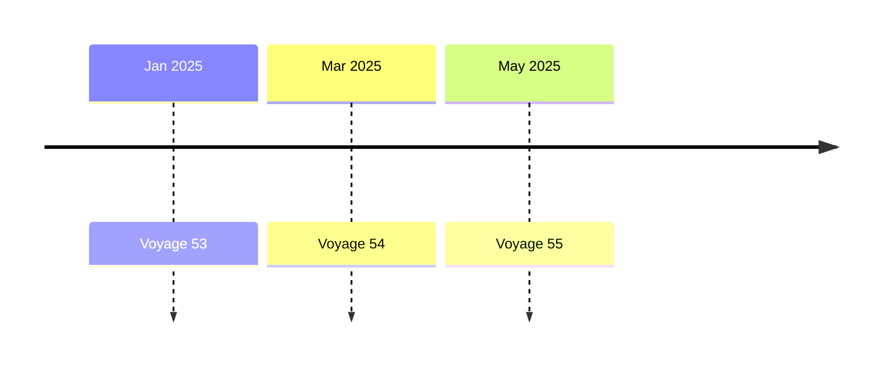

# Voyage

## All About Your Voyage

 1. [What are Voyages](#what-are-voyages)
 2. [Before you Start](#before-you-start)
 3. [The Voyage Process](#the-voyage-process)
 4. [Voyage Tips](#voyage-tips)

---

## What are Voyages❓

Voyages are 6-week long remote team projects where you'll level up your skills and experience to help you land your dream job by:

- Putting the technical knowledge you've gained into practice.
- Improving "soft" skills like teamwork, collaboration, and project management.
- Being accountable to your commitments to your team and yourself.

## Before you Start

Voyages have specific requirements, milestones, and ***require a commitment of 8-12 hours per week*** from each team member.

### Voyage Schedule 🗓️

  
| Milestone | Voyage 53 | Voyage 54 | Voyage 55 |
| :--- | :--- | :--- | :--- |
| Create & submit Solo Project | Prior to deadline | Prior to deadline | Prior to deadline |
| Solo Project Deadline | December 29, 2024 | February 23, 2025 | April 27, 2025 |
| Voyage Launch | January 6 | March 3 | May 5 |
| Weekly Checkin due | Every Monday | Every Monday | Every Monday |
| Voyage ends & projects due | February 16 | April 13 | June 15 |
| Completion Certificates issued | February 23 | April 20 | June 22 |
| Voyage Showcase article published | March 2 | May 4 | June 29 |

### How to Prepare for your Voyage 📝

[What Level of Commitment is Required for a Voyage](./topics/voyage_commitment.md) 
[What are the criteria for successfully completing a Voyage?](./topics/voyage_success_criteria.md) 
[How do I check my Voyage Status?](./topics/check_voyage_status.md) 
[What Does a Voyage Cost?](./topics/voyage_cost.md) 
[What the roles in a Voyage team?](./topics/voyage_roles.md) 
[What the tiers in a Voyage?](./topics/voyage_tiers.md) 
[How are Voyage teams formed?](./topics/voyage_teams.md) 
[What "Soft Skills" are needed?](./topics/voyage_soft_skills.md) 
[What if I need more skills?](./topics/voyage_skills.md) 
[What git & GitHub knowledge will I need?](./topics/voyage_git_github.md) 
[How should my Team select a project?](./topics/voyage_project.md) 

## The Voyage Process

```mermaid
---
config:
  layout: elk
  theme: dark
---
  block-beta
    columns 4
    block:B1:1
      columns 1
      block:B1TOP
        columns 3
        A1(("&nbsp;&nbsp;&nbsp; 1 &nbsp;&nbsp;"))
        A2(("&nbsp;&nbsp;&nbsp; 2 &nbsp;&nbsp;"))
        A3(("&nbsp;&nbsp;&nbsp; 3 &nbsp;&nbsp;"))
      end
      space
      space
      block:B1CENTER
        columns 3
        space
        SPRINT1("&nbsp;Sprint 1&nbsp;")
        space
      end
      space
      space
      block:B1BOTTOM
        columns 3
        A4(("&nbsp;&nbsp;&nbsp; 4 &nbsp;&nbsp;"))
        space
        A5(("&nbsp;&nbsp;&nbsp; 5 &nbsp;&nbsp;"))
      end
      A1 -- "<a href="https://github.com/chingu-voyages/Handbook/blob/main/docs/guides/voyage/voyage.md#1-meet-your-team--schedule-kickoff-meeting-">Meet team &</br>schedule</br>Kickoff</a>" --> SPRINT1
      A2 -- "</br></br></br></br></br></br><a href="https://github.com/chingu-voyages/Handbook/blob/main/docs/guides/voyage/voyage.md#2-conduct-kickoff-meeting-">Hold</br>Kickoff</a>" --> SPRINT1
      A3 -- "<a href="https://github.com/chingu-voyages/Handbook/blob/main/docs/guides/voyage/voyage.md#3-add-your-info-to-the-team-list-in-your-readmemd-%EF%B8%8F">Update</br>readme.md</br>team list<a/>" --> SPRINT1
      A4 -- "<a href="https://github.com/chingu-voyages/Handbook/blob/main/docs/guides/voyage/voyage.md#4-choose-a-project--create-a-vision-statement-">Choose</br>project &</br>define</br>vision stmt.</a>" --> SPRINT1
      A5 -- "<a href="https://github.com/chingu-voyages/Handbook/blob/main/docs/guides/voyage/voyage.md#5-define--prioritize-mvp-features-">Define &</br>prioritize</br>features</a>" --> SPRINT1
    end

    block:B2:1
      columns 1
      block:B2TOP
        columns 3
        A6(("&nbsp;&nbsp;&nbsp; 6 &nbsp;&nbsp;"))
        space
        A7(("&nbsp;&nbsp;&nbsp; 7 &nbsp;&nbsp;"))
      end
      space
      space
      block:B2CENTER
        columns 3
        space
        SPRINT2("&nbsp;Sprint 2&nbsp;")
        space
      end
      space
      space
      block:B2BOTTOM
        columns 3
        space
        A8(("&nbsp;&nbsp;&nbsp; 8 &nbsp;&nbsp;"))
        space
      end
      A6 -- "<a href="https://github.com/chingu-voyages/Handbook/blob/main/docs/guides/voyage/voyage.md#6-setup-product-backlog-">Create</br>Product</br>Backlog</a>" --> SPRINT2
      A7 -- "<a href="https://github.com/chingu-voyages/Handbook/blob/main/docs/guides/voyage/voyage.md#7-create-a-low-fidelity-wireframe-%EF%B8%8F">Create</br>Wireframe</a>" --> SPRINT2
      A8 -- "<a href="https://github.com/chingu-voyages/Handbook/blob/main/docs/guides/voyage/voyage.md#8-setup-your-team-workflow-">Define team workflow</a>" --> SPRINT2
    end

    block:B3:1
      columns 1
      block:B3TOP
        columns 3
        space
        A9(("&nbsp;&nbsp;&nbsp; 9 &nbsp;&nbsp;"))
        space
      end
      space
      space
      space
      space
      block:B3CENTER
        columns 3
        space
        SPRINTS35("&nbsp;Sprint 3-5 ")
        space
      end
      space
      block:B3BOTTOM
        columns 3
        space
        space
        space
      end
      A9 -- "<a href="https://github.com/chingu-voyages/Handbook/blob/main/docs/guides/voyage/voyage.md#9-sprint-3-5---reaching-your-mvp-">Design, code,</br>test & deploy</a>" --> SPRINTS35
    end

    block:B4:1
      columns 1
      block:B4TOP
        columns 3
        space
        A10(("&nbsp;&nbsp;&nbsp;10&nbsp;"))
        space
      end
      space
      space
      block:B4CENTER
        columns 3
        space
        SPRINT6("&nbsp;Sprint 6&nbsp;")
        space
      end
      space
      space
      block:B4BOTTOM
        columns 3
        space
        space
        space
      end
      A10 -- "<a href="https://github.com/chingu-voyages/Handbook/blob/main/docs/guides/voyage/voyage.md#9-sprint-3-5---reaching-your-mvp-">Project Closure</a>" --> SPRINT6
    end

    SPRINT1 --> SPRINT2
    SPRINT2 --> SPRINTS35
    SPRINTS35 --> SPRINT6

    style B1TOP stroke:#292d30,fill:#292d30
    style B1CENTER stroke:#292d30,fill:#292d30
    style B1BOTTOM stroke:#292d30,fill:#292d30
    style B2TOP stroke:#292d30,fill:#292d30
    style B2CENTER stroke:#292d30,fill:#292d30
    style B2BOTTOM stroke:#292d30,fill:#292d30
    style B3TOP stroke:#292d30,fill:#292d30
    style B3CENTER stroke:#292d30,fill:#292d30
    style B3BOTTOM stroke:#292d30,fill:#292d30
    style B4TOP stroke:#292d30,fill:#292d30
    style B4CENTER stroke:#292d30,fill:#292d30
    style B4BOTTOM stroke:#292d30,fill:#292d30
        
    style A1 color:#f0f6fc,fill:#1d8348
    style A2 color:#f0f6fc,fill:#1d8348
    style A3 color:#f0f6fc,fill:#1d8348
    style A4 color:#f0f6fc,fill:#1d8348
    style A5 color:#f0f6fc,fill:#1d8348
    style A6 color:#f0f6fc,fill:#1d8348
    style A7 color:#f0f6fc,fill:#1d8348
    style A8 color:#f0f6fc,fill:#1d8348
    style A9 color:#f0f6fc,fill:#1d8348
    style A10 color:#f0f6fc,fill:#1d8348
    style SPRINT1 color:#f0f6fc,fill:#b9770e
    style SPRINT2 color:#f0f6fc,fill:#b9770e
    style SPRINTS35 color:#f0f6fc,fill:#b9770e
    style SPRINT6 color:#f0f6fc,fill:#b9770e
```

When your Voyage starts, you will see that we have provided your team with your own team channel in Discord. You should use this to communicate and collaborate with one another on your project. Access to this channel is restricted to your team, so it's the best place for open, frank, and respectful communication with your teammates. **_Your team must not create your own Discord server, Slack channel, etc. to communicate with each other about your project._**

You will also be provided with a GitHub repo in the `chingu-voyages` 
organization for your project code. Everyone on your team will have `admin`
access to this repo so you'll be able to adjust settings. But, **you must***:

- leave this as a public repo
- not rename the repo we've provided
- not create any additional repos on your own

If you need another repo, [open a ticket](https://discord.com/channels/330284646283608064/1105911757177888908) and a member of the Chingu Admin team will be happy to create it for you.

### Sprint 1 - Getting off to a Solid Start

---
  #### 1. Meet your team & schedule kickoff meeting 📅
  
  **Objective**
  
  Teamwork is the foundation of any project and learning how to work effectively in a team is every bit as important as your technical knowledge. This is a skill that is valued by employers, so increasing your team skills is one way to set yourself above other job applicants.
  
  Your project’s success depends on how effective your team is at working together. In fact, this is more important than how much code you create or how fast you deploy it.
  
  **How**
  
  - Post an introduction in the team channel. Let your teammates know a bit about what you hope to achieve and more about you as a person as well as a Developer. Share your time commitments, available coding time per week, & goals with your teammates.
  - Use the Team Channel we've set up to schedule a time to meet up on a teleconferencing site such as Discord, Zoom, or TeamViewer.
  - Establish your shared goal for the Voyage as a team. Do you want to learn a new package like React? Do you want to learn a new feature like GraphQL for API’s?
  - Discuss your expectations for how the team will operate. Specifically, what does success look like for your team, how will you make decisions, and how will you deal with conflict?
  
  **Resources**
  
  [What the different roles in a Voyage team?](./topics/voyage_roles.md)
  
  [Schej meeting availability tool](https://schej.it/home)  

  [Document Templates](https://github.com/chingu-voyages/voyage-template/tree/main/docs)
  (These read-only templates will be copied to the `docs` subdirectory in your
  team’s repo when the Voyage starts)

  ---
  #### 2. Conduct kickoff meeting 🫱🏼‍🫲🏽
    
  **Objective**
  
  The Kickoff Meeting lets you meet your team, review the goals & steps for Sprints 1 & 2, and gets you started on creating a solid foundation for your Voyage Project.
  
  **How**
  
  - The first person to arrive in the Team Channel on the first day of the Voyage should create a [Schej meeting availability](https://schej.it/home) event and post its URL in the channel. This will let everyone update it with their availability for the week so a Kickoff meeting can be scheduled.
  - Try to find a time as early as possible in Sprint 1 for your Kickoff meeting. Six weeks sounds like a long time, but it’s quite short and every day you delay in getting started counts!
  - Use the Voyage Kickoff meeting agenda template we’ve provided to guide you and as a place to record notes from the meeting. At the start of the Voyage, all document templates will be copied to the `docs` subdirectory in your team's repo.

  - **Pro Tip!** You can use the audio/visual channel that’s been set up for your team for meetings. This channel supports not only audio & video in real time, but also screen sharing.
      
  **Resources**
  
  [Meeting template - Voyage Kickoff](https://github.com/chingu-voyages/voyage-template/tree/main/docs)
    (These read-only templates will be copied to the `docs` subdirectory in your
  team’s repo when the Voyage starts)

  ---
  #### 3. Add your info to the team list in your README.md ✏️

  **Objective**
  
  Your team repo is a public repo and any GitHub user has read-only access to
  it. However, only members of your team have been granted update access to it.

  It's important that every member of the team verify they have update access
  to their teams repo. This includes Product Owners, Scrum Masters, UI/UX 
  Designers, Developers, and Data Scientists on the team.

  **How**

  

  We populate your team repo with a template which includes a section titled
  "Our Team". Before the end of Sprint 1 every team member should update this
  section with their infomation.

  This shows not only who is on the team, but it is also a quick and easy
  way to verify everyone has update access.

  **Resources**

  [Defining a Git Workflow (Chingu Handbook)](../../resources/techresources/gitgithub.md#the-workflow)

  ---
  #### 4. Choose a project & create a Vision Statement 👓

  **This is for Tier 3 teams only.** All Tier 1 & Tier 2 teams have been assigned a project and the link to its requirements and specification will be posted in your team channel.
  
  **Objective**
  
  Choose a project your team will be able to work together to complete during the Voyage. In addition to refining your technical skills you’ll also be learning new “soft” skills to help you advance your career. These include collaboration, communication, planning, & working in an Agile environment.
  
  **How**
  
  Exchange ideas and / or share screenshots and URLs of similar potential projects. Look at the references below to get ideas or create a project you and the team are passionate about.
  
  - Collect ideas from the team
  - Brainstorm with your team
  - Vote to select one idea
  - Decide on the technical stack you’ll use to construct it in
  
  Once you’ve agreed on a Project, create a short vision statement to capture what it does and the benefit it will bring to its users.
  
  **Resources**
  
  [How to Select a Project](./topics/voyage_project.md)
  
  [Voyage Project Showcase articles (Dev.to)](https://dev.to/chingu)

  The following read-only document templates will be copied to the `docs`
  subdirectory in your team’s repo when the Voyage starts.

  [Project Ideas template](https://github.com/chingu-voyages/voyage-template/tree/main/docs)
  
  [Project Vision and Feature Planning template](https://github.com/chingu-voyages/voyage-template/tree/main/docs)

  ---
  #### 5. Define & prioritize MVP features 🔢
    
  **Objective**
  
  Your [Minimum Viable Product (MVP)](../../resources/glossary/glossary.md) is the minimum number of features your users need to get a solid understanding of your project.
  
  **How**
  
  - [ ]  Each team member should add their ideas to the Project Vision & Feature Planning template before the team meeting
  - [ ]  Prioritize each feature - *Must Have*, *Should Have*, *Nice to Have*
  - [ ]  Meet with the team to review each feature & refine priorities
  
  Once you’ve agreed on the features and their priorities you can add them to the Product Backlog.
  
  *Must Have* features define your MVP, while features in the other two priorities are “stretch goals'' to be worked on when you’ve implemented all the *Must Have*s.
  
  **Resources**

  [Project Vision and Feature Planning Template](https://github.com/chingu-voyages/voyage-template/tree/main/docs) (These read-only templates will be copied to the `docs` subdirectory in your
  team’s repo when the Voyage starts)

### Sprint 2 - Getting off to a Solid Start

  ---
  
  #### 6. Setup Product Backlog 📋
      
  **Objective**
  
  The [Product Backlog](../../resources/glossary/glossary.md) is where you
  track the work that needs to be completed to finish the project.

  > If you are creating your Voyage project based on specifications provided by
  Chingu you don't need to wait until Sprint 2 to start this task. Instead,
  get ahead of the game and start it during Sprint 1.
  
  **How**
  
  - [ ]  Identify & prioritize features
  - [ ]  Create an epic for each feature
  - [ ]  Choose the highest priority epics & divide them into user stories
  - [ ]  Add your epics & user stories to a backlog tool. In prior Voyages, teams have used tools like Jira, Miro, GitHub Projects, Trello, and others as well.
  - [ ]  Prioritize the user stories
  
  During the Voyage you’ll refine the Product Backlog and in every Sprint you’ll move tasks from it to the Sprint Backlog. This is part of the Agile process which helps you and your team concentrate only on the tasks that must be completed in that Sprint.
  
  **Resources**
  
  [Define Your MVP]((../../resources/glossary/glossary.md))
  
  [How to Create a Product Backlog (video)](https://youtu.be/FaoT-DTtXyA)
  
  [Agile Methodology 101 (article)](../../resources/projresources/agile101.md)
  
  ---
  #### 7. Create a low-fidelity wireframe 🖼️

  **Objective**
  
  Establish a common understanding across the team of what information is on each screen and the actions that may be invoked from each screen.

  > If you are creating your Voyage project based on specifications provided by
  Chingu you don't need to wait until Sprint 2 to start this task. Instead,
  get ahead of the game and start it during Sprint 1.
  
  **How**
  
  - [ ]  Using the features you added to the Feature Planning template in step 4 identify the screens you’ll need and the information on each one.
  - [ ]  Map the actions users will be able to perform from each screen and
  the navigation from screen-to-screen.
  - [ ]  Create a low-fidelity wireframe using a tool like [Figma](https://www.figma.com/)
  or even pencil and paper.
  
  **Resources**

  If you are in a Voyage team without a UI/UX Designer check out <a href="../../resources/techresources/uiux.md">this guide</a> your team can use to perform this roles duties.
  
  [How To Wireframe A Website in 3 Easy Steps](https://elementor.com/blog/wireframe-website/)
      
  ---
  #### 8. Setup your team workflow 🌊
      
  **Objective**
  
  Define how you plan to work together as a team. This includes how often you’ll share status, coding standards, git/GitHub processes, and deciding how many meetings you need each week and when and where they’ll take place.
  
  **How**
  
  - [ ]  Decide on the coding standards the team must follow.
  - [ ]  Define the characteristics of your repo including the number of branches, branch names, & the workflow everyone must follow.
  - [ ]  Agree on the format of commit messages, how Pull Requests will be reviewed, and GitHub branch protection rules.
  - [ ]  Decide on where you’ll [deploy your app](../../resources/techresources/appdeployment.md) and the branch to be considered as ‘production’ you’ll be deploying from. We strongly recommend you deploy your `development` branch to the same Web host as your `main` branch, so you have a place to perform integration testing that's in an environment that is 
  similar to your production environment. You should also deploy your app 
  changes to your `main` branch and test them in the Web host it is deployed 
  to **_in each and every sprint_** even before the MVP is complete. 
  - [ ]  Decide on what meetings you’ll need each week and to save time, schedule them as recurring meetings. You might want to look ahead to learn more about the types of meetings you’ll need.
  - [ ]  [Develop the App](#sprint-3-5---reaching-your-mvp)
  
  **Resources**
  
  [Javascript Style Guides](https://codeburst.io/5-javascript-style-guides-including-airbnb-github-google-88cbc6b2b7aa)
  
  [Defining a Git Workflow (Chingu Handbook)](../../resources/techresources/gitgithub.md#the-workflow)
  
  [Git Branches (Chingu Handbook)](../../resources/techresources/gitgithub.md#git-branches)
  
  [Git Commits (Chingu Handbook)](https://chiamakaikeanyi.dev/how-to-write-good-git-commit-messages)
  
  [Git Pull Requests (Chingu Handbook)](../../resources/techresources/gitgithub.md#git-pull-requests)

  [Chingu Video: How to use git & GitHub in a Team](https://youtu.be/0HizvYgNPA0)
    
### 9. Sprint 3-5 - Reaching your MVP 🪜

  
  
  **Objective**
  
  Incrementally create your app by using Scrum and Agile frameworks. At the
  end of each sprint you should deploy your app to the `main` branch in your
  team repo and to your production webhost.
  
  **How**
    
  - *Sprint Planning* - Meet at the start of each sprint to select the highest
  priority tasks the team can realistically complete in the sprint
  - *Post Daily Status* - Communicating & collaborating with your team is the
  most important factor to success. Post answers to these questions every day:
      - What tasks have I completed?
      - What am I currently working on and what will I work on next?
      - What issues or blockers do I need help with and from who?
  - *PR & Deploy* - As team members complete tasks they should create PRs for
  review and deploy the app. Remember that at the end of each and every sprint
  you should PR completed changes from your `development` branch into the
  `main` branch and [deploy it](../../resources/techresources/appdeployment.md)
  to the Internet web host you've chosen.
  - *Sprint Review & Retrospective* - Meet at the end of each sprint to review
  how the team worked together & the processes you used. Make modifications as
  necessary to improve what didn’t work well and reinforce what did work well.
  
  Many teams have found the following meeting schedule helpful:
  
  - Schedule a meeting at the beginning of each sprint, ideally on Mondays or Tuesdays. This will be a combined session for the Sprint Review & Retrospective and the Sprint Planning meeting.
  - Schedule a second meeting on Wednesday or Thursday to address any changes to the Sprint plan. These changes could be the result of problems, bugs, differences of opinion, or the fact that you’ve completed all the tasks for this Sprint and need to select ones to work on next.
  - ***Pro Tip!*** Schedule your meetings to repeat on the same day and time in each Sprint so you only have to spend time scheduling them once.
  - Post your status daily in your Team Channel and use the audio/video channel we’ve created for your team for team meetings, ad hoc discussions, and pair programming.
  
  **Resources**
  
  [Agile Methodology 101 (Chingu Handbook)](../../resources/projresources/agile101.md)
  
  [How to Plan a Sprint (video)](https://www.youtube.com/watch?v=lumOOOKZzto)
  
  [Schej meeting availability tool](https://schej.it/home)

  [Plagarism caution & advice](../../resources/glossary/glossary.md#plagarism)
  
  The following read-only document templates will be copied to the `docs` subdirectory in
  your team’s repo when the Voyage starts.

  [Team Decision Log template](https://github.com/chingu-voyages/voyage-template/tree/main/docs)
  [Meeting template - Sprint Review, Retrospective, & Planning](https://github.com/chingu-voyages/voyage-template/tree/main/docs)
  [Meeting template - Open Topic](https://github.com/chingu-voyages/voyage-template/tree/main/docs)

### 10. Sprint 6 - Project Closure 🏁
  
  **Objective**
  
  The team’s goal in Sprint 6 is to wrap up the project & celebrate your success
  
  **How**
  
  - [ ]  Complete MVP functionality following the same processes you used in Sprints 1-5
  - [ ]  Ensure the Readme is up to date
  - [ ]  Do the final deployment of the application to a hosting site (note that this should be done at the end of each sprint)
  - [ ]  Optional: Create a Showcase video on YouTube!
      1. No more than 5 minutes long
      2. It should be available via a publicly accessible URL
      3. Answer these simple questions:
          1. What did we build?
          2. Who participated in the team?
          3. What technology stack did we use?
          4. What did we create? Demo the app
  - [ ]  Optional: Write an article about your experience for the Chingu page on [Dev.to](http://Dev.to) or Hashnode (see Resources below)
  - [ ]  Submit your completed project using the [Project Submission form](https://forms.gle/V8gfttw9VnoqumeaA)
  - [ ]  Celebrate your success as a team!
  - [ ]  Receive your Voyage Completion Certificate
  - [ ]  Update your resume, LinkedIn profile, portfolio page, etc. to include your Voyage experience, Completion Certificate, and your Showcase video or article if you’ve written one.
  
  **Resources**
  
  [Chingu Content Creators Guide](https://dev.to/chingu/chingu-content-creators-guide-3k6h)

## Voyage Tips

### Tips for all teammates ✏️

[How do I make a voice channel for my team?](./topics/tips_voice_channel.md) 
[What should I do if I don't have access to my team repo?](./topics/tips_repo_access.md) 
[How can I “pin” messages to my Team Channel?](./topics/tips_pin_messages.md) 
[Which team role is the most important one?](./topics/tips_voyage_role.md) 
[My team doesn't have a Product Owner. What should we do?](./topics/tips_no_po.md) 
[Titan - User Status & Ticketing System](./topics/tips_titan.md)

### Tips for Product Owners ✏️

[Do PO's need to be able to develop code?](./topics/tips_po_code.md) 
[How can PO's keep from getting overwhelmed?](./topics/tips_po_code.md) 
[How can you improve your approach and identify areas for growth?](./topics/tips_po_growth.md) 

### Tips for UI/UX Designers ✏️

Stay tuned for new content!

### Tips for Web Developers ✏️

Stay tuned for new content!

### Tips for Data Scientists ✏️

Stay tuned for new content!
