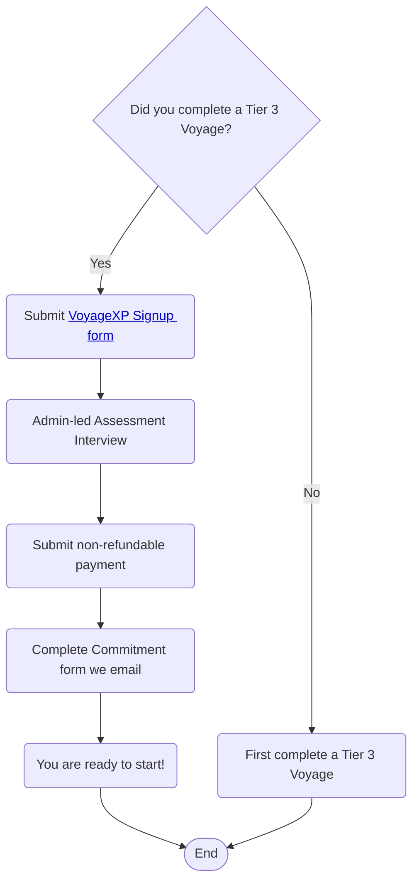

# VoyageXP

## All About Your Voyage

 1. [What is VoyageXP](#what-are-voyages)
 2. [Before you Start](#before-you-start)
 3. [The VoyageXP Process](#the-voyagexp-process)
 4. [VoyageXP Tips](#voyage-tips)

---

## What is VoyageXP❓

Voyage XP is a paid tier — just $20 for the entire 8-week program.
Why? Because research shows that when people pay even a small amount, they
stay more committed, motivated, and accountable. We’ve priced this intentionally
low to keep it accessible, but just enough to help you — and your teammates —
show up fully.

This isn’t a sprint. It’s an 8-week cohort (instead of 6) — giving you more time to:
* Build strong relationships with your team
* Gain real momentum
* Deliver a more advanced, portfolio-worthy project

Forget the chaos of scheduling around different time zones. In Voyage XP, we’ve
pre-set dedicated collaboration hours so teams can actually work together.

> All participants must be available 8:00 AM – 11:00 AM Pacific Time (which is 5:00 PM – 8:00 PM
London Time) with a total commitment of ~15 hours/week.

These hours will include:
* Team meetings & pair programming
* Work sessions
* Weekly live courses, Lean Coffee discussions & speaker events

You don’t need to be in any specific location — you just need to commit to being
available during these hours.

## Benefits of VoyageXP

✅ A cross-functional team: 3–4 Developers, 1 UX/UI Designer, 1 Scrum
Master, 1 Product Owner

✅ Two 40-minute 1:1 coaching sessions with an Agile Guide

✅ Live industry speaker sessions and career talks

✅ Access to Lean Coffee networking & strategy meetups

✅ Resume review + interview practice

✅ Feedback, mentorship, and support from your Agile Guide throughout the
voyage

✅ A structured, committed team experience designed to simulate working in
a real tech company

✅ You’ll receive a certification of completion

✅ Referral/Recommendation letter and LinkedIn endorsements upon request

## Requirements to participate in VoyageXP

This is an advanced track, and we want you to be set up for success. Here’s what
you need to apply:

✅ You’ve successfully completed at least one Tier 3 Chingu Voyage

✅ You can commit 15 hours/week for 8 weeks

✅ You’ll attend a quick 15-minute interview so we can make sure it’s the right
fit for your goals

### VoyageXP Schedule 🗓️
| Milestone | 2026 VoyageXP 58 | 
| :--- | :--- |
| Signup Deadline | TBD |
| Assessment Interviews | TBD - TBD | 
| Session starts | TBD |
| Session ends & projects due | TBD |
| Demo Day presentations due | TBD |
| Demo Day | TBD |
| Completion Certificates issued | TBD |
| Showcase article published | TBD |

## The VoyageXP Process

### Resources for your team

A team channel is provided in Discord to every team at the start of the Voyage. You should use this to communicate and collaborate with your teammates. Access to this channel is restricted to your team, so it's the best place for open, frank, and respectful communication with your teammates. 

**_Your team must not create your own Discord server, Slack channel, etc. to communicate with each other about your project._** Doing this means we won't be able to provide assistance when you
need it.

You will also be provided with a GitHub repo for your project. This is created for you in the `chingu-voyages` organization and everyone on your team is granted `admin`
access to it. But, **you must***:

- leave this as a public repo
- not rename the repo we've provided
- not create any additional repos on your own

If you need another repo, [open a ticket](https://discord.com/channels/330284646283608064/1105911757177888908) and a member of the Chingu Admin team will be happy to create it for you.

### Scrum Agile Framework

During a VoyageXP session you and your team will be using and adhering to Scrum just as you do
in a Voyage. The difference is VoyageXP sessions are 8 sprints long instead of the 6 sprints in
a Voyage. You can review the [Voyage Process documentation](../voyage/voyage.md#the-voyage-process) if you need a refresher.

### VoyageXP Extras

#### Two 40-minute 1:1 coaching sessions with an Agile Guide

TBD

#### Live industry speaker sessions and career talks

TBD

#### Access to Lean Coffee networking & strategy meetups

TBD

#### Resume review + interview practice

TBD

#### Feedback, mentorship, and support from an Agile Guide

TBD

## VoyageXP Tips

### Tips for all teammates ✏️

[How do I make a voice channel for my team?](./topics/tips_voice_channel.md) 
[What should I do if I don't have access to my team repo?](./topics/tips_repo_access.md) 
[How can I share Daily Standup status in my Team Channel?](./topics/tips_standup_cmd.md) 
[How can I “pin” messages to my Team Channel?](./topics/tips_pin_messages.md) 
[Which team role is the most important one?](./topics/tips_voyage_role.md) 
[My team doesn't have a Product Owner. What should we do?](./topics/tips_no_po.md) 
[Titan - User Status & Ticketing System](./topics/tips_titan.md)

### Tips for Product Owners ✏️

[Do PO's need to be able to develop code?](./topics/tips_po_code.md) 
[How can PO's keep from getting overwhelmed?](./topics/tips_po_code.md) 
[How can you improve your approach and identify areas for growth?](./topics/tips_po_growth.md) 

### Tips for UI/UX Designers ✏️

Stay tuned for new content!

### Tips for Developers ✏️

[How can you integrate GitHub & Discord?](./topics/tips_dev_github_discord.md) 
