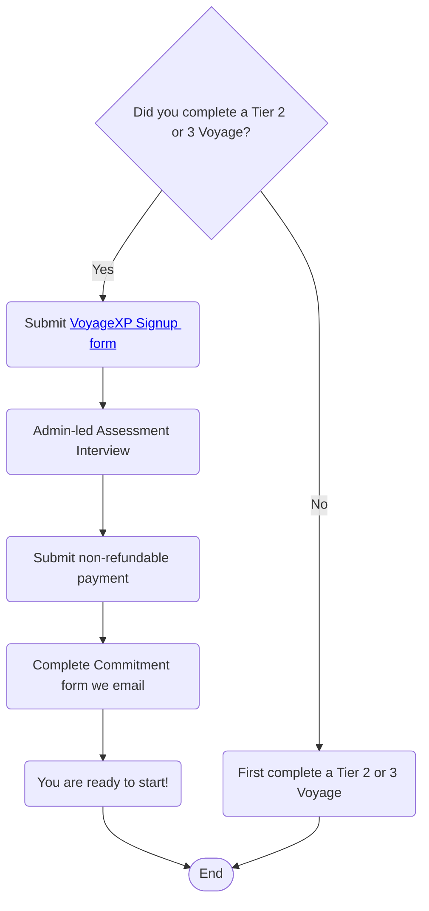

# VoyageXP

## All About VoyageXP

 1. [What is VoyageXP](#what-is-voyagexp)
 2. [Benefits of VoyageXP](#benefits-of-voyagexp)
 3. [Requirements to participate in VoyageXP](#requirements-to-participate-in-voyagexp)
 4. [The VoyageXP Process](#the-voyagexp-process)
 5. [VoyageXP Tips](#voyagexp-tips)

---

## What is VoyageXP❓

Voyage XP is a premium 10-week experience designed to help you build advanced projects, gain real-world collaboration experience, and elevate your technical and leadership skills.

For this pilot cohort, we’re offering it at an introductory rate of just $30 for the full 10 weeks.

We’ve intentionally priced this pilot accessibly so early members can shape the experience while receiving high-impact mentorship, accountability, and advanced project work.
This isn’t a sprint. It’s an 10-week cohort (instead of 7) — giving you more time to:

* Build strong relationships with your team
* Gain real momentum
* Deliver a more advanced, portfolio-worthy project

Forget the chaos of scheduling around different time zones. In Voyage XP, we’ve
pre-set dedicated collaboration hours so teams can actually work together.

> All participants must be available 8:00 – 11:00  Pacific Time (which is 17:00 – 20:00 GMT) with a total commitment of ~15 hours/week.

These hours will include:

* Team meetings & pair programming
* Work sessions
* Weekly live courses, Lean Coffee discussions & speaker events
* Resume review, Interview practice & LinkedIn optimization 

You don’t need to be in any specific location — you just need to commit to being
available during these hours.

## Benefits of VoyageXP

✅ A cross-functional team: 3–4 Developers, 1 UX/UI Designer, 1 Scrum
Master, 1 Product Owner

✅ Two 40-minute 1:1 coaching sessions with an Agile Guide

✅ Live industry speaker sessions and career talks

✅ Access to Lean Coffee networking & strategy meetups

✅ Resume review + interview practice 

✅ Feedback, mentorship, and support from your Agile & Technical Guide throughout the
voyage

✅ A structured, committed team experience designed to simulate working in
a real tech company

✅ You’ll receive a certification of completion

✅ Referral/Recommendation letter and LinkedIn endorsements upon request

## Requirements to participate in VoyageXP

This is an advanced track, and we want you to be set up for success. Here’s what
you need to apply:

✅ You’ve successfully completed at least one Tier 2 or Tier 3 Chingu Voyage

✅ You can commit 15 hours/week for 10 weeks

✅ You’ll attend a quick 25-minute interview so we can make sure it’s the right
fit for your goals

```mermaid
flowchart TB
  A{Did you complete a Tier 2 or 3 Voyage?};
  A -- Yes --> B(Submit <a href='https://forms.gle/19ZDuRVXEfX1JQvv9' target='_blank'>VoyageXP Signup form</a>);
  A -- No --> C(First complete a Tier 2 or 3 Voyage);
  B --> D(Admin-led Assessment Interview);
  D --> E(Submit non-refundable payment);
  E --> F(Complete Commitment form we email);
  F --> G(You are ready to start!);
   
  G --> Z([End]);
  C --> Z([End]);
```

### VoyageXP Schedule 🗓️

| Milestone | VoyageXP Schedule |
| :--- | :--- |
| Signup Deadline | March 11 |
| Assessment Interviews | March 15 - 21 |
| Session starts | March 30 |
| Session ends & projects due | June 7 |
| Demo Day presentations due | June 8 |
| Demo Day | June 10 |
| Completion Certificates issued | June 17 |
| Showcase article published | June 17 |

## The VoyageXP Process

### Resources for your team

A team channel is provided in Discord to every team at the start of the Voyage. You should use this to communicate and collaborate with your teammates. Access to this channel is restricted to your team, so it's the best place for open, frank, and respectful communication with your teammates.

**_Your team must not create your own Discord server, Slack channel, etc. to
communicate with each other about your project._** Doing this means we won't
be able to provide assistance when you need it.

You will also be provided with a GitHub repo for your project. This is created
for you in the `chingu-voyages` organization and everyone on your team is
granted `admin` access to it. But, **you must**:

* leave this as a public repo
* not rename the repo we've provided
* not create any additional repos on your own

If you need another repo,
[open a ticket](https://discord.com/channels/330284646283608064/1105911757177888908) and a member of the Chingu Admin team will be happy to
create it for you.

### VoyageXP Team Formation

Every VoyageXP team includes:

* 1 x Scrum Product Owner
* 1 x Scrum Master
* 1 x UI/UX Designer
* up to 4 Developers

This is an advantage over Voyage teams where teams are only guaranteed to have
Web Developers. All other roles are present only when available.

### Scrum Agile Framework

During a VoyageXP session you and your team will be using and adhering to
Scrum just as you do in a Voyage. The difference is VoyageXP sessions are 10
sprints long instead of the 7 sprints in a Voyage. You can review the
[Voyage Process documentation](../voyage/voyage.md#the-voyage-process) if you
need a refresher.

### Two 40-minute 1:1 coaching sessions with an Agile Guide

Twice in a VoyageXP session one of our Agile Guides will schedule a 40-minute
meeting to listen to your questions and concerns, and provide advice and help
you can use to improve your understanding of Agile, Scrum, and to get more from
VoyageXP.

Agile Guides are certified Scrum Product Owners or Scrum Masters who have
successfully completed multiple Voyages. They will help you learn more about
Agile/Scrum and use what you have learned to help your team.

### Feedback, mentorship, and support from an Agile Guide

In addition to the coaching sessions with an Agile Guide you'll have access to
them in Discord to get their timely feedback on problems and successes,
answers to questions you might have, and general support.

Remember that in Chingu we stress working outside your comfort zone, but that
doesn't mean you are alone or without support and assistance.

### Live industry speaker sessions and career talks

Chingus already have access to our Roundtables and Lean Coffee sessions. But,
those in VoyageXP sessions will have access to live presentations and career
talks with industry leaders from outside Chingu.

In these you will get insights from thought leaders in our industry and you
will have the opportunity to ask questions and get their advice.

### Access to Lean Coffee networking & strategy meetups

In VoyageXP you will also have the opportunity to meet other professionals in
networking and strategy meetups. In these sessions you discuss hot topics in
the industry, share experiences and struggles, and building supportive relationships.

### Resume review + interview practice

Something that makes building experience in a VoyageXP session even more
valuable are the resume review and interview practice sessions that help you
prepare for interviews.

These sessions are facilitated by leaders in the Chingu team, as well as
industry experts and thought leaders.

## VoyageXP Tips

### Tips for all teammates ✏️

[How do I make a voice channel for my team?](../voyage/topics/tips_voice_channel.md) 
[What should I do if I don't have access to my team repo?](../voyage/topics/tips_repo_access.md) 
[How can I share Daily Standup status in my Team Channel?](../voyage/topics/tips_standup_cmd.md) 
[How can I “pin” messages to my Team Channel?](../voyage/topics/tips_pin_messages.md) 
[Which team role is the most important one?](../voyage/topics/tips_voyage_role.md) 
[My team doesn't have a Product Owner. What should we do?](../voyage/topics/tips_no_po.md) 
[Titan - User Status & Ticketing System](../voyage/topics/tips_titan.md)

### Tips for Product Owners ✏️

[Do PO's need to be able to develop code?](../voyage/topics/tips_po_code.md) 
[How can PO's keep from getting overwhelmed?](../voyage/topics/tips_po_code.md) 
[How can you improve your approach and identify areas for growth?](../voyage/topics/tips_po_growth.md) 

### Tips for UI/UX Designers ✏️

Stay tuned for new content!

### Tips for Developers ✏️

[How can you integrate GitHub & Discord?](../voyage/topics/tips_dev_github_discord.md) 
