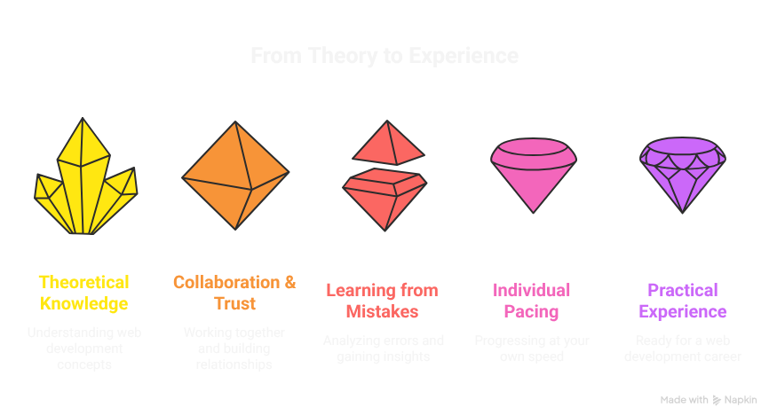

# The Chingu Manifesto

Given our mission, what are some of the high-level principles that govern what we 
do and how we do it?

## “Chingu” means “friend”
Chingu is Korean for “friend”. We intentionally chose this as our company name 
because we believe that an environment that maximizes learning and growth cannot
and must not be toxically competitive. 

We are all dedicated and motivated professionals focused on expanding our careers. 
But, this doesn’t mean that we fail if someone else succeeds. This is the 
antithesis of teamwork and it erodes trust in teams and it increases the dreaded 
Impostor Syndrome.

Building experience and growing your career through Chingu isn’t a zero-sum game. 
You don’t have to lose for me to win. This means we can win together and we can 
lose together too.

## Trust is the cornerstone of teamwork

Teamwork is hard and it doesn’t just happen. Teamwork is built on trust and high 
performing teams recognize this and work to create an environment that builds and 
grows trust.

Building trust requires that we treat each other with respect and when 
disagreements arise, we don’t retreat from them. Instead, we deal with them
respectfully and with a goal of continuous improvement rather than from a win-lose 
position.

The environment we’ve created helps our members to speak up, ask questions, learn from one another, and give and get help and advice.

## Mistakes are to be celebrated

Unfortunately, many professionals at all levels think that mistakes are bad and 
that they are failing if they make mistakes. Nothing could be further from the 
truth. 

The repercussions of mistakes can most definitely be serious. But, the mistakes 
themselves are powerful learning tools. The lessons we learn from them are more 
insightful than those we learn from successes and we remember these lessons longer.

The key is using personal retrospection to inspect the cause of the mistake, the 
impact resulting from it, and how it could have been avoided. Doing this maximizes 
what you can learn from a mistake while lowering the probability of repeating it.

## The Impostor Syndrome affects everyone

Anyone who claims they don’t experience the Impostor Syndrome is either delusional 
or in denial. The Impostor Syndrome affects everyone in all walks of life 
regardless of their level of experience.

However, as you build experience and confidence you will also learn techniques for 
coping with the Impostor Syndrome to minimize its negative effects.

At Chingu, our responsibility is to help our members and teammates learn and refine 
the coping techniques that work best for them. One important way we do this is to 
help them build confidence in themselves and to understand that building a career 
is a process that occurs in stages and takes time. 

## Everyone has their own pace

Everyone advances at their own pace and we acknowledge this and work to build our 
programs to accommodate our members' individual needs. There’s no set schedule that 
says “you have to accomplish this milestone to be successful”. 

A person’s measure of success is whether or not they achieve their goals rather 
than how fast it took them to reach them.

We embrace this and don’t judge our members based on speed - only on whether they 
reached their goal.

## No single technology or techstack is the “best”

The only definition of “best” technology is whether or not it is used to build 
applications that meet the needs of the user. In other words, “best” is a relative 
measure, not an absolute measure.

In our industry new technologies and tools come at a sometimes frightening pace. 
The old adage that “the only constant is change” is very true.

Recognizing this, Chingu is open to all programming languages, tools, libraries, 
frameworks, and technologies that support the Web Development process. Our loyalty 
is to the user, not a specific technology.

## We aren't motivated by profit alone

We don’t want to be the next mega company that rewards senior management and 
investor with massive amounts of money. Our primary reward is the satisfaction we 
investors with massive amounts of money. Our primary reward is the satisfaction we

This is why we have intentionally shunned venture capital where the goal is to grow 
at any cost so you can sell the company and “cash out”.

Having said this, we do have financial obligations. Running Chingu requires the use 
of online services with monthly fees. Our first financial goal is to meet these 
expenses. 

Our second financial goal is to manage our expenses so they are at a minimum. This 
means we often trade time for money since there may be manual steps we must perform 
when a service could perform it for us, but at additional cost. 

Our third financial goal is to generate the revenue needed to continue to adapt 
existing member programs and to add new ones so we continuously increase the value 
provided to our members as they advance their careers.
