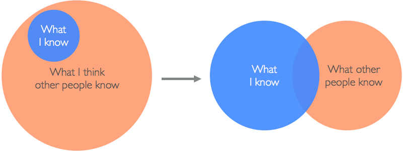

# Glossary


<details>
  <summary>A/B Testing</summary>
  <br/>

  A/B testing is a methodology for trying out different ways of achieving the same end result, with the aim of establishing, through experimentation, which solution is the most effective.
  
  Typically A/B testing is used to trial different layouts of web pages, by tracking how many users convert to paying customers using the alternative layouts.

  By continuing an iterative process of prototyping, evaluating and adapting, A/B testing can provide a significant increase to the conversion rate of individual pages. It's a useful tool: better conversion means a better balance sheet!
  <br/>
</details>
    
<details>
  <summary>Agile</summary>
  <br/>

  The main difference between older waterfall-style project management and agile projects is that waterfall fixes in place the *scope* of a project to improve the accuracy of resource and time estimates, while agile fixes *resources and time* and estimates the scope.
  
  For many types of projects, this reversal is more practical since it is not possible to identify all requirements at the beginning of a project. Any attempt to do so will lead to issues in stability and quality since features are implemented without the necessary resources or time.
  
  Agile methodologies address this by adopting an iterative approach to development, with each iteration being the foundation for its later iterations (ie. sprints).
  <br/>
</details>
    
<details>
  <summary>API (Application Programming Interface)</summary>
  <br/> 

  An API is a communication protocol defined by a software system which provides external components with a lexicon for requesting data and invoking predefined functionality. An API can be thought of as a contract between the provider of a service and its requestors.
  
  APIs consist of a set of pre-defined messages that requestors use to ask for data and services, service routines implemented in the provider, and a transport mechanism that transfers messages and results between a provider and the requestors.
  
  In modern JavaScript software systems the protocol is implemented using REST or GraphQL, the transport mechanism is TCP/IP, and the provider services are a series of routes in a backend HTTP server.
  <br/>
</details>
    
<details>
  <summary>Backend</summary>
  <br/>

  The backend of a web application is an enabler for a frontend experience. An application’s frontend may be the most beautifully crafted web page, but if the application itself doesn’t work, the application will be a failure. The backend of an application is responsible for things like calculations, business logic, database interactions, and performance.
  
  Common technologies used in backend development are Ruby, Python, SQL, Node.js, Express.js, and REST APIs.
  <br/>
</details>
    
<details>
  <summary>Backlog</summary>
  <br/>

  The project backlog is the work to be performed for the project to reach its goal. Building the backlog is a process of decomposing the application’s features and the technical requirements to support them into an actionable set of work items.
  <br/>
</details>
    
<details>
	<summary>Boilerplate</summary>
	<br/>

  In computer programming, **boilerplate code** or **boilerplate** refers to 
	sections of code that have to be included in many places with little or no 
	alteration. It is often used when referring to languages that are 
	considered verbose, i.e. the programmer must write a lot of code to do 
	minimal jobs.
  <br/><br/>
	Most professional web developers have created a collection of assets and 
	snippets of code that they reuse on projects to accelerate development. 
	There are some universal or near universal patterns that all websites share 
	in common. Rather than continuously rebuild these, most developers start by 
	copying the code they used for a similar project and then start modifying 
	it.
	<br/><br/>
	Some developers recognize the value of these boilerplate starter templates 
	and take the time to make the boilerplate more generic and share them 
	online for others to use.
	<br/><br/>
	Two examples of popular boilerplates are:

  - [Create React App](https://create-react-app.dev)
  - [NextJS](https://nextjs.org)

  <br/>
</details>
    
<details>
  <summary>Cache</summary>
  <br/>

  A cache is a temporary storage space for data. When you visit a website, 
  the files that you request are automatically stored in the cache. If you 
  return to that same website in the near future, your browser will retrieve 
  the necessary files from your cache rather than from the original server, 
  so the webpage will load quicker.
  <br/>
</details>
    
<details>
  <summary>CRUD</summary>
  <br/>

  An acronym for a class of functionality that provide users with Create-Retrieve-Update-Delete (CRUD) operations against a particular 
  set of data. CRUD is common to virtually all applications, so it's 
  important to understand this type of functionality.
  <br/>
</details>
    
<details>
  <summary>Edge Case</summary>
  <br/>

  An Edge Case is a situation that isn't likely to occur, but isn't impossible either. Edge cases arise when conditions or inputs of extreme ranges are encountered. For example, when extremely high or low values are input into a numeric field.
  
  Software often operates as expected when inputs falling within an expected range of values are provided (sometimes referred to as the "happy path"), but fail if they fall outside the bounds of what is considered normal. Properly handling situations like this requires the developer to code defensively and either support the full range of possible input values, or restrict the input to the range that can be processed without error.
  
  Situations that may lead to unexpected results and errors are broadly classified as edge cases. Examples of these include:
  
  - Missing or incomplete detection and handling of error conditions. This includes error handling around API and database calls.
  - Improper validation and editing of input values
  - Failure to properly initialize or reset variables
  - Failure to account for changes in environmental conditions, such as resizing of windows or removing all records in a file.
  
  Addressing these types of conditions requires the developer to anticipate them by considering not what is supposed to happen based on the specifications that have been provided, but considering what types of conditions could occur. In other words - "thinking outside of the box".
  <br/>
</details>

<details>
  <summary>Epics</summary>
  <br/>
	
  Epics are brief statements highlighting the main functions the product promises to provide to its users. Epics complete the phrase "This app lets you..."

  > You can create Epics directly from the app's use cases (as defined in its Vision Statement).
  <br/>
</details>
    
<details>
  <summary>Feature (App. Feature)</summary>
  <br/>
  
  Features are the discrete capabilities an application provides to users which allow them to complete a particular business function. Groups of applications features support an [application function](https://docs.chingu.io/glossary#function-application-function).
  
  For example, an application function in a texting application is to send a message, but the functions it provides to the user are to select the recipients, create a message, and to send the message.
  <br/>
</details>
    
<details>
  <summary>Frontend</summary>
  <br>

  Front-end developers write the code that controls how a website looks and interacts when it's displayed in a browser. The primary tools of a front-end developer include HTML (code that makes content render on a page), CSS (coded stylesheets that apply color, typography, style and layout to the HTML) and JavaScript (code that handles advanced interactivity). A front-end developer will also work with a handful of other frameworks that help expedite, enhance, and organize the coding process. For example, popular frontend JavaScript frameworks include React, Vue, and Angular.
  <br/>
</details>
    
<details>
  <summary>Full Stack</summary>
  <br/>

  Full stack simply means that a combination of frontend and backend will 
  be used.
  <br/>
</details>
    
<details>
  <summary>Function (Application Function)</summary>
  <br/>

  Application functions can be thought of as the commitments an application makes to its users. In this context, application functions are the contracts an application establishes with the user. Application functions are composed of [application features](https://docs.chingu.io/glossary#feature).
      
  Note that this is different from the function definition used in a programming language.
  
  For example, a function of an invoicing application is to create a past due notice, but the application features it's composed of include identifying purchases that have not been paid, applying additional charges based on the purchase terms, generating an itemized dunning notice, and emailing to the buyers.
  <br/>
</details>
    
<details>
  <summary>Git</summary>
  <br/>
  
  [Git](https://en.wikipedia.org/wiki/Git) is a distributed source code control system developed in 2005 by [Linus Torvalds](https://en.wikipedia.org/wiki/Linus_Torvalds). Unlike earlier source code control systems (SCCS), Git allows multiple developers to simultaneously modify the same modules. Conflicts are detected and resolved when changes are pushed to a common branch.
  
  This is radically different from earlier SCCS's which followed a checkout-checkin process that allowed only one developer at a time to modify a given file.
  
  Git is the defacto standard SCCS for both commercial and non-commercial software development and most SCCS services, like GitHub and GitLab, are based on it.
  <br/>
</details>
    
<details>
  <summary>GitHub</summary>
  <br/>
  
  GitHub is a cloud interface for Git. It has been around since 2008 and now has over 28 million users worldwide, making it the largest host of source code in the world! GitHub offers all the version control functionality of Git, but also offers its own features, such as bug tracking, task management, and project wikis.
  <br/>
</details>
    
<details>
  <summary>HTTP</summary>
  <br/>

  HTTP stands for Hypertext Transfer Protocol, and is used to transfer data across the internet. HTTP sends the data (say, a HTML document or an image) from an HTTP server program (a web server) to an HTTP client program (a web browser).
  <br/>
</details>
    
<details>
  <summary>HTTPS</summary>
  <br/>
  
  HTTP layered with Transport Layer Security (TLS) or Secure Sockets Layer (SSL) protocols. With HTTPS any data that you send from your computer will be encrypted and will only be decrypted once it has safely arrived at your intended location.
  <br/>
</details>
    
<details>
  <summary>Impostor Syndrome</summary>
  <br/>
  
  The [Impostor Syndrome](https://medium.com/learn-love-code/developers-how-to-overcome-imposter-syndrome-48edee803cf4) is a persistent feeling of inadequacy that continues in spite of evidence to the contrary. This is a very common feeling that we all share (yes! "we"). But in fact, the reality is quite different as shown by the following diagram.
  
  
  
  No one starts out with an innate knowledge of a subject — it’s acquired through work and study! You may not be the expert at JavaScript or CSS or HTML or Angular or React or Vue or some other technology or library, but you will be. And as soon as you think you’ve grasped it, it's almost guaranteed it will change.
  
  Knowledge and learning are cyclical, never ending endeavors. No one ever has a complete mastery over a subject. So, we in this respect we are all impostors. Rest assured that you are not alone in this feeling and you are not an impostor.
  <br/>
</details>
    
<details>
  <summary>Minification</summary>
  <br/>

  Minification is the process of minimizing code and markup in order to reduce the file size. When creating a HTML file, for example, developers will most likely use spacing, comments and variables to make the code more readable as they work with it. To minify the code once the webpage is ready to go live, developers will remove these comments and spaces to ensure a quicker page-load time (crucial for delivering a good user experience!).
  <br/>
</details>
    
<details>
  <summary>Mockup</summary>
  <br/>
  
  In software, a [mockup](https://en.wikipedia.org/wiki/Mockup) is a prototype that represents the features and functionality of the final product. This can range from a hand drawn wireframe all the way up to an actual working skeleton of an application.
  
  The primary use of a mockup is during design to ensure that features, the user interface, and the user experience all work in harmony before any code is written. Mockups are useful during walkthroughs to identify gaps or weak points in the application design.
  <br/>
</details>
    
<details>
  <summary>MVC (Model View Controller)</summary>
  <br/>
  
  [MVC](https://en.wikipedia.org/wiki/Model%E2%80%93view%E2%80%93controller) is a design pattern which separates the presentation of information to the user from the operations applied to the data provided by the user. This pattern helps make application software modular and easier to maintain and enhance by separating different architectural concerns from one another.
  <br/>
</details>
    
<details>
  <summary>MVP (Minimum Viable Product)</summary>
  <br/>
  
  When working in web development, you may hear talk of “MVP” — or minimum viable product. The minimum viable product is the most pared-down version of a product that can be released to market. When adopting an MVP approach, developers will first focus on the core features and functions that are absolutely crucial. Then, once the product has been released and user feedback has been gathered, they will continue to build the complete set of features.
  <br/>
</details>
    
<details>
  <summary>Pair Programming</summary>
  <br/>

  There is an oft-quoted adage that "two heads are better than one". *Pair Programming* is a practical implementation of this advice. It leverages the experience and knowledge of two developers to improve the speed at which an app is created, but also its quality.
     
  In this process two developers work together, either side-by-side or via screen sharing, with one writing code while the other reviews the code as it is being written. The developer reviewing the code examines it not just for correctness, but also to ensure that it's clear, supportable, and resilient.
  
  The pair keep up a running dialog and frequently switch roles.
  
  The advantage of pair programming is the developer writing the code can focus on the tactical attributes of the code since the developer who reviews the code is responsible for the strategic aspects.
  
  You can find out more about pair programming at:

  - [What is Pair Programming](https://stackify.com/pair-programming-advantages/)
  - [How to Pair Program in 7 Steps](https://www.wikihow.com/Pair-Program)
  - [Wikipedia](https://en.wikipedia.org/wiki/Pair_programming)
  <br/>
</details>

<details>
  <summary>Plagarism</summary>
  <br/>

  Modern software development is built on collaboration and the work others have
  shared on the Internet. For example, code examples in tutorials, articles,
  videos, and on sites like [Stack Overflow](https://stackoverflow.com/).

  While it's an accepted practice to copy/paste code and then modify it for your
  own purposes you should provide attribution to acknowledge the those who have
  been kind enough to share their work.

  When using code from other sources, web developers should follow these best practices to ensure proper attribution:

1. **Include Clear Comments**:
   - **Direct Comment**: Immediately before or within the code block, add a comment specifying the original source. For example:
     ```javascript
     // Code snippet taken from https://example.com/tutorial on 2024-06-20
     function exampleFunction() {
         // original code here
     }
     ```
   - **Author Credit**: Mention the author's name if available:
     ```javascript
     // Code by John Doe from https://example.com/tutorial
     function exampleFunction() {
         // original code here
     }
     ```

2. **Use Readme Files**:
   - **Documentation**: If you’re using multiple pieces of code from different sources, maintain a `README.md` file or equivalent documentation. List all external code sources, including URLs and authors, along with the specific parts of your project where they are used.

3. **License Compliance**:
   - **Check the License**: Before using any code, review its license to ensure you comply with its terms. Some licenses require more than just attribution (e.g., sharing modifications under the same license).
   - **Include License Text**: If the code's license requires it, include the full license text in your project. For instance, if using code under the MIT License, include a `LICENSE` file in your project root.

4. **External Attribution Files**:
   - **Credits File**: Maintain a `CREDITS.md` or similar file in your project root, detailing all third-party contributions. This can include code snippets, libraries, and other resources.

5. **Web Page Footers**:
   - **Visible Attribution**: If applicable, especially for open-source web projects, provide visible attribution in the footer or about page of your website.

6. **Git Commit Messages**:
   - **Commit Records**: When adding copied code, note the source in your git commit message. This makes the history clear and traceable.
     ```sh
     git commit -m "Added sorting function from https://example.com/tutorial"
     ```

7. **In-Line Documentation**:
   - **Code Comments**: Add comments directly in the code to explain its origin and purpose, making it easier for other developers to understand and follow the attribution.

8. **Avoid Plagiarism**:
   - **Do Not Claim as Your Own**: Clearly distinguish between your original code and copied code. Never imply that copied code is your original work.

9. **Respect Source Restrictions**:
   - **API Terms of Use**: If using code snippets from APIs or other restricted sources, ensure compliance with their terms of use, which may include specific attribution requirements.

10. **Ask for Permission if Needed**:
    - **Contact Authors**: For non-open-source code or if you are unsure about the terms of use, consider contacting the original author for permission to use their code.

Following these practices helps maintain transparency, respect intellectual property rights, and fosters a culture of open and ethical collaboration in the development community.
  
  <br/>
</details>

<details>
  <summary>Prototype</summary>
  <br/>
  
  A prototype is a proof of concept used to evaluate a design idea. For example, rather than creating a static mockup of what a web page will look like and then asking stakeholders to "approve the design", a team might create a prototype that everyone can interact with in the browser. This gives everyone a more realistic, interactive facsimile of the website to try out. [Prototypes](https://blog.wsol.com/paper-prototyping-an-essential-design-tool) help teams test ideas and make necessary changes early on, before committing the effort, time and cost that go into building a fully functional product.
  
  An example prototype program is [Framer](https://framer.com/).
  <br/>
</details>
    
<details>
  <summary>Responsive Design</summary>
  <br/>
  
  In simple terms, a responsive design is one that adapts to the user's device and, in an ideal world, the user's context so that it displays the content required in the most appropriate and accessible manner, regardless of what kind of web-connected device is being used to view it.
  
  In practice this means a web page will re-paginate itself as the screen size reduces or increases, displaying in multiple columns when viewed on a desktop computer, but only a single column when viewed on a smartphone.
  <br/>
</details>
    
<details>
  <summary>Retrospective</summary>
  <br/>
  
  The Sprint Retrospective is conducted by and for the Scrum Team to promote [continuous improvement](https://en.wikipedia.org/wiki/Continual_improvement_process). It is the primary means the team uses to improve their work and to drive value not just for the customer, but also for themselves in the form of a more integrated and smoothly operating team.
     
  This is an inward look by the team at how they performed during the last sprint and identify changes for the next sprint. This isn’t just about technology and tools, but also about procedures, interactions between people and roles, and successes and failures. The goal is to improve by implementing “midstream” corrections at the point they are needed.
  <br/>
</details>
    
<details>
  <summary>REST-ful API</summary>
  <br/>

  [Representational State Transfer (REST)](https://en.wikipedia.org/wiki/Representational_state_transfer) is an architectural pattern used to create web services. REST provides requestors with a stateless mechanism for accessing data and services across the Internet using a defined set of operations including GET, PUT, POST, and DELETE.
  <br/>
</details>
    
<details>
  <summary>Solo Project</summary>
  <br/>

  The [Solo Project](../guides/soloproject/soloproject.md) 
  is your warmup for your first Voyage. In it you will either submit a project 
  you already have that matches the tier you have chosen, or you will create 
  small project (approximately 8-16 hours) from specifications provided by 
  Chingu.
     
  Solo projects provide you with these opportunities:
  
  1. You can use it to validate the tier you've selected. You may change tiers at any point in the session up to the time you submit your project for evaluation.
  2. Meet other Devs to learn from them and to share what you know.
  3. Time to familiarize yourself with the concepts** and tools you’ll need to complete the six week Voyage team project.
  4. Get feedback on your application.
      
  > Most importantly, you'll have another app to add to your portfolio!
  <br/>
</details>

<details>
  <summary>Sprint</summary>
  <br/>

  In product development, a sprint is a set period of time during which 
  specific work has to be completed and made ready for review. Each 
  sprint begins with a planning meeting.
    
  Chingu Voyage projects consist of six Sprints that are each one week long. 
  Voyage Sprints always start on Monday and end on the following Sunday.
  <br/>
</details>
    
<details>
  <summary>Sprint 1</summary>
  <br/>
  
  A major misconception about Agile is that it doesn't include design time. 
  Nothing could be further from the truth! Agile doesn't and shouldn't 
  include time for proper design, but it should be conducted at the right 
  time. This means that design, like coding, is iterative.
      
  It's a good use of the team's time to devote the first sprint to creating a 
  high-level design. The goal of this design isn't to answer every detail - 
  it is to identify the main features, create the initial backlog, the 
  structure of the project, who on the team has the skills needed to support 
  the development of each feature, and to identify gaps that need to be 
  filled.
      
  In other words, the goal of your first two sprints is to define what is to 
  be built and create a roadmap to be followed throughout the remainder of 
  the project.
  <br/>
</details>
    
<details>
  <summary>Standups</summary>
  <br/>

  Quick status updates regarding your progress. Typically, your entire team 
  would have a dedicated time to share standups together in real-time.
  <br/>
</details>
    
<details>
  <summary>Stretch Goals</summary>
  <br/>

  [Stretch goals](https://hbr.org/2017/01/the-stretch-goal-paradox) are 
  objectives that introduces risk many factors beyond a normal goal and as 
  such, add a level of uncertainty to the ability to reach the objective. 
      
  Stretch goals embrace the concepts of difficulty as a way to increase your capabilities, and novelty to provide motivation. Doing something difficult 
  is always more enjoyable and rewarding if it’s engaging and fun.
  <br/>
</details>
    
<details>
  <summary>Tiers</summary>
  <br/>

  Participants are divided into one of three tiers based on their knowledge 
  and experience at the start of the Voyage. 

  [How to select your tier](https://www.notion.so/Solo-Projects-2a41ff900cc24a72a919f0eb5e79c42b?pvs=21).

  <br/>
</details>
    
<details>
  <summary>Team</summary>
  <br/>

  A team is a group of individuals who work together to reach a common objective. This could be winning a sports competition, achieving a sales goal in business, or developing a software application.
  <br/>
</details>
    
<details>
  <summary>Technical Product Owner</summary>
  <br/>

  The role of a technical product owner is not defined in Scrum Framework or SAFe Guide - although both frameworks have the role of Product Owner.

  Product Owners are responsible for maximizing the product value delivered through the software development effort - the Product Owner defines and prioritizes the product backlog and clarifies product goals and roadmaps.

  In Chingu when you are a PO for a full stack product, when creating detailed and clear PBI you will face many technical issues: more new and complex features, more dependencies, increasing technical debt, essential architecture changes, increasing deployment frequency, etc. 

  Because so many of the issues are technical issues, Product Owners who have a strong background in technology, or who are also a developer, are often referred to as a _Technical Product Owner_. Their focus remains the product backlog and the general scrum accountabilities of a product owner, yet they have a strong technical background.

  _Technical Product Owners_, due to their technical knowledge, are sometimes considered subject-matter experts. A Product Owner generally does not take on technical work, yet Scrum doesn’t prohibit a Product Owner also working as a Developer - because in Scrum the key element regarding roles are accountabilities, and it is possible, although more difficult, for one person to fulfill multiple accountabilities. 

  **_How much technical knowledge classifies a Product Owner as a Technical Product Owner?_** This is not well defined, yet, at Chingu, we would generally consider a TPO to be someone who has been a programmer, designer ,database architect or at least has comprehensive knowledge of the software development process.

  **_What should you do if you are a Product Owner without a strong technical background?_** Transparency, honesty, and teamwork. Be open and frank with your team about your abilities, or lack of abilities. Lean on your team for their technical expertise - and learn.  If you don’t know Github and your team is having a meeting to discuss Github workflow, join in. Listen. Learn. Ask questions. Focus on increasing your technical skills. 

  In summary, the role of a Technical Product Owner (TPO), especially here at Chingu, fills a unique and valuable niche, blending the traditional responsibilities of a Product Owner with a strong technical understanding of technology. For those serving as Product Owners who do not have a strong technical background, embracing a culture of continuous learning and collaboration is key to increasing technical knowledge - never hesitate to ask questions and learn something new.
  <br/>
</details>

<details>
  <summary>Techstack</summary>
  <br/>

  A tech stack is a combination of software products and programming 
  languages used to create a web or mobile application. Applications have 
  two software components: client-side and server-side, also known as 
  front-end and back-end.
  
  Some popular stacks are:
      
  - MERN - MongoDB - Express - ReactJS - NodeJS
  - MEAN - MongoDB - Express - AngularJS - NodeJS
  - LAMP - Linux - Apache - MySQL - PHP
  <br/>
</details>

<details>
  <summary>User Stories</summary>
  <br/>

  User Stories are the required activities users must do to get the value a particular feature promises to deliver. User Stories complete the sentence:
  
  `As a <persona>, I want <requirement> So I can <value-statement>.`

  For instance,

  `As an Idea Creator, I want to provide the URLs to any supporting diagrams. URLs should have a plain text description in addition to the URL itself. So I can quickly and easily provide reviewers with more detail about my idea.`
  
  <br/>
</details>
    
<details>
  <summary>Voyage</summary>
  <br/>

  A Voyage is the 8-week team project phase of the Chingu Cohort.
      
  Chingu Voyages are an exciting way to work on projects that provide the 
  opportunity to:
      
  - Work on interesting and challenging projects
  - Learn new technologies
  - Work with a team of like-minded web developers
  - Improve soft skills including communication, collaboration, and Agile 
  project management
  - Create impact while leveling-up your skills
      
  In short, Chingu Voyages create a setting to help you both acquire and 
  practice the skills you will need on the job.
  <br/>
</details>
    
<details>
  <summary>Workflow</summary>
  <br/>
  
  A workflow is a pattern of actions created by an organization that when 
  followed, create a repeatable product. In this context the product may be 
  information, a service, or a tangible entity. For example, your teams 
  development workflow defines the steps for creating, testing, and deploying 
  modules and files that make up application software.
  <br/>
</details>
