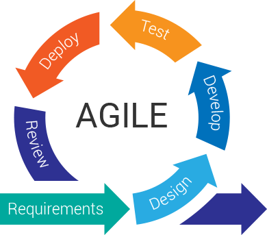
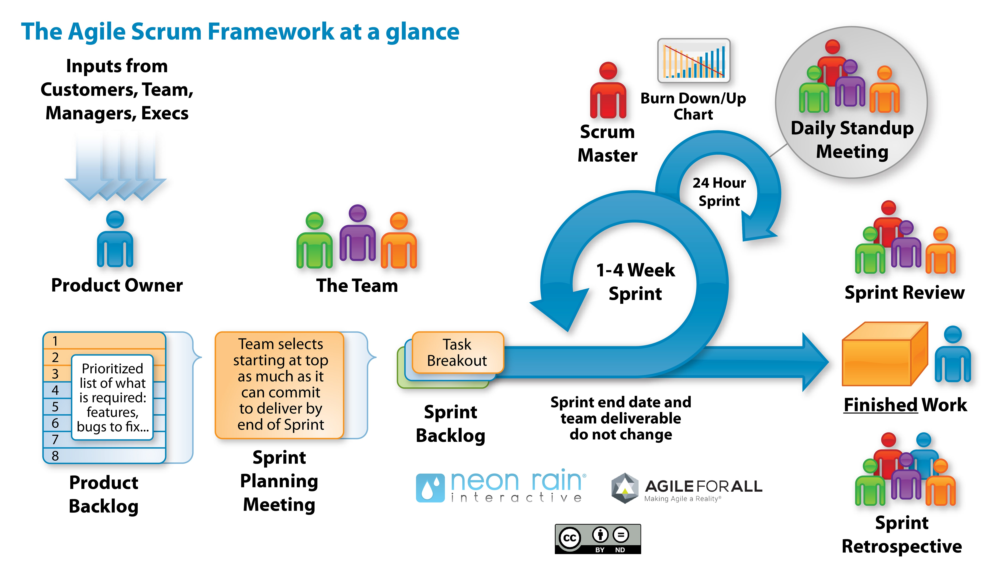
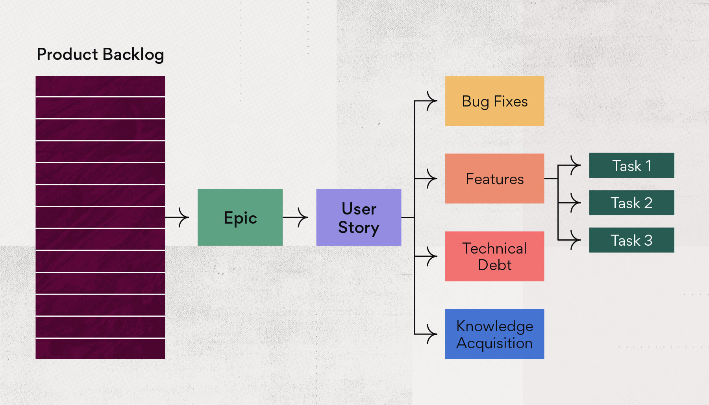
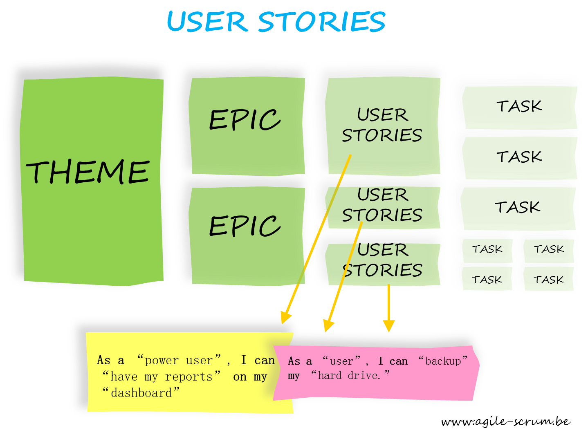

# Agile Methodology 101

## Sprints

Agile project development methodologies, like Scrum, divide the time between the start of your project and its delivery date into *sprints* of equal duration in which you'll be completing tasks. At the start of each sprint the team reviews the backlog of remaining work and chooses the tasks to be completed in the upcoming sprint. If you complete all of these before the end of the sprint then you'll start new tasks, one at a time, from the backlog to fill the remaining time.

Dividing your project in this manner and planning and executing backlog items in a logical progression allows the team to adapt to change and to start tasks at the right time. "Right" in this context is when enough details are known to allow development to be both efficient and produce something that is relevant.

The goal of each sprint is to produce a working release of an app that has more functionality and is more stable than the previous release. This iterative approach builds an app up from a simple skeleton in the first sprint to a finished application at the end of the final sprint.

## Building the Backlog

Building the backlog of tasks involves breaking down your project into discrete tasks. A good place to start is to treat every page in the app as a component and organize them in a logical sequence based on their dependency to one another. For example, you’ll probably want to complete your "Create Thing" page before starting in on a "Search for Thing(s)" page.

Once you've done that, define a *user story* for each unit of work needed to build the components. These should be very discrete and each one should be able to be completed in a single sprint. User stories are not expressed in technical terms. Instead they identify the persona that will use the delivered piece of functionality, what that requirement is, and the value they will realize from it. 

This may sound very foreign to you in your role as a WebDev, but it's critical to ensuring that your product delivers value to the end user. The most technically beautiful implemented app is useless if it doesn't deliver on this value proposition.

User stories help you to define what both "good" and "done" mean with respect to the development of your application.

Stories are simple statements having a form such as:

`As a <persona> I want <requirement> So I can <value-statement>`

For example,
`As an Idea Creator I want to provide the URLs to any supporting diagrams. URLs should have a plain text description in addition to the URL itself. So I can quickly and easily provide reviewers with more detail about my idea`

Even though the story is expressed in non-technical terms, it doesn't mean that you can't annotate it with technical details as they become known. Many of the tools you have at your disposal allow story cards to contain additional information. 

However, while documentation is important, keep in mind that Agile values working code over comprehensive documentation - this doesn't mean you don't produce documentation. It means you produce it at the right level of detail and at the right time.

Many teams do find it useful to annotate the user stories with very high level checklists listing the steps to be completed for the story and the order they are to be completed in. 

It's important to keep in mind that these define what is to be done and not how it is to be done. It's just as important to first concentrate on building the user stories before starting work on defining the steps involved in each story.

`As an Idea Creator I want to provide the URL's to any supporting diagrams. URL's should have a plain text description in addition to the URL itself. So I can quickly and easily provide reviewers with more detail about my idea[] Define the constraints for the URL and its description[] Define layout of these fields on the Idea screen[] Create component to support capture, display, and edit of these fields[] Add these fields to the database[] Add support for maintaining this information in the various backend idea routes`

Remember that the focus of the user story is to classify who your users are, what functionality they require, and the value each function will deliver.

## Backlog Grooming

Once you have defined your initial backlog of tasks you can start your first sprint as previously described. With each team meeting and each sprint, you will be updating the backlog with new information that comes to light. 

This will involve adding, modifying, and even removing stories. You'll find that some stories aren't granular enough and must be broken up into additional stories. If a story isn’t completed, it should be moved out of the Done lane on your project board and back into In Progress. 

In short, keeping the backlog relevant is a never ending task while the project is underway.

## For More Information

This has been a very light introduction to Agile project management and has been focused on practical steps to get your project to the point where you can start Sprint 1. 

Just as there are many paths to failure, there are also many paths to success.

[Beginner’s Guide to Agile](https://www.wrike.com/agile-guide/)

[A Short Introduction to the Scrum Methodology](https://medium.com/chingu/a-short-introduction-to-the-scrum-methodology-7a23431b9f17)

[Getting Started With Scrum — Building the Project Backlog](https://medium.com/chingu/dont-fear-only-the-last-mile-the-first-can-be-as-hard-19362b893ac?source=friends_link&sk=8652105af520c310527eb430ef5e93d7)

[8 Attitudes Guaranteed to Sink Your Agile Projects](https://www.wrike.com/blog/8-attitudes-guaranteed-to-sink-your-agile-projects/)

[Beginner’s Guide to Scrum](https://www.wrike.com/scrum-guide/) 

[Beginner’s Guilde to Kanban](https://www.wrike.com/kanban-guide/)

[Top 7 Agile Frameworks](https://premieragile.com/types-of-agile-frameworks/)

[What is the Waterfall software development methodology and is it still relevant?](https://kruschecompany.com/waterfall-software-development-methodology/)