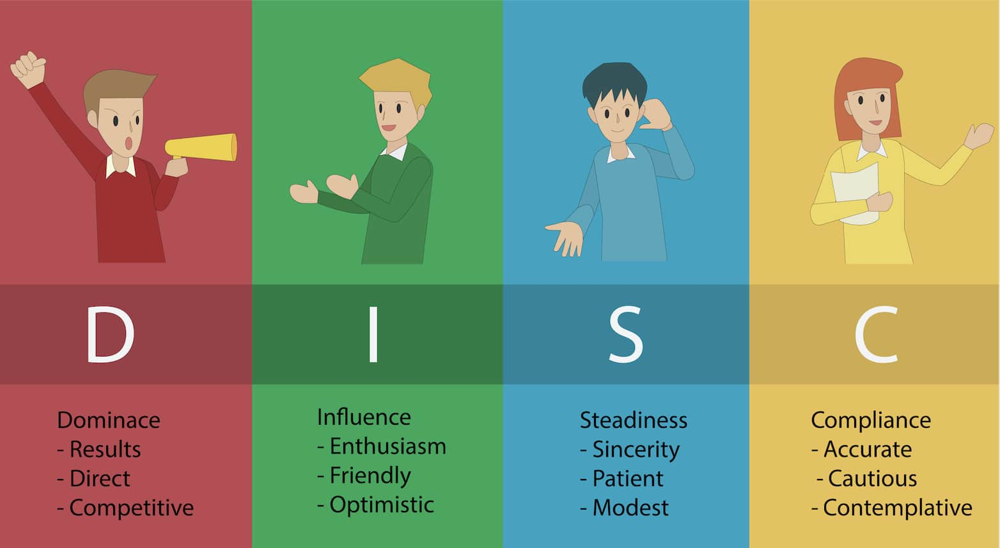

# Traits of Highly Effective Teams

Teams don't just happen! It takes thought, planning, and work to build an effective team. Great teams share the following traits and as you start the Voyage Project your team should review these:

**1. Team Identity**

Team members must share a common vision and a clear understanding of the goal, and an understanding of each individual's role. Respect between team members also fosters a sense of loyalty to each other and the team as a whole.

**2. Motivation**

Team members must be motivated to achieve the team's goal. This is especially true for Web Development projects because they blend many disciplines, both technical and non-technical. Motivated teams reflect on their successes and failures during the project to improve how they work together and the quality of what they produce. They also set stretch goals and work through problems without giving up.

**3. Emotional Awareness**

Team members pay attention to one another. They are empathetic to the feelings of their teammates and strive to help, coach, and mentor one another. By their very natures, teams are cooperative rather than individual enterprises - they require a high degree of understanding and cooperation between members.

**4. Communication**

High performing teams don't just talk to one another; they practice active
listening and participation, and are open to the ideas of others. Team members
don't give up their principles when differences arise, but instead provide
honest and respectful feedback.

A problem teammates often face is when one teammate says something, thinks that
they've been quite clear, but it's interpreted diffently be another teammate.
Practicing active listening goes a long way to resolving this type of situation.
But, the effectiveness of your communication is supercharged if you take the
time to understand what type of communicator each of your teammates are.

The [DiSC Model](https://www.everythingdisc.com/what-is-disc/) is one way to
help you and your teammates categorize your individual communication styles
to help you identify how best to communication with one another.

**5. Stress Tolerance**

Developing complex applications under a deadline often brings on stress. Having a healthy tolerance for stress doesn't require the repression of feelings, it requires introspection to understand them in proportion to their importance. It also requires the maturity to ask your teammates for help when it's needed, even if it's only to listen.

**6. Conflict Resolution**

Disagreements happen. The question isn't whether or not a disagreement will happen, it's *when* it will happen and how will the team deal with it in a mature manner.

Few disagreements are "win-lose", they are almost always "lose-lose". Dealing with conflict requires that teammates recognize this and work towards resolutions that resolve the problem, but don't damage the cohesiveness of the team in the process.

**7. Positive Mood**

Many times, teams will spend more time on problems and failures than on their successes. This often carries over to neglecting the work of the team to correct them and can impact the team's mood. Teams need to celebrate success, encourage one another, and foster an attitude that challenges even the toughest of problems.

Source: Catarina Lino, “The Psychology of Teamwork: The 7 Habits of Highly Effective Teams”, Positive Psychology Program, 5 Sept. 2016, [mashable.com/2014/09/03/education-data-video/#hViqdPbFbgqH](https://positivepsychologyprogram.com/psychology-teamwork/).