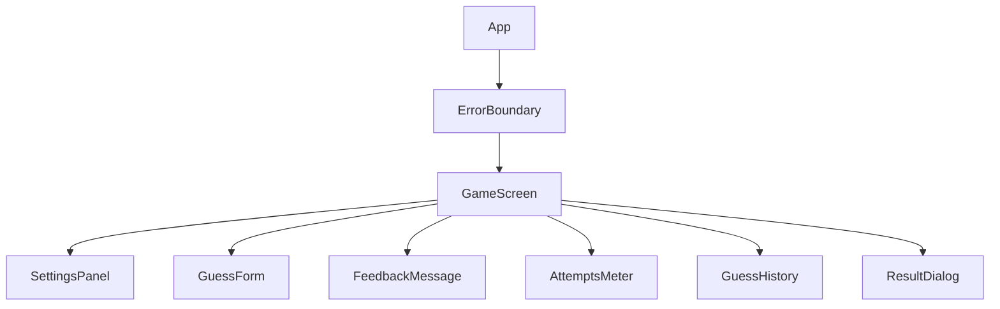
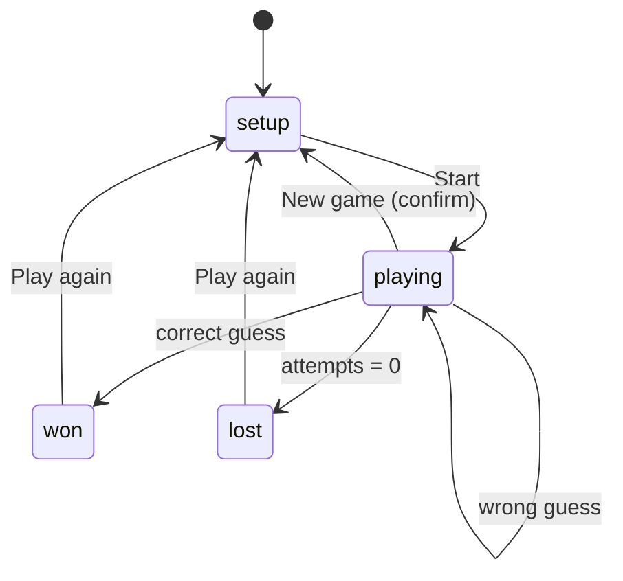

# Number Guessing Game — Build Specification

## 1. Overview

Build a single-page React app where the player guesses a secret whole number within a range, gets "too high / too low" hints, and wins or loses within a limited number of attempts. Hand this whole document to the code generator; every "must" is a requirement, every "should" is strongly preferred.

**Goals**

- Playable in under 10 seconds from page load, with no instructions needed.
- Fully usable by keyboard, screen reader, touch, and mouse.
- Works from 320 px phones to 1920 px desktops.
- Never crashes or shows a blank screen, whatever the input.

**Non-goals:** accounts, backend, multiplayer, sound effects, analytics.

**Tech stack**

| Item | Requirement |
| --- | --- |
| Language | JavaScript (ES2022). No TypeScript unless requested. |
| Framework | React 18+ with function components and hooks only. No class components. |
| Build tool | Vite. |
| Styling | Plain CSS or CSS Modules with CSS custom properties. No UI framework. |
| Dependencies | None at runtime beyond `react` and `react-dom`. |
| Testing | Vitest + React Testing Library + `@testing-library/user-event`; `jest-axe` for accessibility checks. |
| Linting | ESLint with `eslint-plugin-react-hooks` and `eslint-plugin-jsx-a11y`. |
| Browsers | Latest 2 versions of Chrome, Edge, Firefox, Safari (desktop + iOS), Chrome Android. |

## 2. Game rules

The app picks a secret integer in the chosen range; the player wins by guessing it before attempts run out.

1. Player picks a difficulty (default: Medium) and presses **Start**.
2. The app generates the secret with `crypto.getRandomValues`, falling back to `Math.random` if unavailable. Both ends of the range are inclusive.
3. Each valid guess uses one attempt and returns one of: **Too low**, **Too high**, or **Correct**.
4. Win: guess equals the secret. Lose: attempts reach zero without a correct guess; reveal the secret.
5. After a win or loss, the input is disabled and **Play again** becomes the primary action.
6. Invalid or repeated guesses never use an attempt (see sections 7 and 8).

| Difficulty | Range | Max attempts |
| --- | --- | --- |
| Easy | 1–50 | 10 |
| Medium | 1–100 | 7 |
| Hard | 1–1000 | 10 |
| Custom | Player sets min and max | Player sets 1–50 |

**Hints** (shown with every non-winning guess):

- Direction: "Too high" or "Too low".
- Temperature: "Hot" if within 5% of the range size, "Warm" within 15%, otherwise "Cold".
- Narrowed range: "The number is between X and Y", updated from all guesses so far.

**Scoring:** attempts used. Keep a best score (fewest attempts) per difficulty; Custom is not ranked.

## 3. Architecture

Keep game logic in pure functions and a single reducer, so it is testable without rendering anything.



Each box is one component file in `src/components/`, with its own CSS Module.

**File layout**

- `src/logic/game.js` — pure functions (below). No React imports.
- `src/logic/gameReducer.js` — reducer + action types.
- `src/hooks/useGame.js` — wraps `useReducer`, persistence, and focus management.
- `src/hooks/useLocalStorage.js` — safe storage wrapper (section 9).
- `src/constants.js` — difficulty table, limits, message strings.

**State shape**

```js
{
  status: 'setup' | 'playing' | 'won' | 'lost',
  difficulty: 'easy' | 'medium' | 'hard' | 'custom',
  min: number, max: number, maxAttempts: number,
  secret: number | null,
  guesses: [{ value, result: 'low' | 'high' | 'correct', temperature }],
  low: number, high: number,   // narrowed range
  inputError: string | null,
  bestScores: { easy: number|null, medium: number|null, hard: number|null }
}
```

**Reducer actions:** `START_GAME`, `SUBMIT_GUESS`, `SET_INPUT_ERROR`, `CLEAR_INPUT_ERROR`, `RESET`, `CHANGE_SETTINGS`. Unknown actions return state unchanged and log a warning in development only.

**Pure functions** (each must have unit tests):

- `generateSecret(min, max)` → integer in \[min, max\].
- `parseGuess(rawString, min, max)` → `{ ok: true, value }` or `{ ok: false, error }`.
- `evaluateGuess(value, secret)` → `'low' | 'high' | 'correct'`.
- `getTemperature(value, secret, min, max)` → `'hot' | 'warm' | 'cold'`.
- `narrowRange(low, high, value, result)` → `{ low, high }`.
- `validateCustomSettings({ min, max, attempts })` → `{ ok, errors }`.

The secret must never be rendered, placed in the DOM, logged, or stored until the game ends.

## 4. UI/UX

One screen, no routing: settings on top, the guess form in the middle, history below, and a result dialog on win or loss.



**Screen elements**

- **Header:** game title as the page's only `<h1>`; one-line instructions ("Guess a number between 1 and 100"), updated with the range.
- **Settings panel:** difficulty as a radio group (not a dropdown). Selecting Custom reveals Min, Max, and Attempts fields. Changing settings mid-game asks for confirmation first.
- **Guess form:** a single text input (`inputMode="numeric"`, `autoComplete="off"`), a visible label, and a **Guess** button. Enter submits. After each submit, clear the input and keep focus in it.
- **Feedback message:** large text directly under the input, with an icon plus words (never color alone). Example: "↑ 42 is too low. Warm. It's between 43 and 100."
- **Attempts meter:** "3 of 7 attempts left" as text, plus a progress bar. At 2 or fewer left, add a "Last chances" warning.
- **Guess history:** ordered list, newest first, each item showing value, direction, and temperature.
- **Result dialog:** win shows attempts used and whether it is a new best; loss reveals the secret. Buttons: **Play again** (focused) and **Change difficulty**.
- **New game** button is always visible during play.

**Visual design**

- Base font 16 px minimum; feedback message 1.5 rem or larger.
- Colors defined as CSS custom properties with light and dark themes following `prefers-color-scheme`.
- Status colors: low = blue, high = orange, correct = green, error = red, each paired with an icon and text.
- Animations: a short shake on wrong guess and a brief celebration on win, both disabled under `prefers-reduced-motion: reduce`.
- Buttons show distinct hover, focus, active, and disabled states.

## 5. Responsiveness

Build mobile-first: the layout must work at 320 px wide with no horizontal scrolling, then enhance for larger screens.

| Breakpoint | Layout |
| --- | --- |
| < 600 px | Single column. Input and Guess button stack full-width. History collapses under a "Show history" toggle after 5 items. |
| 600–1023 px | Single centered column, max width 560 px. Input and button on one row. |
| ≥ 1024 px | Two columns: game on the left, history on the right. Max content width 960 px. |

- Use relative units (`rem`, `%`, `clamp()`) and flexbox/grid. No fixed pixel widths on containers.
- Touch targets at least 44 × 44 px with 8 px spacing.
- Include `<meta name="viewport" content="width=device-width, initial-scale=1">`. Never disable zoom.
- Input font size at least 16 px so iOS Safari does not auto-zoom.
- Layout must survive 200% browser zoom and 400% zoom at 1280 px (reflow, no content loss).
- Handle landscape phones: the on-screen keyboard must not cover the input or feedback; scroll the input into view on focus.
- Respect safe-area insets (`env(safe-area-inset-*)`) on notched devices.

## 6. Accessibility

The app must meet WCAG 2.2 Level AA and pass an automated axe scan with zero violations.

**Structure and semantics**

- Semantic HTML first: `<main>`, `<header>`, `<form>`, `<fieldset>` + `<legend>` for difficulty, `<ol>` for history, `<button>` for every action. No clickable `<div>`s.
- One `<h1>`, logical heading order, `lang="en"` on `<html>`, a descriptive `<title>`.
- Every input has a visible `<label>` tied by `htmlFor`/`id`. Placeholders are never the only label.

**Screen reader announcements**

- Feedback message lives in a region with `role="status"` and `aria-live="polite"`, present in the DOM from first render (empty) so updates are announced.
- Win, loss, and "last attempt" messages use `aria-live="assertive"`.
- Announce the full sentence, e.g. "42 is too low. Warm. 4 attempts left." Icons are `aria-hidden="true"`.
- Attempts progress bar uses native `<progress>` or `role="progressbar"` with `aria-valuenow`, `aria-valuemin`, `aria-valuemax`, and `aria-valuetext`.

**Errors**

- Invalid input sets `aria-invalid="true"` and links the error text with `aria-describedby`. The error text is announced and shown in text, not just a red border.

**Keyboard and focus**

- Everything works by keyboard alone, in visual tab order. No keyboard traps.
- Visible focus indicator: at least 2 px outline with 3:1 contrast, via `:focus-visible`. Never `outline: none` without a replacement.
- Focus lands in the guess input when a game starts and stays there after each guess.
- Result dialog uses native `<dialog>` with `showModal()` (or equivalent focus trap), moves focus to **Play again**, closes on Escape, and returns focus to the guess input.
- Add a "Skip to game" link as the first focusable element.

**Visual**

- Text contrast at least 4.5:1 (3:1 for large text and UI components) in both themes.
- Never convey meaning by color alone; always pair with text or an icon.
- Honor `prefers-reduced-motion`; no flashing more than 3 times per second.
- Content readable with text spacing overrides (WCAG 1.4.12).

## 7. Input validation and error checking

Validate on submit, not on every keystroke; an invalid guess shows an error and never consumes an attempt.

**Guess validation** — `parseGuess` runs these checks in order and returns the first failure:

1. Trim whitespace. Empty → "Enter a number."
2. Must match `/^[+-]?\d+$/` after trimming. Rejects `3.5`, `1e3`, `0x10`, `12abc`, `five`, `1,000` → "Whole numbers only, like 42."
3. Convert with `Number()`, never `parseInt` (which accepts `12abc`). Reject if not `Number.isSafeInteger` → "That number is too large."
4. Must be within the current game range, min–max inclusive → "Pick a number from 1 to 100." (uses the live range).
5. Must not repeat an earlier guess → "You already guessed 42." (not counted as an attempt).
6. Optional soft check: if outside the narrowed range, accept it and count it, but add "Hint: it's between 43 and 60."

**Custom settings validation** — `validateCustomSettings`, shown inline per field with the Start button disabled until valid:

| Field | Rule | Error message |
| --- | --- | --- |
| Min | Integer, −1,000,000 to 999,999 | "Min must be a whole number from −1,000,000 to 999,999." |
| Max | Integer, greater than Min, up to 1,000,000 | "Max must be greater than Min." |
| Range size | Max − Min ≥ 1 (at least 2 numbers) | "The range needs at least 2 numbers." |
| Attempts | Integer 1–50 | "Attempts must be from 1 to 50." |

**Input handling rules**

- Use `type="text"` with `inputMode="numeric"` and `pattern="-?[0-9]*"`, not `type="number"` (which allows `e`, changes on scroll wheel, and returns empty strings for invalid values).
- Cap input length at 8 characters (`maxLength`).
- Prevent double submission: ignore a second submit while the first is processing, and debounce rapid Enter presses (one guess per 150 ms).
- Clear the error as soon as the player edits the input.
- Ignore submits when status is not `playing`.

**Runtime error handling**

- Wrap the app in an `ErrorBoundary` that shows "Something went wrong" and a **Restart game** button that resets state and storage.
- The reducer must never throw: guard every action payload and return current state on bad data.
- Validate the secret after generation (integer, within range); regenerate once if it fails, then fall back to `Math.floor((min + max) / 2)` and log a dev warning.
- `console` output only in development builds.

## 8. Edge cases

Each row below must be handled exactly as described and covered by at least one test.

| # | Situation | Required behavior |
| --- | --- | --- |
| 1 | Guess equals min or max | Valid. Both ends inclusive. |
| 2 | Secret equals min or max | Must be possible; test the generator's distribution covers both ends. |
| 3 | Correct on first guess | Win with 1 attempt; message "First try!" |
| 4 | Correct on the final attempt | Counts as a win, not a loss. |
| 5 | Final attempt is wrong | Loss; reveal the secret. |
| 6 | Repeated guess | Error, no attempt used. |
| 7 | Leading zeros (`007`) | Accept as 7. Repeated-guess check compares numeric values. |
| 8 | Negative zero (`-0`) | Treat as 0. |
| 9 | Pasted text with spaces or a trailing newline | Trim, then validate. |
| 10 | Full-width or non-ASCII digits (`４２`) | Reject with the whole-numbers message. |
| 11 | Only `+` or `-` typed | "Enter a number." |
| 12 | Very long input (`99999999999999999999`) | Blocked by maxLength; if pasted past it, "That number is too large." |
| 13 | Custom range of exactly 2 numbers | Allowed. |
| 14 | Custom min > max, or equal | Inline error; Start disabled. Do not auto-swap. |
| 15 | Custom attempts ≥ range size | Allowed; show a note "You can't lose with these settings." |
| 16 | Negative custom range (−50 to −10) | Fully supported, including hints and temperature. |
| 17 | Change difficulty mid-game | Confirm dialog; Cancel keeps the game untouched. |
| 18 | Rapid double-click on Guess | Only one guess recorded. |
| 19 | Enter pressed after game ends | Ignored; no error shown. |
| 20 | Browser refresh mid-game | Restore the game from storage (section 9); if data is invalid, start fresh silently. |
| 21 | Two tabs open | Best scores sync via the `storage` event; each tab keeps its own current game. |
| 22 | localStorage blocked, full, or private mode | Game still works; best scores kept in memory only; no error shown to the player. |
| 23 | Corrupted or tampered storage JSON | Catch parse errors, validate shape and ranges, discard bad data. |
| 24 | `crypto` API unavailable | Fall back to `Math.random`. |
| 25 | JavaScript disabled | `<noscript>` message: "This game needs JavaScript." |
| 26 | Screen rotated mid-game | No state loss; input stays visible. |

## 9. Persistence, testing, and acceptance

The build is done when every checkbox below passes.

**Persistence (localStorage)**

- Key `numberGuess:v1`, storing `{ version: 1, bestScores, lastDifficulty, currentGame }`.
- `currentGame` holds the secret so a refresh can resume. This is acceptable for a casual game; note it in a code comment.
- All reads and writes wrapped in `try/catch`. Validate everything read back; on any mismatch, discard and start fresh.
- A version mismatch discards old data rather than migrating.

**Testing**

- Unit tests for every pure function in section 3, including all inputs from sections 7 and 8.
- Mock randomness in tests (inject a random function or seed) so games are deterministic.
- Component tests with React Testing Library that drive the game by keyboard only, using `user-event`.
- A `jest-axe` check on each state: setup, playing, error shown, won, lost.
- Minimum 90% line coverage on `src/logic/`.

**Deliverables**

- Complete source, `package.json` with `dev`, `build`, `test`, and `lint` scripts.
- `README.md` with setup steps, how to play, and how to run tests.

**Acceptance checklist**

- [ ] A full game (start, several guesses, win) works using only the keyboard.
- [ ] A full game works with VoiceOver (macOS/iOS) and NVDA (Windows); every hint and result is announced.
- [ ] No horizontal scroll at 320 px; layout correct at 600 px and 1024 px.
- [ ] Usable at 200% zoom.
- [ ] Every edge case in section 8 behaves as specified.
- [ ] Invalid input never uses an attempt and always shows a text error.
- [ ] Refresh mid-game restores the game; clearing storage causes no errors.
- [ ] Zero axe violations; zero ESLint errors; all tests pass.
- [ ] Lighthouse Accessibility score 100; Performance ≥ 90 on mobile.
- [ ] Reduced-motion setting disables all animation.
