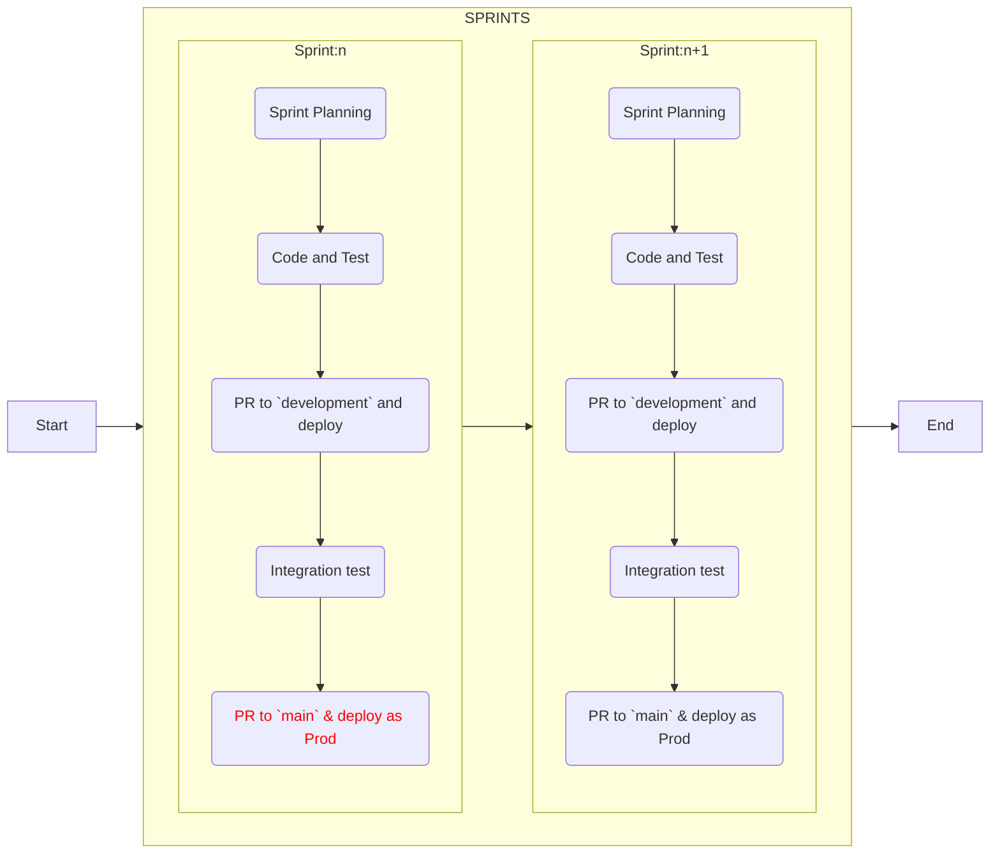

# Deploying your Application

Well before you've reached the MVP milestone for your application you'll want
to deploy it to the Internet so your team can perform integration testing and
get everything set up to incrementally deploy what you've completed at the end
of **_every_** sprint.

The following lists some of the more popular web hosting services. Remember that
although most of these have paid options they also have free ones as well. At
Chingu we strongly suggest you take advantage of the free options, which provide
virtually all of the services you'll need in your learning journey.

## Deployment Options

| Technology              | Frontend | Backend | Database |
| ----------------------- | -------- | ------- | -------- |
| Fly.io                  | ✓        | ✓       | ✓        |
| GitHub Pages            | ✓        |         |          |
| Glitch                  | ✓        |         |          |
| Netlify                 | ✓        | ✓       |          |
| Railway                 | ✓        | ✓       | ✓        |
| Render                  | ✓        | ✓       | ✓        |
| Surge                   | ✓        |         |          |
| Vercel                  | ✓        | ✓       |          |

### Fly.io

[Fly.io](http://Fly.io) is a CLI-first application hosting service supporting
automatic migration from Heroku

### GitHub Pages

GitHub provides this simple hosting solution for static frontend-only
applications. The advantages of [GitHub Pages](https://pages.github.com/) is
that it's free, simple to use, and tightly integrated with the applications
GitHub repo

### Glitch

[Glitch](https://glitch.com/) is a web-based interactive development environment
similar to CodePen. It has both VSCode and GitHub integration and is simple to
use. However, it is best suited for smaller projects.

### Netlify

[Netlify](https://www.netlify.com/) is an application hosting service that is
free of charge, easy to use, and integrated with GitHub repos. Netlify is a good
solution for any size app.

### Railway

[Railway](https://railway.app) is a GUI application hosting service that
includes 50+ templates with support for Vite, Typescript, NodeJS, PostgreSQL,
MongoDB, Svelte, Rails, Flask, NuxtJS, React, & more.

### Render

[Render](https://render.com/) allows you to build and run your websites with
free TLS certificates, a global CDN, DDoS protection, private networks, and
automatic deployment from Git.

### Surge

[Surge](https://surge.sh/) is similar in functionality to GitHub Pages. It is
suitable for publishing static frontend applications.

### Vercel

[Vercel](https://vercel.com) is an application hosting service that is free of
charge, easy to use, and integrated with GitHub repos. Vercel is a good solution
for any size app.

If you are using Vercel to host your deployed app be aware of this potential
problem. The free version of Vercel doesn't support deploying repos that are in
a GitHub organization, like `chingu-voyages`. The solution is for your team to
do their development work in the repo we've provided, but to fork this repo to
one of your personal GitHub accounts and to deploy to Vercel from there.

## Deployment Workflow

It's important that you deploy your completed and tested functionality by the
**_end of each and every sprint_**! Teams often wait until the final two 
sprints of a Voyage to do this, which is a **serious mistake**.

You want to deploy changes in the sprint they are completed in even if the
app isn't completely finished or even functional for these reasons:

1. Deploying early in the project means you are deploying the app in its
simplest state. This means that any deployment issues you encounter will be
easier to resolve.

2. Deploying to the Internet give your team a way to test the app in an
environment that's exactly the same as your users will use. It's common to find
that local tests work just fine, but fail in the production environment.
Deploying early lets you quickly find and fix issues that would otherwise not
be discovered until the end of the project.

## Tips for Deployment

