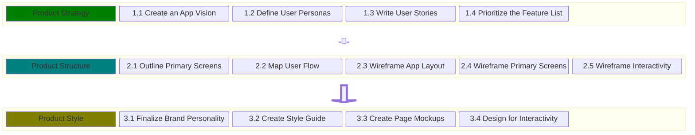

# UI/UX - A workflow for Voyage teams

In any application team the UI/UX Designer is an important role which helps
teams design and implement a UI/UX thats easy to use, pleasent to view,
responsive, and accessible. But, sometimes UI/UX Designers aren't available to
join a Development team.

The purpose of this section is to provide teams with a simple workflow they can
use to implement a website design when a UI/UX Designer isn't available.

## UI/UX Workflow

