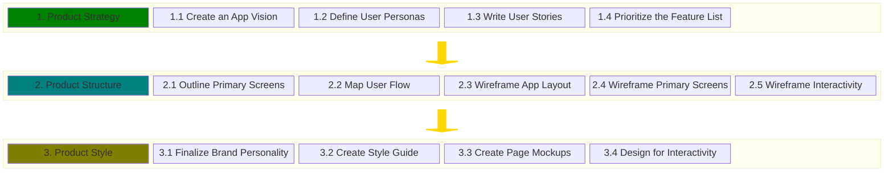

# UI/UX - A workflow for Voyage teams

In any application team the UI/UX Designer is an important role which helps
teams design and implement a UI/UX thats easy to use, pleasent to view,
responsive, and accessible. But, sometimes UI/UX Designers aren't available to
join a Development team.

The purpose of this section is to provide teams with a simple workflow they can
use to implement a website design when a UI/UX Designer isn't available.

## UI/UX Workflow

### 1. Product Strategy

1.1 **_Cast your App Vision_**

**_Objective:_** What problem will your app solve for its users?

**_How?_**
1. ...
2. ...

**_Resources:_**

* ...
* ...

1.2 **_Define the User Personas_**

Who, specifically, will use the app? Name them, and then as you design your site be sure to consider their wants and needs.

1.3 **_Write the User Stories_**

What discrete tasks will each user need to accomplish when using your app?

1.4 **_Prioritize the Feature List_**

Which user stories are core to your app’s purpose? What can you reasonably expect to achieve in a six-week voyage?

### 2. Product Structure

2.1 **_Outline the Primary Screens_**

What views, or pages, will your app need? What should be displayed and/or what actions should be available for each view?

2.2 **_Map the User Flow_**

For the primary user stories, chart the path your user will take from screen to screen to accomplish their task.

2.3 **_Wireframe the App Layout_**

What components (header, footer, etc.) will be used again and again on every page? How should they be laid out? Create a sketch!

2.4 **_Wireframe the Primary Screens_**

Now lay out the relevant content and components for each of your app’s pages. Again, a low-fidelity sketch is enough to get started.

2.5 **_Wireframe the Interactivity_**

Note how state changes for each component based on different actions, like the click of a button or data entered into a field.

### 3. Product Style

3.1 **_Finalize your Brand Personality_**

Name the app and describe its character with words like playful or reliable, dynamic or solid, etc.

3.2 **_Create a Visual Style Guide_**

Create your color scheme and typography, decide on an icon set, and explore the possibility of bringing in images or illustrations.

3.3 **_Create your Page Mockups_**

Glow up your sketches with the theme from your style guide, and make sure layout and spacing is intuitive and consistent site-wide.

3.4 **_Design for Interactivity_**

Show how links, buttons, menus, forms and other components should look when the user interacts or the app updates.