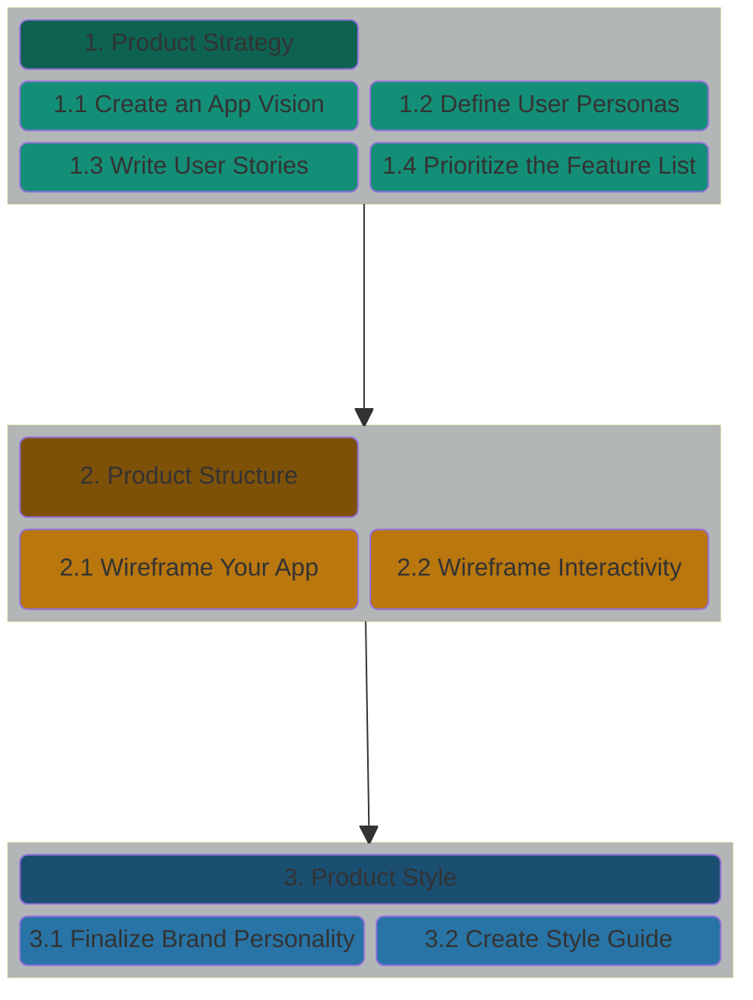
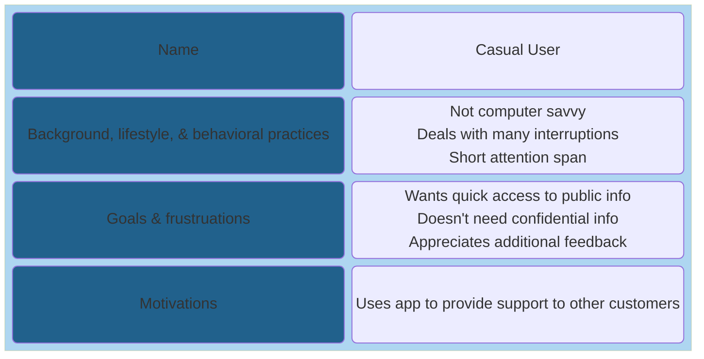
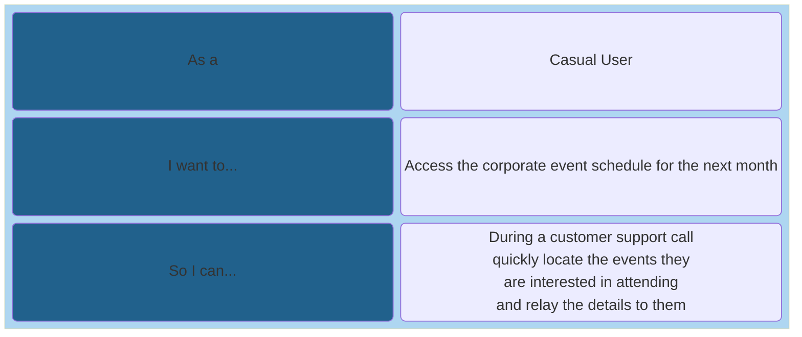
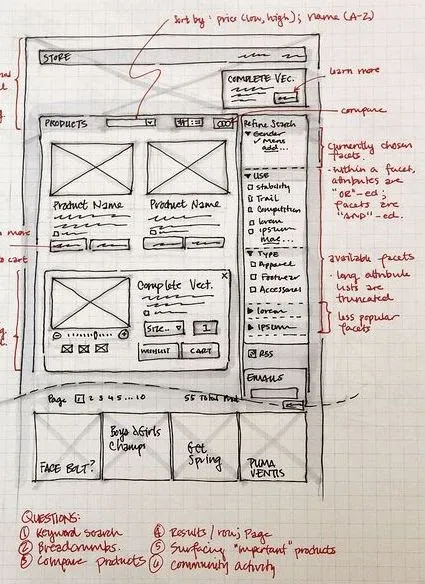
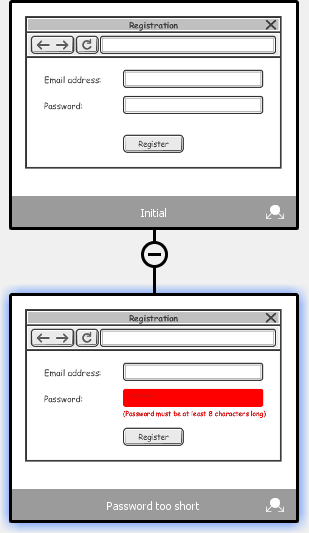

# UI/UX - A workflow for Voyage teams


In any application team the UI/UX Designer is an important role which helps
teams design and implement a UI/UX thats easy to use, pleasent to view,
responsive, and accessible. But, sometimes UI/UX Designers aren't available to
join a Development team.

The purpose of this section is to provide teams with a simple workflow they can
use to implement a website design when a UI/UX Designer isn't available.

## UI/UX Workflow


### 1. Product Strategy

#### 1.1 Cast your App Vision

**_Objective:_** Define the problem to be solved and the value the app will provide to its users.

**_How?_**
* What problem will your app solve for its users?
* You should create this as a team as defined in the Voyage Sprint 1 process we've provided [here](../../guides/voyage/voyage.md#4-choose-a-project--create-a-vision-statement-)

**_Resources:_**

* [How To Write A Vision Statement In 4 Steps + Tips & Examples](https://www.cascade.app/blog/write-good-vision-statement)
---
#### 1.2 Define the User Personas

**_Objective:_** Define the types of users who will be using the app.

**_How?_**
* Who, specifically, will use the app? 
* Name them, and then as you design your site be sure to consider their wants and needs.
* Personas shouldn't be complex or take a lot of time to create in a Voyage project. Here's a simple template to use:



**_Resources:_**

* [How to create a Persona](https://xtensio.com/how-to-create-a-persona/)
---
#### 1.3 Write the User Stories

**_Objective:_** Define the functionality to be implemented.

**_How?_**
* What discrete tasks will each user need to accomplish when using your app?
* User stories have a simple format that captures the persona performing the task, what they need to do, and the value it provides to them.



**_Resources:_**

* [Agile Methodology 101](https://github.com/chingu-voyages/Handbook/blob/main/docs/resources/projresources/agile101.md)
---
#### 1.4 Prioritize the Feature List

**_Objective:_** Prioritize your list of essential user stories and tasks

**_How?_**
* Which user stories are core to your app’s purpose? 
* What can you reasonably expect to achieve in a six-week voyage?
* You should create this as a team as defined in the Voyage Sprint 1 process we've provided [here](../../guides/voyage/voyage.md#5-define--prioritize-mvp-features-)

**_Resources:_**

* [Define & Prioritize MVP Features](https://github.com/chingu-voyages/Handbook/blob/main/docs/guides/voyage/voyage.md#5-define--prioritize-mvp-features-)
---
### 2. Product Structure

#### 2.1 Wireframe Your App

**_Objective:_** Create a sketch to identify common parts of your UI/UX.

**_How?_**
* What pages will your app need? 
* What components (header, footer, etc.) will be used again and again on every page?
* What should be displayed and/or what actions should be available for each view? 
* How should they be laid out? Create a sketch!
* For the primary user stories, chart the path your user will take from screen to screen to accomplish their task.
* You may use a tool like [Figma](https://figma.com) to build your wireframe, but a hand-drawn sketch is usually a faster approach



**_Resources:_**

* [Layout basics](https://m3.material.io/foundations/layout/understanding-layout/overview)
* [Creating the User Journey – map of screens as core UX design practice](https://itcraftapps.com/blog/user-journey-map-of-screens/)
* [Low Fidelity Wireframes](https://alvarotrigo.com/blog/low-fidelity-wireframes/)
---
#### 2.2 Wireframe the Interactivity

**_Objective:_** Identify how application state changes in response to user actions.

**_How?_**
* Note how state changes for each component based on different actions, like the click of a button or data entered into a field.



**_Resources:_**

* [States](https://m3.material.io/foundations/interaction/states/overview)
* [What is a wireframe state?](https://www.visual-paradigm.com/support/documents/vpuserguide/2822/2613/83713_whatisawiref.html)
---
### 3. Product Style

#### 3.1 Finalize your Brand Personality

**_Objective:_** Choose a unique and descriptive name for your app.

**_How?_**
* Name the app and describe its character with words like playful or reliable, dynamic or solid, etc.
* This is a team effort and something you will have most likely already done in Sprint 1

**_Resources:_**

* [How to choose the perfect name for your app](https://www.goodbarber.com/blog/how-to-choose-the-perfect-name-for-your-app-a696/)
---
#### 3.2 Create a Visual Style Guide 

**_Objective:_** Create a theme that gives your app a consistent look and feel.

**_How?_**
* Create your color scheme and typography, decide on an icon set, and explore the possibility of bringing in images or illustrations.
* There are a lot of tools available to create and render style guides. But, the simplest approach is to embed your style guide in the `readme.md` in your repo
To embed your app’s style guide into a README.md file, follow these steps:

  1. Use Markdown syntax: Write your style guide in Markdown syntax, using formatting options like headings, bold text, and code blocks. This will make it easy to read and maintain.
  2. Include examples: Provide concrete examples of each style guideline, using code snippets or images. This will help developers understand how to apply the guidelines in their code.
  3. Link to additional resources: If you have additional resources (e.g., design files, style guides in other formats), link to them from your README.md file.
  4. Integrate into README.md: In your README.md file, create a section dedicated to your app’s style guide. Use a clear heading (e.g., “Style Guide”) and provide a brief introduction to the guidelines.
  5. Maintain and update: Regularly review and update your style guide to ensure it remains consistent and accurate.

* Here's a sample template to follow:
```
**Style Guide**
================

### Color Palette

* Primary color: `#2A91BD` (defined in `colors.xml`)
* Secondary color: `#FFFFFF` (defined in `colors.xml`)

### Typography

* Font family: `Open Sans`
* Font sizes:
	+ Headings: 18px
	+ Body text: 14px
* Font styles:
	+ Bold: `**bold text**`
	+ Italic: `*italic text*`

### Spacing and Margins

* Default margin: 16px
* Default padding: 8px

### Iconography

* Icon set: Material Design Icons
* Icon sizes:
	+ Small: 16px
	+ Medium: 24px
	+ Large: 48px

### Branding Elements

* Logo: [logo image]
* Logo with text: [logo image with text]
```
**_Resources:_**

* [Style Guide](https://m3.material.io/foundations/content-design/style-guide/ux-writing-best-practices)
* [Design System documentation](https://design-system.example.com)
* [Style Guide PDF](https://example.com/style-guide.pdf)