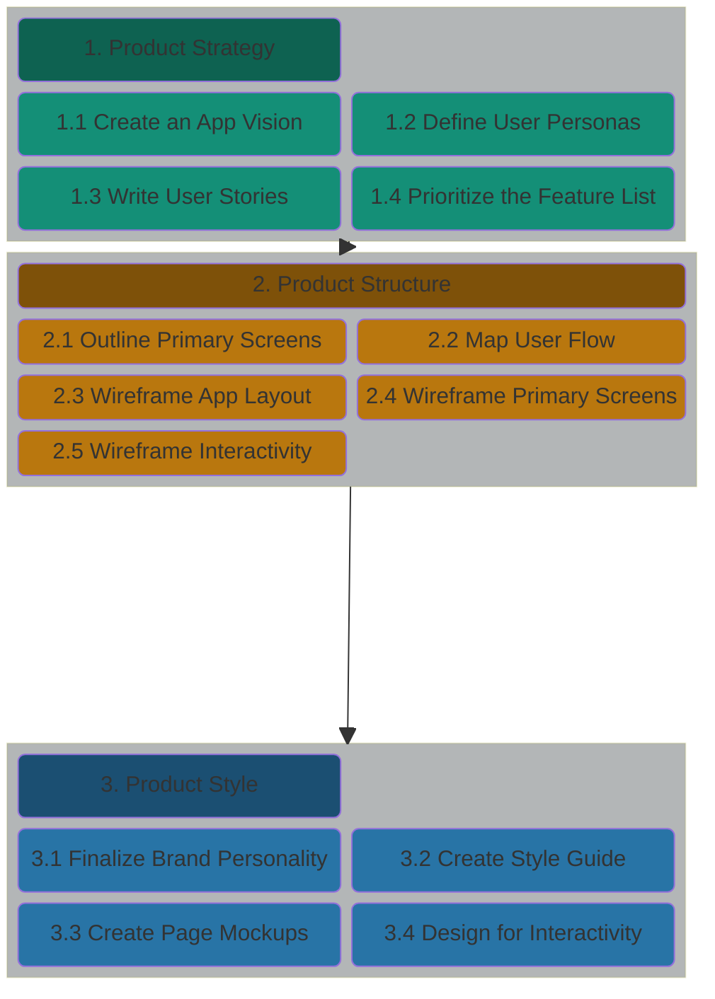
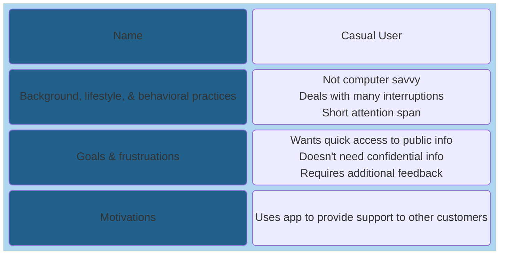

# UI/UX - A workflow for Voyage teams

In any application team the UI/UX Designer is an important role which helps
teams design and implement a UI/UX thats easy to use, pleasent to view,
responsive, and accessible. But, sometimes UI/UX Designers aren't available to
join a Development team.

The purpose of this section is to provide teams with a simple workflow they can
use to implement a website design when a UI/UX Designer isn't available.

## UI/UX Workflow

### 1. Product Strategy

#### 1.1 Cast your App Vision

**_Objective:_** Define the problem to be solved and the value the app will provide to its users.

**_How?_**
* What problem will your app solve for its users?
* You should create this as a team as defined in the Voyage Sprint 1 process we've provided [here](../../guides/voyage/voyage.md#4-choose-a-project--create-a-vision-statement-)

**_Resources:_**

* [How To Write A Vision Statement In 4 Steps + Tips & Examples](https://www.cascade.app/blog/write-good-vision-statement)
---
#### 1.2 Define the User Personas

**_Objective:_** Define the types of users who will be using the app.

**_How?_**
* Who, specifically, will use the app? 
* Name them, and then as you design your site be sure to consider their wants and needs.
* Personas shouldn't be complex or take a lot of time to create in a Voyage project. Here's a simple template to use:

**_Resources:_**

* [How to create a Persona](https://xtensio.com/how-to-create-a-persona/)
---
#### 1.3 Write the User Stories

**_Objective:_** Define the functionality to be implemented.

**_How?_**
* What discrete tasks will each user need to accomplish when using your app?

**_Resources:_**

* [Agile Methodology 101](https://github.com/chingu-voyages/Handbook/blob/main/docs/resources/projresources/agile101.md)
---
#### 1.4 Prioritize the Feature List

**_Objective:_** Define user stories

**_How?_**
* Which user stories are core to your app’s purpose? 
* What can you reasonably expect to achieve in a six-week voyage?

**_Resources:_**

* [Define & Prioritize MVP Features](https://github.com/chingu-voyages/Handbook/blob/main/docs/guides/voyage/voyage.md#5-define--prioritize-mvp-features-)
---
### 2. Product Structure

#### 2.1 Outline the Primary Screens

**_Objective:_** Define how the pages are to be organized.

**_How?_**
* What views, or pages, will your app need? 
* What should be displayed and/or what actions should be available for each view?

**_Resources:_**

* [Creating the User Journey – map of screens as core UX design practice](https://itcraftapps.com/blog/user-journey-map-of-screens/)
---
#### 2.2 Map the User Flow

**_Objective:_** Map the desired user flow to make sure it is included in your design.

**_How?_**
* For the primary user stories, chart the path your user will take from screen to screen to accomplish their task.

**_Resources:_**

* [Creating the User Journey – map of screens as core UX design practice](https://itcraftapps.com/blog/user-journey-map-of-screens/)
---
#### 2.3 Wireframe the App Layout

**_Objective:_** Create a sketch to identify common parts of your UI/UX.

**_How?_**
* What components (header, footer, etc.) will be used again and again on every page? 
* How should they be laid out? Create a sketch!

**_Resources:_**

* [Layout basics](https://m3.material.io/foundations/layout/understanding-layout/overview)
---
#### 2.4 Wireframe the Primary Screens

**_Objective:_** Create a low-fidelity sketch to show what content and components are on each page.

**_How?_**
* Now lay out the relevant content and components for each of your app’s pages. 
* Again, a low-fidelity sketch is enough to get started.

**_Resources:_**

* [Low Fidelity Wireframes](https://alvarotrigo.com/blog/low-fidelity-wireframes/)
---
#### 2.5 Wireframe the Interactivity

**_Objective:_** Identify how application state changes in response to user actions.

**_How?_**
* Note how state changes for each component based on different actions, like the click of a button or data entered into a field.

**_Resources:_**

* [States](https://m3.material.io/foundations/interaction/states/overview)
---
### 3. Product Style

#### 3.1 Finalize your Brand Personality

**_Objective:_** Choose a unique and descriptive name for your app.

**_How?_**
* Name the app and describe its character with words like playful or reliable, dynamic or solid, etc.

**_Resources:_**

* [How to choose the perfect name for your app](https://www.goodbarber.com/blog/how-to-choose-the-perfect-name-for-your-app-a696/)
---
#### 3.2 Create a Visual Style Guide 

**_Objective:_** Create a theme that gives your app a consistent look and feel.

**_How?_**
* Create your color scheme and typography, decide on an icon set, and explore the possibility of bringing in images or illustrations.

**_Resources:_**

* [Style Guide](https://m3.material.io/foundations/content-design/style-guide/ux-writing-best-practices)
---
#### 3.3 Create your Page Mockups

**_Objective:_** Apply your theme to your wireframe (optional).

**_How?_**
* Glow up your sketches with the theme from your style guide, and make sure layout and spacing is intuitive and consistent site-wide.

**_Resources:_**

* N/a
---
#### 3.4 Design for Interactivity

**_Objective:_** Refine your theme with styling to be applied based on user actions.

**_How?_**
* Show how links, buttons, menus, forms and other components should look when the user interacts or the app updates.

**_Resources:_**

* [Inputs](https://m3.material.io/foundations/interaction/inputs)
* [Selection](https://m3.material.io/foundations/interaction/selection)